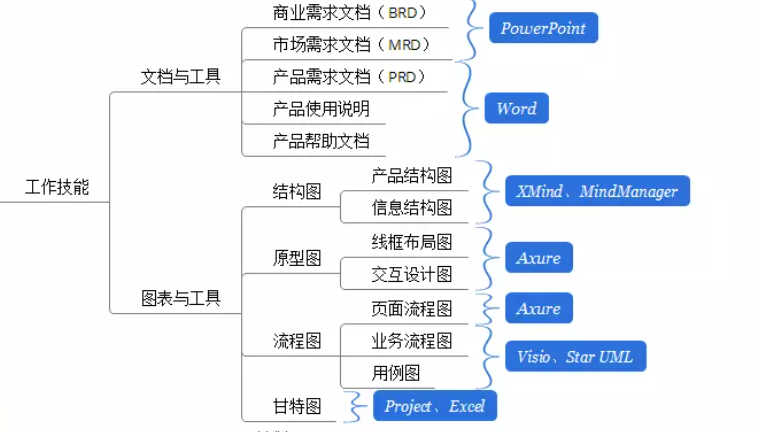
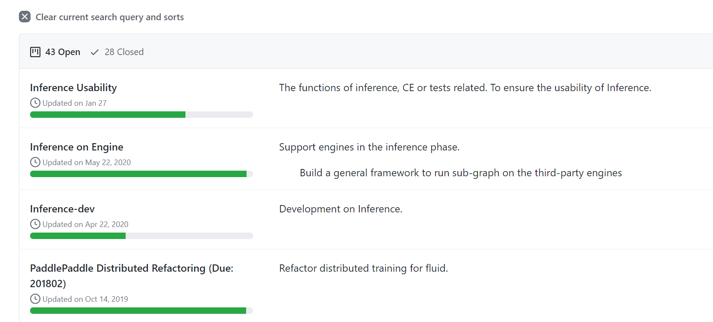

# 工具

工具只是工具，没有绝对的标准、只要适合就好

https://tangjie.me/blog/184.html

TODO: 产品经理必用的软件大全—产品手记推荐工具系列 - 「已注销」的文章 - 知乎
https://zhuanlan.zhihu.com/p/109261065

## Project

甘特图：https://support.microsoft.com/zh-cn/office/%E4%BD%BF%E7%94%A8%E7%94%98%E7%89%B9%E5%9B%BE%E8%A7%86%E5%9B%BE-0e84efa4-78ce-4cd1-baed-5159a55f78b4

- https://www.iamxiarui.com/?paged=3&cat=111
- https://blog.csdn.net/liwei16611/article/details/100106262## UML

https://www.iamxiarui.com/?p=1231

## Axure [1]

Axure 9.0不用？[4] 口碑差，实际上都用8.0、8.1

**Axure实战**见 https://github.com/StevenJokess/2bPM/blob/master/rsc/meituan_PM_recovered.rp

- 流程图实战:ref:`flow_chart_Axure`
- 流程图页面化实战:ref:`flow_chart2page_Axure`
- 低保真页面实战:ref:`page_Axure`
- 高保真页面实战:ref:`page_done_Axure`

更多：

- https://www.axure.com.cn/axure/
- AxureShop：https://www.axureshop.com/
- https://axhub.im/
- AXURE8 原型绘制效率工具：https://coffee.pmcaff.com/article/2111722865562752/pmcaff?utm_source=forum&newwindow=1
- AXURE8 教学（从8到9，布局快捷键大变，更不方便，一步交互变四步，多目标藏+好里，很多bug）：https://www.bilibili.com/video/BV1bt41137MY
- AXURE8：http://www.woshipm.com/xiazai/188927.html
- Axure（8+9）产品经理：https://edu.csdn.net/course/play/28296/389326

### 简介

https://www.iamxiarui.com/?p=1845

在我的实践中，用Axure原型+注释的方式撰写，导出HTML或发布到Axshare或通过蓝湖上传的方式传达；效率最高效果最好。

Axure之于产品经理就像PhotoShop之于设计师

经典的虽然看起来没那么酷炫，但是它代表着易用性、拓展性、普适性

- 易用性：可以找到大量教程，降低门槛快速上手
- 拓展性：可以获取大量素材，积累提升输出质量
- 普适性：可以兼容各种系统，提升工作协同效率

- 有人用墨刀做花里胡哨的交互，文字描述寥寥，结果连异常流程都覆盖不了
- 有人用word写长篇大论，结果开发根本不看，还要问你每个页面怎么跳转
- 有人用sketch，不配合专属插件的话，很容易画成没有结构性的页面流程图。而且是否具备普适性，取决于周围与你配合的人

工具本身没有问题，有问题一定是工具人的问题。

为了让你的PRD的用户使用效果更好，汲取意见是很重要的。有的时候不要埋怨开发为什么不认真看，去问问他们喜欢看什么样的，适当调整达成统一。

Tower、禅道、tapd等团队协同工具，会导致一部分人习惯把产品的结构通过协同工具中的单个需求建立父子关系连接，在每个子需求中上传需求图片+文字描述。这种方式更适合优化已有功能，功能可以在小范围内实现闭环，但是容易使人忽略细节的调整对全局的影响。

产品经理应该把控Axure源文件的颗粒度，哪些版本/模块在一个源文件里更新，从哪个版本/模块新建文档维护；文档或文件夹之间尽量去重、解耦。在原有文件上新增或调整的部分，更显眼的做出标注，让人可以一眼看出变动的部分。

在Axure里搭建当前版本/模块最完整的产品结构，并且及时更新。要明确一个认知，协同工具是给UI、开发、测试、运营看的，目的是让他们看起来方便，可以针对单个需求设置执行人员、排期、添加bug记录等，核心价值是项目管理。而不是为了产品经理维护需求文档方便，所以在需求的撰写和管理时，不要依赖协同工具。在追溯需求问题的时候，要能做到在Axure文件里便能找到记录，而不是去翻协同工具里的需求记录。

Axure基础操作总结：https://blog.csdn.net/zcl050505/article/details/110439551

## Sketch [5]

Sketch有利于产品与UI的协同工作。对于较小的需求，在白板上画出原型后可以直接进入UI阶段。

优点：

方便画出高保真的原型图；
在静态界面的展示方面有一定优势；
无限画布，可以将各页面放到一个画布上帮助串联思考。
不足：

对于初学者，基础功能的学习成本较高；
Sketch作为一款设计工具，会让使用者陷入“设计者思维”，在细节上耗费较多时间，拖延项目进度。

## TAPD

TAPD开放产品，包含两个解决方案-轻量协作和敏捷研发。轻量协作：对标Tower，功能特点为看板+云文档+企业微信集成，为满足小团队的协作需要。敏捷研发功能特点包含需求、迭代、缺陷、测试计划／用例、发布评审、看板等。总体来看敏捷研发特性（能力）更强。整体UI特点：偏传统，多页应用。

https://www.zhihu.com/question/56575428/answer/352398510

## 眼界

- 快懂百科：https://www.baike.com/
- 中文互联网数据资讯网：http://www.199it.com/
- FT中文网：https://www.ftchinese.com/
- 品玩：https://www.pingwest.com/

[1]: https://www.yinxiang.com/everhub/note/435c8b2c-9127-43f3-a6e3-fc5f8898d893
[2]: https://www.bilibili.com/video/BV1WE411w7LW?from=search&seid=9895003283584993406
[3]: http://www.woshipm.com/pmd/1642415.html
[4]: https://www.bilibili.com/video/BV1it41137Xg?p=2
[5]: https://blog.csdn.net/Dylan_zhijing/article/details/107825514?spm=1001.2014.3001.5502
