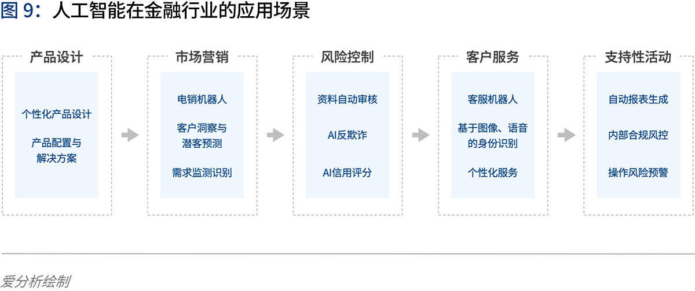

# AI 金融

## 背景

1. 金融科技的生态是三个相互牵制的部分：

公司/银行——监管——资本

2. 金融科技发展：

20世纪70年代 业务电子化
20世纪80年代 前台电子化（ATM机等）
20世纪90年代 金融业务互联网化（实现了高效连接）
21世纪 金融科技

3. 中国金融科技发展

IT系统——支付——信贷——大金融——生活

 [5]

## “AI+金融”产业链

![“AI+金融”产业链[6]](../img/financial_AI.png)

2020年中国AI+金融行业发展分析报告：https://mp.weixin.qq.com/s/1jOCiQMMYIqDFWOLv-6n-A

## 为什么是金融+AI而非AI+金融呢[4]

这两者的前后连接顺序体现的是主动和被动，引导和被引导的关系。之所以是金融+AI，体现的是这是金融行业对AI技术主动性的利用需求，而非被动型的推动。

## 为什么金融可以+AI呢？

因为金融业务开展的基础本质上是基于信息（数据）进行，AI可以对数据进行更好的利用，从而提升金融业务的效率。

具体来说，有这么几个主要的业务范围：

- KYC（客户了解）：具体包括客户背景信息调查、客户核身、用户画像、客户偏好等；
- 交易决策：例如信贷领域的风控，理财领域的风险等级评估、产品推荐，保险领域的保险方案设计、理赔验证，以及所有细分领域都包含的反欺诈等；
- 客户服务：例如售前营销、售后服务等。

## 金融新基建[2]

在金融新基建榜中，乐信、水滴、弘玑Cyclone、洞见、同盾五家公司凭借各自优势在众多优秀竞争者中脱颖而出。

他们分别荣获“最佳新消费AI平台奖”、“最佳保险科技数据中台奖”、“最佳智能自动化平台方案奖”、“最佳隐私计算平台奖”和“最佳智能分析决策奖”。

## 特有的知识体系 [7]

很多行业都有特有的知识体系，不深入工作5年以上，很难做到融会贯通。比如，互联网金融行业的风险控制产品经理如果原来没有在金融体系、银行体系工作过，那么很难做出优秀的风险控制产品。这种风险控制产品可不是随随便便在办公室里想想，或者打开某个竞争对手的产品看看就能够想清楚的。

## 智能投顾 [1]

智能投顾，用服务新模式，打造差异化品牌
业务同质化让券商竞争激烈，企业希望通过服务的创新打造出差异化，吸引更多用户。追一AIForce的智能投顾助手YIFA提供了实时个股诊断、多条件筛选的能力，再结合快速交易能力，让投资者随时掌握个股动态，抓住转瞬即逝的交易机会。

智能投顾助手积累了行业头部的3000+常用知识点，让客户能在自营券商APP中闭环完成查询、交易和学习。创新的服务模式在不断增加客户信任度和粘性，提升品牌价值。

低成本高质量的智能外呼
有效覆盖更多场景
证券行业的高频度服务，让每个用户触点上的服务质量，
成为决定券商运营效率和客户满意度的关键。

外呼可以提供各类电话沟通服务，包括开户的回访、对离职员工名下的客户进行回访、风险抽查、满意度调查、新股中签缴费提醒等等。他还能提供自动的业务咨询等经纪服务，既降低人力成本，又提升服务能力，提升覆盖度。

客户画像师，
挖掘数字金矿价值
大量的客户数据和运营数据在碎片化的场景中，难以获得有效沉淀与分析利用。

追一AIForce的客户画像师Feature，基于强大的语义理解能力，可以分析每一通外呼电话和各个渠道的客户交互内容。打破数据黑盒，将信息整理为结构化的数据，构建出消费者画像，从而辅助决策或主动服务，实现精细化运营与精准营销。

## AI 在金融领域落地面临困难和挑战 [3]

1. 深度学习模型的构建比较困难
目前并没有成熟的理论对深度学习模型的构造提供指导，主要还是依靠研究学者不断实验、不断探索
2. 深度学习模型的稳健性和适用性有待商榷
深度学习模型能否适用于特定领域的分析和预测，需要大量实验进行验证。目前相关理论研究还处于对单一模型的优化处理，并没有提炼出通用的规律性方法和框架，从而限制了最终模型的稳健性和广泛适用性。
3. 深度学习模型较难正确地阐述金融数据分析结果背后的经济学原理
深度学习模型在分析金融数据时，削弱了利用经济学解释最终结果的因果关系、以及隐藏于数据背后的经济学原理。

## 2020 金融AI

金融科技进入“强监管”时代，行业合规有序发展◆金融科技行业正式进入“强监管”时代，市场的喧嚣与浮躁开始隐退，各类机构在探索创新与合规的平衡中不断前行。首份金融科技发展顶层文件出台，明确金融科技创新与服务的边界，整个行业进入合规有序发展阶段。金融机构积极拥抱金融科技，通过调整内部信息技术架构、成立科技子公司，推动技术从后台走向前台和中台，赋能业务发展。金融科技出海热潮持续进化，一批以提供获客、风控、运营等金融技术服务的企业开始扬帆远航，寻求新的发展机遇。整体来看，监管规范、新技术与金融业的融合应用、技术驱动下的经营模式与业务合作模式创新都是行业普遍关注和积极实践的焦点。

亿欧智库认为金融科技2020年十大关键词为：金融开放、金融科技监管、监管科技、消费金融、小微金融、开放银行、第三方支付、财富管理、保险科技。

[1]: https://zhuiyi.ai/solution/securities
[2]: https://www.leiphone.com/news/202012/7ovvkzByXnPQjnlD.html
[3]: http://www.ramywu.com/work/2018/05/18/AI-in-Finance-Survey/
[4]: https://tanxianlian.com/2020/05/15/%e9%87%91%e8%9e%8dai%e7%9a%84%e6%9c%aa%e6%9d%a5%e7%95%85%e6%83%b3/
[5]: https://www.donews.com/news/detail/4/3084506.htmls
[6]: https://www2.deloitte.com/content/dam/Deloitte/cn/Documents/innovation/deloitte-cn-innovation-ai-whitepaper-zh-181126.pdf
[7]: https://weread.qq.com/web/reader/46532b707210fc4f465d044ke4d32d5015e4da3b7fbb1fa
