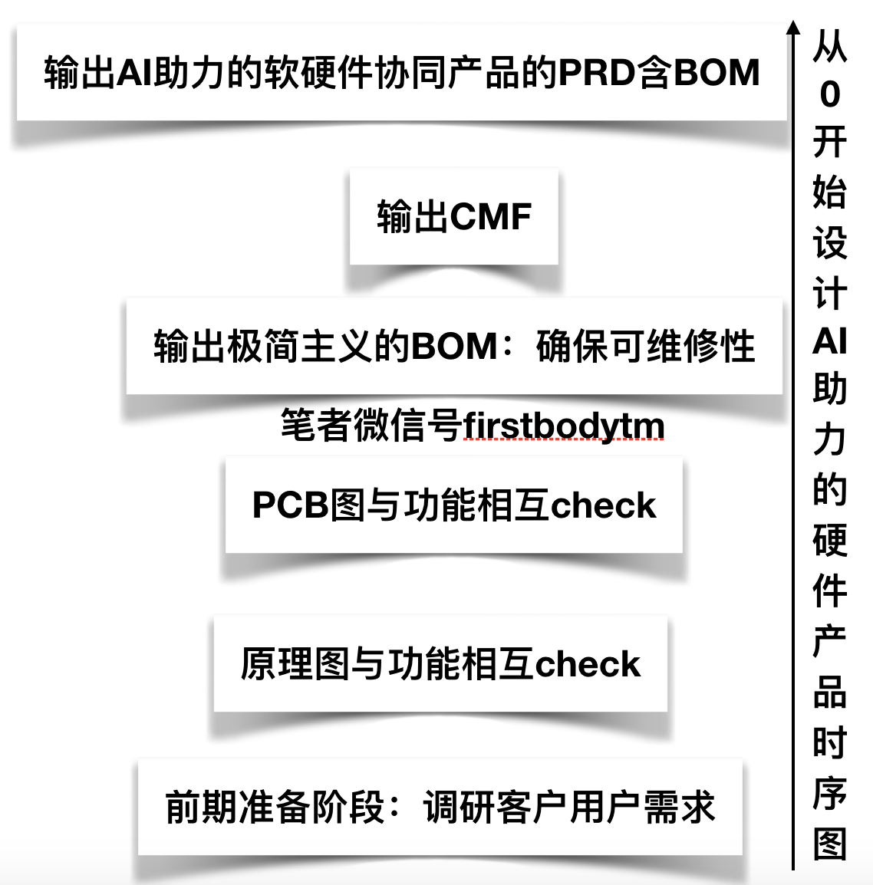
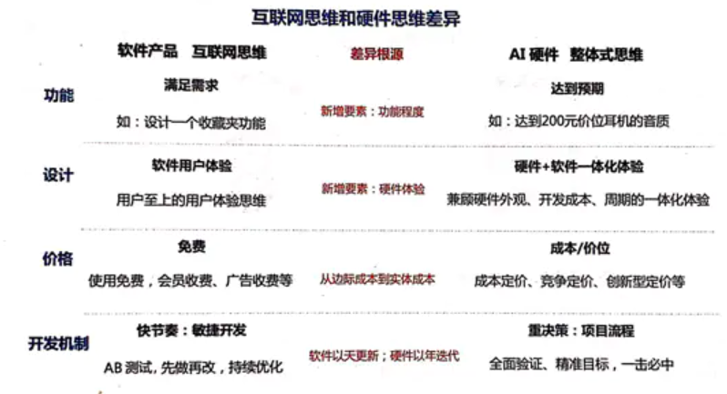
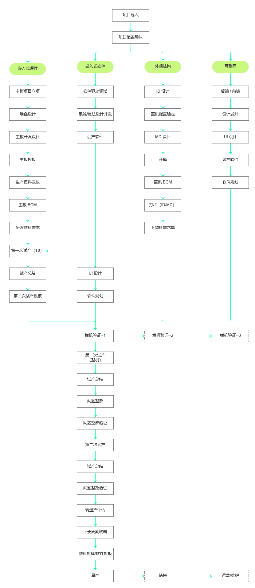
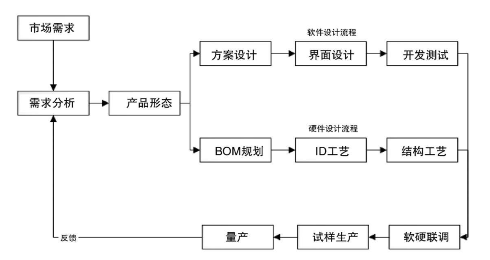

# AI 硬件 [1]

智能硬件比如现在流行的智能音箱和智能手环等

## 不确定性 [6]

智能硬件产品不仅具有极端的不确定性还具有比互联网产品经理需要花更多精力打磨的地方，比如供应链，核心元件：例如芯片、电池等。总的体会来说智能硬件产品经理包含了部分互联网产品经理的职能，在这条路上个人最大额体会是：确定的事情是留给机器人（智能硬件）做的，不确定的研究创新是给人（产品经理）做的，看来不停地专研是产品经理的常态！

## 方案+研究+生产

做方案：

1. 研究市场需求
2. 出MDR，定义市场需求（定目标人群、定卖点、定关键特性、定价）
3. 和ID（工业设计）团队一起出方案，出效果图
4. 拿方案在内部评审可行性，直到比较有把握
5. ID开始设计和打样，做Mockup
6. 做市场调查，找用户提提意见
7. 拿方案去对客户宣讲，看看客户的反馈（一般是合作过的老客户，比如运营商、渠道商；新客户都是拿成品去拓展的）
8. 根据市场调研反馈修改设计

研发和生产阶段：

1. ID团队出正式的方案（中间需要反复修改设计、去喷漆厂调色、做高保真Mockup）
1. MD（结构设计）出结构方案
1. 硬件出硬件方案
1. MD和硬件一起选购元器件，定BOM
1. 软件研发软件方案
1. 开模，需多次修模
1. 量产

产品立项书模板内容: https://zhuanlan.zhihu.com/p/313721146

## 硬件AI PM

智能硬件产品经理一种是规划应用AI技术，统筹规划设计生产出智能硬件产品的产品经理角色。

硬能力核心流程如下图：

## 硬件PM VS 互联网PM

### 知识面不同： [2]

- 软件产品经理通常需要关注市场和用户调研和分析、产品设计、用户体验、UI设计、开发技术、数据分析、运营维护、拉新促活和召回、商业变现、推荐推送等方面的知识。
- 硬件产品经理除了需要关注市场和用户调研和分析、产品设计之外还需要关注、方案设计、ID开模、电子电路、成本控制、包装设计、质量把控、营销渠道、售后服务等各方面知识。

### 合作人不同：

- 互联网产品经理一般合作的团队成员主要有设计、开发、测试、运营、市场这几个主要岗位，如果是大公司还有需求分析师、交互设计师、用户研究员等相关岗位。
- 硬件产品经理一般是和ID设计、平面设计师、结构设计师、电子工程师、软件工程师、采购、品控、销售、售后、技术支持、仓库管理员、供应商、代工厂、模具成、SMT厂、包装厂等相关职位以及合作伙伴进行合作。因为需要面对很多外部人员以及多方合作，所以硬件产品经理也需要具有来更好地协调能力和规划能力。

### 定位不同：参谋 VS 领班 [3]

- 硬件团队中职能团队要广的多，老板难以掌控所有的工作，所以必须专设两类助手——产品经理（找业务方向）和项目经理（推动项目执行）。尽管PM也没有管人的”实权“，但因为身背业绩，所以在业务的发言权要大很多——比如例会上，一般是老板坐镇，所有团队负责人参与，然后产品经理和项目经理轮流汇报工作。在这个过程中，任何问题都可能被提出来，由对应职能部门负责人解释。一旦被被挑战，压力非常大。
- 互联网团队通常采用扁平化管理，产品、设计、研发、运营都是彼此协作的 职能团队，职位高低上并无不同。由于团队中一般不专设项目经理，就把PM抓来同时兼任。由于这种”项目经理“并无分配资源的”实权“，又必须推动项目实 施，所以”产品汪“天天跪舔”攻城狮“就一点都不奇怪了。

### KPI不同：收入考核 VS 用户考核

- 硬件产品没有互联网那么多眼花缭乱的商业模式。硬件PM的KPI非常简单粗暴，就是收入和利润是否达标。无论市场眼光准不准、方案完成度高不高、产品有没有竞争力、情怀能不能打动人，最终都体现在一件事上——能不能把东西卖掉并赚到钱！
- 互联网产品一般不向用户收费，很多产品在上线多年后都不能变现，用收入考核产品经理根本不现实。所以产品经理一般是与运营一起背用户增长、流量等。

### 关注点不同：商业价值 VS 用户体验

- 互联网PM更关注完整的用户体验，对用户心理的揣摩更细腻，比如用切换卡导航还是抽屉导航，用图标按钮还是文字链等等。
- 硬件PM虽然也关注用户体验，但更需要衡量每一点改善的投入产出比，如果不能带来销量的提升就尽可能砍掉。比如我从来没见过哪个传统电视机厂家把遥控器做的好用一些，因为这对销售帮助极小。

### 项目追求不同：高完成度VS快速上线

- 发布硬件产品，则需要从市场到设计、研发、生产、销售、售后全部团队的重度参与，一旦量产就不能容许有严重BUG。所以在立项起各阶段的检查就需要极为严格，在方案达标后必须及时关闭迭代，保证产品的高完成度。硬件产品试错成本很高，必须谨慎计划，严肃执行。
- 互联网常常拉一拨人几个月就上线顺便公测，效果不错就加大投入，效果不佳就赶紧换方向或砍掉。上线后就算有严重BUG，也不算事儿，有问题下一版升级就好了。互联网产品试错成本很低，可以小步快跑，随时掉头

### 成本意识不同：非常关注成本VS不太关注成本

- 硬件对配置斤斤计较：由于每件硬件产品最终都是一笔交易，所以控制成本就极为重要。因此从元器件采购到确定BOM都需要PM深度参与，当然专业意见还是技术部门出，订货过程由项目经理跟。
- 互联网产品不考虑成本：一般初期投入成本很低（只有一些人力投入），用户增长的边际成本也极低。所以互联网PM基本不太需要考虑成本，更关心如何吸引用户。

## 互联网思维对硬件的束缚

互联网的“反硬件基因”，能用app解决的事情，坚决不用硬件

## AI产品商业简史

- 三大应用：语音、视觉、机器翻译
- 四大品类：智能音响、家庭机器人、翻译机、AI相机

## 智能音响

智能音箱是什么? [13]WiFi网络音箱+麦克风阵列+人工智能平台

### 商业史

Echo诞生之初着力点是运算能力和高音质，因此价格199美金。此时市场为蓝海，通过降价策略吸引了一部分观众后，用户体验后感觉良好。随后google感到危机加入战场，凭借其互联网搜索引擎的家底占据了一部分市场。随着技术的成熟，价格下降成为趋势，通过低价位，echo进一步巩固市场地位，google随后也向低档下手。最后屏幕音响扰乱市场。

### 常见场景

- 绝大多数的用户习惯在卧室中使用音箱
- 语音指令中排名前三：音乐、闲聊、控制设备[13]

### 智能音响商业策略

三大基本策略：应用渗透（以产品服务的渗透率为第一目标）+生态延伸（自身产品生态的延伸，如HomePod）+价值割据（围绕用户价值改进产品，建立优势巩固壁垒）

企业需要考虑的：战略贯穿（以引流为目的，盈利优先级低）+结局导向（确保能落地）+全局商战（企业的利弊权衡+需求程度和用户接受度+软件加硬件加商业化运作）

### 智能机器人发展史

14年的妖风初起，资本夸大机器人市场；15年巅峰在望，消费级机器人品类增加；16年由盛转衰，回归理性；17年资本降温，强弩之末，或突围或止损；18年回首，一地鸡毛。

底层需求与价值：教育（早教机器人、编程机器人）、娱乐（玩具）、效率（扫地机器人、音响）

极点产品设计：极点形态（用户选择）、极点功能（需求）、合理的价格区间

商用机器人市场大于消费级机器人，仅仅炫技而无法落地的机器人很难生存

商用机器人：物流机器人+农场机器人+安防机器人+公关+外骨骼+医疗

### 智能翻译机发展史

翻译机相对app的卖点：使用可靠性、识别准确性、操作简易性

翻译机的商业策略：产品演化+抢占市场

### 机器视觉产品应用

技术赋能，给老产品带来新体验

## 互联网思维做不好AI硬件

- 功能：互联网思维是设计功能、满足需求，硬件领域则是要达到用户的预期。如Echo
- 设计：软件产品强调极致，硬件产品关注全局整体性。如AirPods
- 价格：互联网的免费思维背后是流量，硬件则应该一开始就考虑产品定位和定价。硬件的渗透是渐进的，无法复制软件的导流。
- 开发机制：软件快节奏，容错能力强；硬件重质量，容错能力弱

## 为什么体验好的产品，卖不好

体验最好不代表最合适。合适的重要性远大于体验，提升体验着成本的上身，用户只买对的，不买贵的。销量是衡量产品最普适的指标。

## AI硬件的3种模式

- 硬件模式（AI+硬件）：硬件是主体，AI可有可无。如智能手机的拍照、无人机的镜头、加入新技术的玩具、带有语音助手的耳机、智能手表、智能家居（音响主控，其他的家电被连接）、相机、眼镜
- 互联网模式（AI+管道）：智能音响、智能翻译机、智能电视、家庭监控
- 资本模式（资本+梦想）：下一代交互/运算平台（消费者购买的是产品，不会为梦想买单，如TNT）+AI机器人（技术or泡沫？）

## AI硬件创新

- 用户决策：轻决策（门槛低、风险低、心动就会买，忌花里胡哨抬高价格）+重决策（门槛高、风险高、没有必要就不买，不能妥协性能）
- 产品演进：压缩成本（轻决策，平民化）+提高价值（重决策，价值穿透）
- 推广路径：轻决策，依靠平价，快速渗透；重决策，穿透核心价值用户后才能抵达大众，强贯穿

## 智能硬件

智能硬件看似复杂，拆解出来脉络很清晰。包含硬件（HW）、软件（SW）、外观（ID）、结构（MD）、互联网平台。

其中软件包含板级支持包（BSP）、底层引导程序（bootloade）、系统与应用程序、算法，这些不展开来讲，找固件打包的工程师就 OK ，一般所有的程序都汇总到他那儿了。

作为项目经理，不太需要进行深入的了解，当然能够深入更好，但作为产品经理还是更深入一点较好。

互联网平台，这个包含云服务、后台、App、小程序等。常见的是前三个。跟进对应的工程师就好。

## 项目研发

项目研发分为EVT阶段、DVT阶段、PVT阶段、MP阶段和维护阶段

EVT 阶段：（Engineering Verification Test），指工程验证。一般在工程样机之前的研发行为，我都称之为工程验证。

这个阶段，目的是工程验证。尽可能的发现设计问题，方案对比。

最终拿到的是工程样机，用于样机整机测试，判定是否可以开模。

DVT 阶段:（Design Verification Test）,指设计验证测试。最终拿到的是试产的整机样机，用于多方联调，验证优化。

上一个阶段，完成产品的雏形，这个阶段继续上个阶段的设计开发、优化。MD 详细设计完成，开始投模、试模、修模、颜色调制等。

试产模具，组装整机，进行硬件/结构的整机测试。软硬件、结构、互联网平台多方联调。比如软硬件的稳定性、可靠性、性能等；软件与互联网平台（云服务/App等）联调测试；硬件与结构的联调测试，比如散热、结构强度等。

另外，这在这阶段关于产品的贴纸、说明书、包装等可以开始设计/打样，然后等待，因为这些时间周期比较短。

如果软硬件状态比较理想，在这个阶段尽早安排认证。因为认证周期非常长，基本在 40 天左右，别等到产品快要量产了，认证还没出来，影响销售。

总之，这个阶段就是联调、测试、试模、打板、试产。

PVT 阶段 ：（Process Verification Test），指生产验证。进行小批量产，摸清生产工艺，测试工艺，为大批量产做准备。

这个阶段依然会进行各种验证，以及解决上一阶段遗留的一些小问题。但主要的精力放在一致性、设计（细节，比如按键手感不好，干涉等）调整上。

各部门处于生产支持模式，比如工程部制作 SOP（标准作业程序），结构部帮忙解决生产上的结构问题。与生产相关的测试工具、生产工具、烧录工具、产测工具的支持。

所有的生产支持文件规定当送到工厂，量产软件/量产硬件BOM/量产结构BOM，结构/元器件终版签样。

总之，这个阶段就是为了保证产品量产。 量产顺利，效率高，不良率最低，产品一致性够高。

## 智能硬件设计流程 [5]

智能硬件从智能穿戴设备开始，在智能硬件领域已经扩展出了诸如智能电视、智能家居、智能汽车、医疗健康、智能玩具、机器人等人工智能应用。如今比较典型的智能设备包括Google Glass、三星Gear、Fitbit、麦开水杯、咕咚手环、Tesla、无屏电视等。智能硬件涉及领域广泛，与此相关的行业也非常多。一个完整的智能硬件产品通常拥有一个包含双流程的产品设计流程，如下图所示。

### 需求分析

确认整体的业务场景、了解应用的技术、明确需要满足人什么需求，甚至对整体市场的情况进行评估，这个阶段是AI产品经理调研需求定义产品的阶段，是一个智能硬件产品生命周期的开始。

### 产品形态定义

AI产品经理在这个阶段需要完成产品的整体方案，包括硬件和软件的相关功能，将产品形态，以文字、图片、模型等方式展示出来，完成对产品形态的定义。

### 双流程设计需求

采集并完成产品方案设计后，会按照硬件设计和软件设计流程同步进行。在硬件的设计流程中，会涉及一些更加专业的流程，如BOM规划、ID工艺。

#### BOM规划

BOM（Bill of Material）指的是硬件产品所需物料明细表，BOM详细记录了一个项目所用到的所有材料及相关属性，母件与所有子件的从属关系、单位用量及其他属性，在有些系统称为材料表或配方料表。当AI明确产品经理的需求后，工业设计团队和研发团队会分工设计产品的结构、外观，包括对核心部件的选择，从而完成BOM规划，通过合理的BOM规划，可以最大限度地减少资源浪费，通过物料清单，AI产品经理能够了解基本的成本。

#### ID工艺

ID设计指的是工艺产品设计，主要指的是产品外观设计，该部分会有专业人员进行设计，ID设计需要考虑产品的美观、易用等性能。

#### 结构工艺

完成BOM规划和ID设计后，设计团队会进行结构工艺，如注射开模，然后进行小量试产，就会产生试用产品。

智能硬件还包括软件设计流程，该部分流程同大部分互联网产品设计流程一致，配合产品功能，需要进行软件功能设计，包括方案设计，如有相关操作界面，还需要增加界面设计、完成开发测试的流程。① 方案设计。软件设计部分需要了解数据存储方式和数据交互方式；硬件产品部分数据是存储在本地的，这与常见的互联网产品不同，如智能音箱唤醒词，需要特别注意的是，由于数据存储方式的差异而产生的边界情况。② 界面设计。智能硬件的屏幕不再是标准的手机界面，如可能是如手表的圆形界面，此外色彩呈现和交互方式也与手机有所不同，AI产品经理需要确认产品的载体及支持的展示方式，太过复杂的效果可能无法呈现。③ 开发测试。软件部分的开发测试主要侧重于进行数据逻辑的验证，在硬件设计和软件设计阶段完成后，会进行软硬联调的工作。

## 智能硬件成本预估

智能硬件产品的成本主要包括原材料成本、生产成本和第三方成本。

### 原材料成本

原材料成本是产品的直接成本，是组成产品的所有原材料的成本之和，一个硬件产品的原材料成本通常包含如下几种。

1. PCB成本，PCB物料成本和PCB板上元器件成本，包括IC（主IC、电源管理IC、RF IC、其他类IC）、存储（FLASH、RAM）、屏幕、电池、电阻电容电感的物料成本等。
1. 结构物料成本，包括产品上盖、下盖、中框和按键等。
1. 配件物料成本，包括电源适配器、数据线、耳机等，适配器基本为标配。
1. 包装物料成本，包括外包装、内纸托等。
1. 文档类物料成本，包括使用说明书，法规类说明文档等。

### 生产成本

生产成本指的是将产品原材料组装生产、研发、成品过程中所产生的费用，主要包括以下几项费用。

1. 生产组装费用，烧录、SMT、插件、包装费用。
1. 生产检测类费用，产品性能类测试费用、产品法规类检测费用、产品品质类检测费用等。③ 批量生产费用，工厂的一切日常活动都反映到机器产能和人工产能上，批量和产能越高，费用越低。
1. 研发成本，主要为人力成本。
1. ID设计成本，产品外观设计费用；外观手模制作费用。
1. 模具开模成本，产品ID开模、结构物料开模（屏蔽罩等）费用。
1. 物料打样成本，样机制作成本。

### 第三方成本

由产品生产方支付给第三方公司的费用，主要包括：第三方专利费用、第三方软件授权费用、服务器费用、流量费用、云费用等。

## 都要懂硬件 [7]

准产品经理是个学校培养的硬件工程师，但是志在硬件产品经理，首先他处在了产品经理起跑线的前沿，因为高段位的产品经理做到后来都是懂硬件的，哪怕最热门的数据产品经理或者什么什么产品经理，都是要懂硬件的，因为所有的数据都靠硬件采集、运算和存储。

小米智能音箱：https://www.bilibili.com/video/BV1wt411Y7zh

## 嵌入式AI硬件 [8]

## 乔布斯

乔布斯在硬件产品领域的出身：

乔布斯并非硬件技术学院科班出身，但他却是200多项美国专利的发明人或共同发明人，我们都知道一个专利分为专利发明人、专利申请人，专利权人。

乔布斯是专利发明人，也就是说这些专利事是他干的，因为专利法所称发明人或者设计人，指对发明创造的实质性特点做出创造性贡献的人。在完成发明创造过程中，只负责组织工作的人、为物质技术条件的利用提供方便的人或者从事其他辅助工作的人，不是发明人或者设计人。

发明人是对该件专利技术具有贡献的人，一般来说在企业内，研发人员是发明人。

乔布斯不是硬件科班系出身但几乎是最懂PC电脑用户需求硬件的人。

**乔布斯在产品团队中的职责：**

从传奇级科技网络产品经理乔布斯做过的早期、中期和后期产品可以看到，乔布斯不仅仅是个懂用户创造并引领用户需求的会议型产品经理，更多的时候乔布斯知道用什么技术引领用户需求。

## 典型企业 [9]

- 大疆产品追求先进性，企业文化是积极尽志，求真品城。风格激进，敢为天下先。创始人有鲜明的法家风格。以结果为导向，狼性文化，苛求真知灼见，拒绝平庸之辈。
- OPPO产品追求差异性，企业文化是本分，敢为天下后，后中争先。创始人和兄弟品牌，都是鲜明的道家风格，平常心，不议同行，稳中求胜，把事作对。
- 小米产品追求经济性，企业特点是效率，唯快不破，不追求利润。虽然是硬件企业，背后却是有互联网模式的伟大愿景。

## 智能硬件产品需求文档 [10]

1、需求修订历史

记录修订内容及时间，有便于团队进行了解

2、项目简介

产品是做什么的？

3、使用场景

产品将用在什么场景？

4、产品原则

产品原则性要求，如低功耗，7*24小时，安全可靠等

5、产品组成关系

各软件组成关系，硬件的组成关系

6、功能性需求

产品的具体功能有哪些，包括软件跟硬件功能，需重点详细描述，软件需带原型图

7、性能需求

产品需要什么性能，如功耗，使用寿命，运行速度等

8、接口需求

产品的内部通讯接口，以及产品的外部接口，包括产品端口

9、存储需求

元器件的性能，存储的大小，速度等

10、安全需求

对产品的安全性要求，如防静电、防雷击、防浪涌等

11、机械、电子设计需求

产品外壳材质、尺寸大小、PCB大小，丝印，端口位置、通风扇热等

12、环境需求

产品在什么产品下可以使用如高低温、湿度环境等

13、设计约束条件

如产品的最高成本限制、产品的最高功耗限制、产品效果性能的最低指标

14、可生产性需求

考虑产品在生产装配过程中部件之间的配合、定位等方面的问题，保证产品可以快速地、高效地且以最低的成本进行装配生产

15、可测试性需求

产品的各项功能、性能都可以被便捷地、全面地测试到位，并在测试中能够迅速而真实地获取产品的各部分状态和相关信息

16、核心元器件

将已经确定的核心元器件与团队成员进行介绍，提供元器件的型号、元器件功能、技术指标、性能指标等信息

17、嵌入式固件需求

对于嵌入式固件的功能和性能的说明，包括业务逻辑方面的处理、远程的配置控制、安全方面的保证机制、设备的OTA升级、设备的状态监控、设备的远程代理及设备出现问题后可以自动恢复的“看门狗”程序等。

## TODO

更多：

http://www.woshipm.com/pmd/2337370.html
http://www.woshipm.com/pmd/3301527.html

## AI硬件产品经理[11]

### 智能硬件产品经理

智能硬件比如现在流行的智能音箱和智能手环等，而智能硬件产品经理一种是规划应用AI技术，统筹规划设计生产出智能硬件产品的产品经理角色。产品经理需要对整个产品设计、开发、测试、试产和量产等过程监控，确保产品顺利按时保质保量的完成。硬件产品经理可能还需要对生产流程、质量控制方法等有一定了解，软件产品是没有生产工艺这一环节的。

### 算力产品经理

大部分人了解到的AI硬件产品经理都是前面这一种，但其实在大型的AI厂商中还会存在后面这一类硬件产品经理。因为AI的三大要素是数据、算法和算力。对应的有数据产品经理、算法产品经理，自然也就有算力产品经理。只不过这部分产品经理更多是从服务器厂商出来的，因为AI的算力基本就是服务器资源了，对应的厂商有华为、浪潮、联想等。这一类产品经理相对来说对AI技术不需要很了解，对算力资源的配置和使用足够了解就可以了，简单了解不同场景应用哪类算力资源最合适即可。

## AI芯片

人工智能芯片按照不同用途可以被分为三个主要类型（可查看附件图）：

第一类：模型训练
第二类：云端推断
第三类：设备端推断。

第一个类型是用在训练环节的芯片。训练过程由于要处理海量训练数据和复杂的深度神经网络，因此需要GPU来提高深度模型的训练效率。与CPU相比，GPU具备强大的并行计算能力与浮点计算能力，而且可以提供更快的处理速度、更少的服务器投入和更低的功耗，当然GPU并不是训练环节的唯一解决方案，例如谷歌提供的TPU也能提供训练环节的深度网络加速能力。这个领域的芯片技术当前也是日新月异，产品经理应对市场的变化保持敏感并选取性价比最高的方案。

第二种类型是用作云端推断（Inference on Cloud）的芯片，目前主流人工智能应用需要通过云端提供服务，将采集到的数据传输送到云端服务器，用服务器的 CPU、GPU、TPU去处理推断任务，然后再将数据返回终端，即将推断环节放在云端而非终端设备上。

第三种是为各种终端设备（嵌入式设备）包括智能手机、智能安防摄像头、机器人、自动驾驶、VR等设备提供设备端推断（Inference on Device）的芯片。由于设备端的运行环境是变化的，这就导致网络通讯带来的延迟响应会影响云端推断的推断速度，甚至在某些没有网络信号的环境中，云端推断无法执行，这就导致人工智能产品根本无法运行。尤其是那些需要快速进行推断、决策并执行输出的机器人产品，需要在和用户的交互过程中进行快速响应并满足用户需求。为了解决这样的问题，设备端（终端）芯片成为解决问题的重要手段。但是设备端推断芯片目前由于性能普遍较差，因此主要被用来进行一些相对简单的、对实时性要求很高的推断。另外，算法模型升级和运维成本较高也是设备端芯片的缺点，而云端推断通常可以根据需求配置足够强大的硬件资源，适合运行一些复杂的、允许有一定延时的算法模型。因此，考虑到整体解决方案的投入产出比，二者并没有好坏之分。[12]

## AI显卡

https://lambdalabs.com/blog/deep-learning-hardware-deep-dive-rtx-30xx/

https://www.zhihu.com/question/342327559/answer/816382235

https://www.zhihu.com/topic/19805484/hot

哪些电脑数码产品看起来很硬核，实际上治愈了你的生活？ - Deadpool的回答 - 知乎
https://www.zhihu.com/question/464339007/answer/1941465387

一篇文章看懂小米AI音箱，避免买完后悔！ - 科技头条的文章 - 知乎
https://zhuanlan.zhihu.com/p/29649645

特斯拉 AI 日推出人工智能训练计算机 DOJO 芯片，有哪些技术亮点？使用场景是怎样的？ - 知乎
https://www.zhihu.com/question/481118861
硬件产品开发制度规范流程:https://ihpm.cn/69/.html

电子信息工程专业可以看些什么书？ - 飘香麻辣小土豆的回答 - 知乎
https://www.zhihu.com/question/21230283/answer/19051219

[1]: https://www.jianshu.com/p/111d9fcc005e?utm_campaign=maleskine&utm_content=note&utm_medium=seo_notes&utm_source=recommendation
[2]: http://www.woshipm.com/pmd/1815501.html
[3]: http://www.woshipm.com/pmd/134575.html
[4]: http://www.woshipm.com/zhichang/3125326.html
[5]: https://weread.qq.com/web/reader/40632860719ad5bb4060856k98f3284021498f137082c2e
[6]: https://zhuanlan.zhihu.com/p/22551432
[7]: https://zhuanlan.zhihu.com/p/163236280
[8]: https://www.bilibili.com/video/BV1Zp4y1Q7ub?from=search&seid=1470711389248919578
[9]: http://www.woshipm.com/pd/990245.html
[10]: https://zhuanlan.zhihu.com/p/345731185
[11]: http://www.chanpin100.com/article/113861
[12]: https://www.zhihu.com/club/1266018382773624832/post/1271062493445029888
[13]: https://www.bilibili.com/video/BV1KE411b7zo?from=search&seid=5263016510491773061

从零开始的硬件之路3：使用AD绘制电路板需要的主要步骤 - 弥城的文章 - 知乎
https://zhuanlan.zhihu.com/p/375207100
