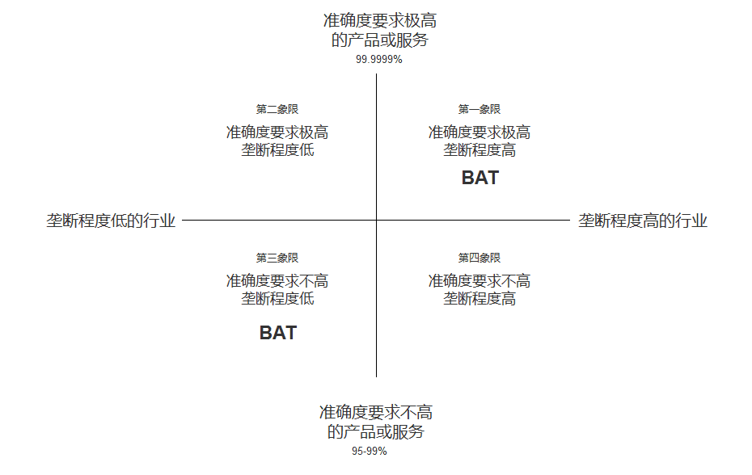

# AI行业分析

## PEST

### 政治/政策

2021年作为新十四五规划开局之年，在新规划建议中，多次提及人工智能这个关键词，而且科技前沿领域的公关，排在第一位的就是“新一代人工智能”[16]

[《新一代人工智能发展规划》](http://www.gov.cn/zhengce/content/2017-07/20/content_5211996.htm)

从数字上,中国在深度学习方面的论文发表数量以及论文的引用(文章至少被引用一次)数量均在2014年对美国实现反超,并大幅度领先其它国家,居于领跑者的地位。[19]

TODO：更多十四五

财政政策：税收政策、财政预算、财政投资、财政补贴。

货币政策：货币供给、利率政策。

### 经济

2020年中国AI产业地图研究报告[23]

### 技术

![人工智能技术场景体系层级划分（2020）[17]](../img/AI_tech_map.png)

[CB Insights调研出2019年人工智能行业25大趋势](http://www.stdaily.com/cxzg80/kejizixun/2019-02/19/content_750862.shtml)

[全球AI基础设施市场规模，现状和预测2021-2026](http://www.etimeweekly.com/2021/03/11/ai%E5%9F%BA%E7%A1%80%E8%AE%BE%E6%96%BD%E5%B8%82%E5%9C%BA2021%E5%B9%B4%E5%85%A8%E7%90%83%E6%B4%9E%E5%AF%9F%E5%8A%9B%E5%92%8C%E4%B8%9A%E5%8A%A1%E5%9C%BA%E6%99%AF-oracle%EF%BC%8Cmicrosoft%EF%BC%8Cintel-c/)

从全球来看，开源开发框架的第一次洗牌已到尾声，谷歌、脸书等头部企业的开发框架体系基本确立，市场份额和社区生态已远超其他框架，我国框架以一己之身突围难度很大。同时，受制于我国集成电路较全球起步晚的历史背景，英伟达、英特尔等芯片大厂已在工艺制程、芯片架构、软件生态等方面有数十年积累；智能计算时期，芯片头部企业针对人工智能任务需求加速优化芯片架构、完善软件工具、适配多样的开发框架，构筑庞大的生态体系不断提高行业壁垒，导致其他初创智能芯片企业一时间难以切入市场进行规模应用。[20]

2021中国AI产业10大趋势，一分钟看明白 | WAIC2021 - 量子位的文章 - 知乎
https://zhuanlan.zhihu.com/p/389611650

#### 2020 AI Hype Cycle

新内容： [4]

1. 健康护照（健康码）
1. 形成性人工智能：一种能够用动态变更对情况作出响应的AI。比如可随时间动态适应的AI，以及可生成新颖的模型来解决特定问题的技术等。
1. 人工智能增强设计
1. 复合人工智能
1. 嵌入式人工智能
1. 生成性人工智能：一种可以创建新颖内容（图像，视频等），或者变更已有内容的AI。新生成的产物跟原始的很像，但不完全相同。这项技术可生成深度伪造的内容，可能会衍生出严重的假信息并带来名誉风险，预计在未来五年内，伪造内容会越来越多。[8]
1. 负责任的人工智能
1. 人工智能增强开发
1. 自我监督学习
1. 小数据
1. 复合型AI

删除： [7]

与去年相比，Gartner将13种技术删除、重新分类或者转移到其他技术曲线中，例如今年Gartner将支持VPA的无线扬声器从所有曲线中删除;AI开发人员工具包现在被分类到AI开发人员和教学工具包类别下;AI PaaS现在属于AI云服务;与AI相关的C&SI服务、AutoML、可解释AI（2020年划归到负责任的AI类别下）、 图形 分析、强化学习移至2020年数据科学和机器学习技术成熟度曲线中;会话式用户界面、 语音识别 、虚拟助理转至2020年自然语言技术成熟度曲线中;量子计算移至2020年计算基础设施技术成熟度曲线中;机器人流程自动化软件从AI技术成熟度曲线中删除。

##### 人工智能工程化（AI Engineering） [5]

Gartner的研究表明，只有53%的项目能够从人工智能（AI）原型转化为生产。首席信息官和IT领导者发现，由于缺乏创建和管理生产级人工智能管道的工具，人工智能项目的扩展难度很大。为了将人工智能转化为生产力，就必须转向人工智能工程化这门专注于各种人工智能操作化和决策模型（例如机器学习或知识图）治理与生命周期管理的学科。

人工智能工程化立足于三大核心支柱：**数据运维、模型运维和开发运维**。强大的人工智能工程化策略将促进人工智能模型的性能、可扩展性、可解释性和可靠性，完全实现人工智能投资的价值。

##### 渐入冷静期

最近两年 AI 的发展其实是呈现一个冷静趋势，非常多的明星企业面临了衰落和倒闭。包括 Anki Vector Robot, 芯片新星 Wave computing 以及吴恩达夫妇投资的 drive.ai，还有大量自动驾驶，头戴式 VR 眼镜和聊天机器人公司，都倒在了上市之前的道路上。从 AI 投资的角度来看，前几年投资人主要关注这个团队有没有明星的科学家，例如有没有图灵奖获得者，有没有大牛存在，然后就更关注算法效果是不是国际领先的，再到这两年，大家更关注的是有没有落地的案例，有没有客户，以及公司的收入如何。[14]

## 市场

### 市场规模

比如，深圳市人工智能行业协会发布的《2019 人工智能产业发展白皮书》中提出：预计到 2020 年，我国人工智能市场规模约 990 亿元。如果你是人工智能行业的产品经理，就可以通过整体的规模来倒推自己产品的规模了。 [9]

据德勤报告预计，2025年世界人工智能市场规模将超过6万亿美元，2017-2025年CAGR达30%；IDC预计2020年中国人工智能市场规模达42.5亿美元，年增长率达51.5%，2023年市场规模达119亿美元。[18]

### 产业格局

![2020 AI [1]](../img/2020_AI.png)

![AI-100-startup-2020[12]](../img/AI-100-startup-2020.png)
![Most-Valuable-AI-Startups-V3[13]](../img/Most-Valuable-AI-Startups-V3.png)

![AI 公司[21]](../img/AI_company.png)
![2021中国AI商业落地百强企业系列榜单[24]](../img/AI_potiential_company.png)

### 发展报告

- [《2019人工智能发展报告》](https://www.aminer.cn/research_report/5de27b53af66005a44822b12)
- [2020年中国AI基础数据服务行业研究报告](http://report.iresearch.cn/report/202004/3548.shtml)
- [赛迪展望 | 一文了解“2021年中国人工智能产业发展趋势”](https://www.ccidgroup.com/info/1105/32595.htm)
- [2020中国AI算力报告](https://finance.sina.com.cn/tech/csj/2020-12-18/doc-iiznctke7174074.shtml)

#### 信息途径

机器之心、量子位 [3]；然后还有易观智库和 QuestMobile 的一些调研报告、https://www.itsiwei.com/category/ai

## 优势：极快、极简

人工智能可以处理人1秒中可以想出答案的问题，这个问题还需要有以下几个特点：大规模，重复性，限定领域，快速反馈。

人工智能产品设计要以操作极度简单为标准，但是前端的简单代表后端的复杂，系统越复杂，才能越智能。

同样，人工智能的发展依赖于产业生态的共同推进，上游芯片提供算力保障，中游人工智能厂商着力研发算法模型，下游应用领域提供落地场景

## 分工 [10]

### 基础设施提供者

基础设施提供者，为整个产品体系提供了计算能力、产品与外界沟通的工具，并通过基础平台实现支撑。比如当前的阿里云、腾讯云、百度智能云，等等AI基础设施平台，我们只需要购买其服务，就可以基于平台现有的软硬件和模型算法，实现企业的个性化AI产品打造。

### 数据提供者

数据提供者是体系的数据来源，为后续的数据处理提供充足的“养料”。比如一些大数据公司、广告公司，他们拥有者丰富的数据资源，在以前这些数据可能只会应用于企业内部的角色分析，但是如今却可以将这些数据进行清洗，为第三方企业提供数据服务，例如数据增补、数据开源、以及数据销售。不过鉴于数据安全，国家政策会在一定程度上限制，但这并不影响人工职能的发展。

### 数据处理者

数据处理者，代表着各种人工智能技术和服务提供商，主要负责智能信息表示与形成、智能推理、智能决策及智能执行与输出等工作。数据处理者，在某个智能领域拥有成熟的解决方案，例如旷世科技（Face ++，致力于图像识别领域）、科大讯飞（强大的智能语音服务商），数据处理者能够帮助第三方快速进行AI产品方案的落地。

### 系统协调者

系统协调者，负责系统的集成、需求的定义、资源的协调、解决方案的封装，以及除研发以外一切可以保障人工智能产品顺利运行和再行业落地所需的工作；系统些调者的主要的目标就是实现AI产品服务的商业化落地，也是保障前三个角色价值落地的根本。

我们从数据流开始说起，人工智能的产品体系是一个动态流程，本质上是围绕数据采集、存储、计算展开的。

1. 数据提供者使用各种手段获得原始数据。
1. 数据处理者对数据进行加工。
1. 数据处理者进行模型训练，获得可以使用对模型。
1. 用模型对新数据进行预测。

“数据–信息–知识–智慧”的过程，再随着动态循环，就是“训练–推断–再训练–再推断”的过程。产品经理需要完成系统集成、需求定义、资源协调、解决方案封装的保障工作。

## BAT

百度A（AI）B(Big data)C(Cloud)战略，阿里腾讯也有各自云服务，大数据中心，人工智能实验室，这些大公司胜在基础架构层、数据量和资本优势上，拥有大量的人工智能科学家，可以持续优化算法，提升算法模型的准确度。

## 准确性

### 需要达到99.9999%

如手术机器人，自动驾驶技术，智慧交通等，这些产品和服务直接关系到人的生死，要求具有极高的准确度，需要AI科学家持续的优化，只有达到近乎百分之百的准确度才会商用。

### 达到99%或者95%就可以

如面部识别，语音机器人，无人机农药喷洒，艺术设计，搜索引擎，精准营销等，这些产品和服务对于精确度要求不高，因为即使不精确也不会直接造成人员伤亡。

## 垄断程度

### 高

行业的垄断程度越高，头部公司的体量越大，最初可能因为缺乏AI技术而采购技术，当技术环境成熟，BAT和google这类公司开源了大量技术后，行业垄断型公司会则会搭建自己的AI团队，搭建自己的大数据，云计算和AI实验室，以运营商行业为例，资源垄断型市场，三家独大，每家都在搭建自己的大数据分析平台，也在搭建自己的人工智能实验室。

### 低

如衣食住行相关的制造业和零售行业，因为分散，他们有需求，但是没有足够体量和资本自己搭建AI团队，所以他们会将AI技术作为一项工具，以合理的价格采购成套服务，来实现+AI的升级。

如同当年的互联网+和+互联网一样，也会演化出AI+和+AI的发展方向。

### 象限图

我认为第一象限因为BAT拥有科学家优势，虽然垄断程度高的企业很有钱，但是因为BAT有数据优势和科学家优势，在这个领域BAT优势明显，可以向企业提供独特的AI服务，提升垄断企业效率，这部分产品需要靠AI科学家驱动。

第三象限虽然技术门槛低，垄断程度低，会出现大量小AI公司进入这个市场，BAT进入这个市场拥有足够的品牌优势，因为市场需求量较大，BAT可以考虑做开放平台，为有垂直领域的AI公司体统底层服务，如果自己来做，这部分服务和产品将是运营和产品来主要驱动。

第二象限暂时来看不太适合进场，第四象限垄断企业会自己组建AI团队来做，我们能看到，手机制造这个还不算垄断的行业中，因为资本实力雄厚，各个厂家已经在组建自己的AI研发团队。

:width:`600px`

## 应用场景[2]

1.场景比较规范，2.需要经验， 3.且数据量大，4.但是反复度高的工作岗位，5.如果监管准入门槛比较低就更好。
1和5可促进快速落地，2、3、4适合深度学习复现场景。

医疗+AI，门槛着重考虑；安防+AI，门槛重在渠道，和海康；无人驾驶，需要规范，市场、大众、政府、产品供应、交通设施等都需要规范。

## 2B

### 民营企业

- 赚更多的钱
- 转型的决心和行动力:只要技术是有用的，可以提升效率或压缩成本的
- 途径：BAT可以考虑在尽可能多民营企业家聚集的场合，推广真实高效的+AI产品和服务

### 国营企业

- 国营企业即承担创造价值的责任，也同时承担着保证国有资产不流失的责任，组织内部员工多是对上级和自己的职位负责，所以创新一定要稳妥
- 用友和亚信等软件开发团队多是长期驻厂，提供运维服务和新需求开发
- 核心诉求是不犯错，未必有功，但求无过

### 创业公司

AIStartups: https://github.com/lipiji/AIStartups

## 上市

截至3月12日，CV四小龙中，旷视和依图2家都中止过上市进程；智能语音领域的云知声在问询后被终止；最烧钱的AI芯片领域短时间难有企业上市；营收稍好的硬件领域，也有优必选等企业折戟IPO。

https://www.jiemian.com/article/5806409.html

从2020年全球知名的AI芯片企业——Wave Computing 公司破产，AI企业再难获得VC亲睐，独立造血不足的情况，第一批AI公司甚至已经开始倒下，现在对于活着的AI来说，能不暴雷已经算是发展行情不错。

最近，东南亚电商平台Shopee 3月份发布的财报坐实，原依图科技CTO颜水成已在2020年末离开，加盟Shopee。而据内部人士消息，格灵深瞳CTO邓亚峰也已经离职。核心高管离职，对拟上市企业无疑是重大打击。

当下的情况是，投了很多资金、寄于厚望的AI独角兽近乎全部折戟上市，也算是投资人继O2O后，又押错的一个时代。强如李开复也在2020年公开承认，“不少AI公司割了投资人的韭菜。”

## 访谈

EE Times：你怎么看这种现象？[15]

Ernst：在很大程度上，这反映了中国加入全球高科技产业创新竞赛时间较晚；此外，我认为很多研发活动仍被局限在官方科研机构，而企业更多扮演“生产者”角色，没有体现出研发与工程能力，在营销与策略规划方面也没有发挥作用。尽管有很多在市场与组织改革方面的努力，中国在强化产业界与学数界之间的知识交流方面，还有一段路要走。

EE Times：然后还有专利政策。

Ernst：事实上， 中国企业现在过于专注在增加专利申请案的数量，一旦获得注册，就似乎不太关注那些专利的状况。更重要的是，在能够达到高引证(citations)的专利识别、开发、维护以及质量的改善方面，缺乏后劲。

中国AI技术的最大挑战
EE Times：所以在你看来，中国的AI技术发展遇到的最大挑战是什么？

Ernst：中国创新体系的分散化突显了中国AI发展的一个基础性困境；在中美贸易战爆发前， 中国AI业者在能够反映他们竞争优势的领域创新，透过当地数量庞大的低人力成本大学毕业生来开采大数据库，专注于在中国快速成长的大众化AI应用市场竞争。中国在国际贸易与全球生产网络的深度融合，提供取得全球知识来源的充足机会，让这种策略成为可行；在某种程度上中国业者能用外国技术，不需要投资内部的基础性与应用研发，就能繁荣成长。但随着美国升高技术出口限制，这些业者要取得相同的收益就越来越困难。

## 项目[22]

首先是项目上，开发的项目要有大幅度的创新，要有预判性。

其次是管理上，需要了解的是开源并不是为了盈利，需要长期维护，即使是有了生态之后，还是要持续投入下去。同时要重视的是，项目有人用才是关键。这一点中国的AI框架还是比较弱，目前我们的下载量是280K，百度 Paddle 是300K，均比TensorFlow少了很多很多。此外，还有许多其他团队开发的库，甚至总下载量都不如国外框架一个小时的下载量。总的来说，如果开源项目没有市场的话，可能刚开始的两年你会很兴奋，但如果没有人用你也坚持不了很久的。

第三，在讲究生态的时代，几个人搞定全部已经不现实了，而且也不可能几个人做一辈子。举个例子，比如TensorLayer，我们也不可能什么都做，我们下一个版本，对于分布式的支持，我们用的是麦络帝国理工那边的Kungfu来实现跨平台兼容，反正都在我们社区可控的范围内就行。

## More:

- https://mattturck.com/data2020/
- 中国人工智能产业发展联盟:http://aiiaorg.cn/
- 中国人工智能产业知识产权白皮书2020：http://www.ai-research.online/#/whitepaper/detail/51
- https://daxueconsulting.com/category/artificial-intelligence-industry-in-china/
- https://www.ulapia.com/reports/search?query=AI
- https://www.iyiou.com/search?p=%E4%BA%BA%E5%B7%A5%E6%99%BA%E8%83%BD
- https://emerj.com/ai-executive-guides/
- IT桔子的工智能创投数据厍：https://www.itjuzi.com/ai
- 人工智能行业研究报告(147份):https://zhuanlan.zhihu.com/p/346793543
- 中國大陸人工智慧大廠發展布局分析:https://books.google.com.sg/books?id=IMX3DwAAQBAJ
[1]: http://www.woshipm.com/pd/873240.html
[2]: https://www.zhihu.com/question/57373956/answer/155398900
[3]: https://blog.csdn.net/Dylan_zhijing/article/details/107548246
[4]: http://www.iotworld.com.cn/html/News/202009/31046f2ae4fd6885.shtml
[5]: https://www.gartner.com/cn/newsroom/press-releases/2021-top-strategic-technologies-cn
[6]: https://www.gartner.com/cn/research/methodologies/gartner-hype-cycle
[7]: https://moore.live/news/247633/detail/
[8]: https://www.gartner.com/cn/information-technology/articles/5-trends-drive-the-gartner-hype-cycle-for-emerging-technologies-2020
[9]: https://www.zhihu.com/pub/reader/119980992/chapter/1284104620428685312
[10]: http://www.changgpm.com/thread-387-1-1.htmls
[11]: http://www.xmamiga.com/3573/
[12]: https://www.cbinsights.com/research/2020-top-100-ai-startups-where-are-they-now/
[13]: https://www.cbinsights.com/research/most-valuable-private-ai-companies/
[14]: https://www.infoq.cn/article/Vw5WdUPVIZd0tVFdgBae
[15]: https://www.eet-china.com/news/202005080936.html
[16]: https://www.weiyangx.com/382066.html
[17]: https://www.weiyangx.com/356538.html
[18]: http://pdf.dfcfw.com/pdf/H3_AP202007081390272095_1.pdf
[19]: https://business.linkedin.com/content/dam/me/business/zh-cn/talent-solutions/Event/july/lts-ai-report/%E9%A2%86%E8%8B%B1%E3%80%8A%E5%85%A8%E7%90%83AI%E9%A2%86%E5%9F%9F%E4%BA%BA%E6%89%8D%E6%8A%A5%E5%91%8A%E3%80%8B.pdf
[20]: https://mp.weixin.qq.com/s/y49r-uKmja6f1oz4ckbMIA?
[21]: http://www.woshipm.com/pmd/2445583.html
[22]: https://www.bilibili.com/read/cv7540974/
[23]: https://www.pianshen.com/article/38211437376/
[24]: https://zhuanlan.zhihu.com/p/389516140
