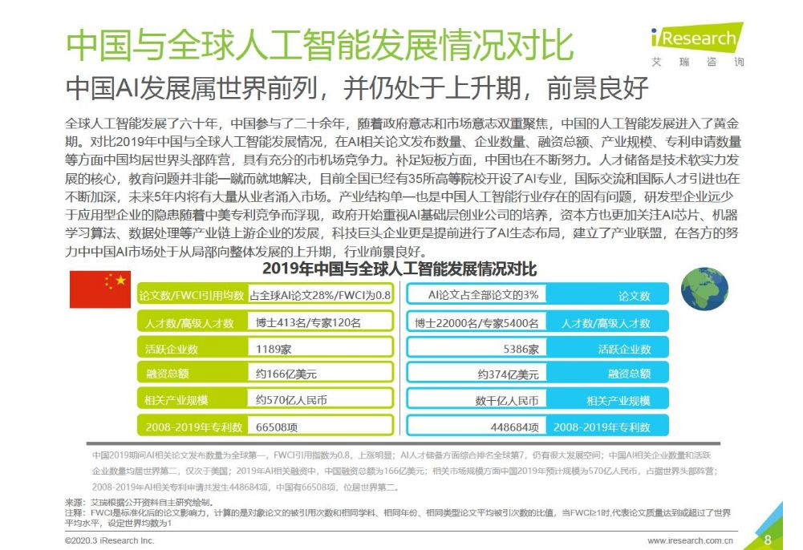
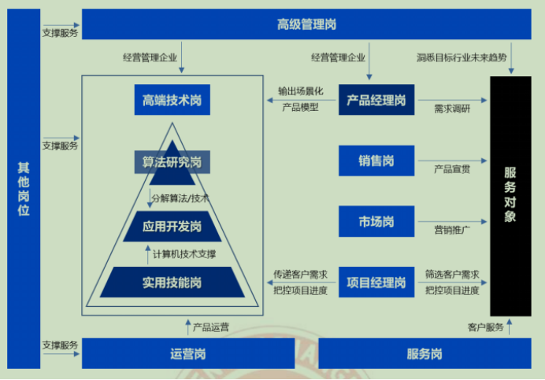

# AI 人才

## 中国

据数据显示，中国的人工智能专利申请数量占全球总量的37.1%，位居全球第一。论文总产出量达到141840篇，位居全球第二。

现阶段中国也是全球人工智能产业投融资最为活跃的国家之一，其中总投融资事件数量占全球的31.7%，投融资资金总额占全球的60%。

虽然我国在专利申请和论文产出方面已经跻身全球领先序列，但人工智能人才短缺问题依旧存在。报告称，我国从事人工智能基础研究的学者仅占全球总量的11%，科研机构仅占5%，仍落后于全球顶尖水平。[1]

## 十大紧缺岗位

在算法研究岗、应用开发岗和实用技能岗这三大岗位类型中，算法研究岗和应用开发岗的学历准入门槛远高于其他岗位。

据报告显示，45.1%的算法研究岗和41.9%的应用开发岗要求应聘人员具有硕士及以上学历；实用技能岗和产品经理岗的准入门槛为本科及以上，相关的岗位占比分别为88.8%和91.8%。

## 人工智能产业人才岗位类型

薪酬方面，学历准入门槛高于其他岗位的算法研究岗和应用开发岗也得到较好体现。据报告显示，目前高达56.5%的算法研究岗和46.1%的应用开发岗的单月薪酬达到35k以上。

[1]: https://tech.sina.com.cn/roll/2020-07-19/doc-iivhvpwx6203309.shtml
