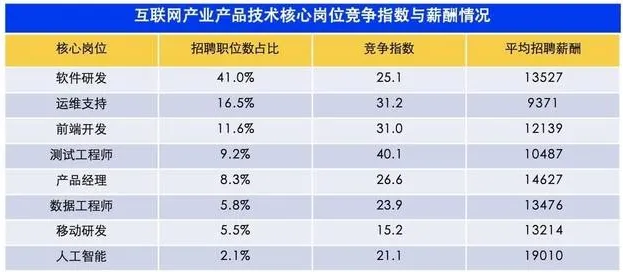

# AI 人才

## 所有人的危机

![所有人的危机[7]](../img/AI_risk.jpg)

## 全球

## 中国

https://zhuanlan.zhihu.com/p/22995382

据数据显示，中国的人工智能专利申请数量占全球总量的37.1%，位居全球第一。论文总产出量达到141840篇，位居全球第二。

现阶段中国也是全球人工智能产业投融资最为活跃的国家之一，其中总投融资事件数量占全球的31.7%，投融资资金总额占全球的60%。

虽然我国在专利申请和论文产出方面已经跻身全球领先序列，但人工智能人才短缺问题依旧存在。报告称，我国从事人工智能基础研究的学者仅占全球总量的11%，科研机构仅占5%，仍落后于全球顶尖水平。[1]

都跟工业界有非常深度的联系。但是高校老师也要分类,有些老师可能适合基础性的研究,有些老师可能适合做产业结合,印奇觉得在中国,真正能把一个技术从研发做到产业化的学校师并没有那么多,很多老师做的还比较偏理论。所以我们也在跟包括清华、北大、西安交大比较好的学校尝试看各种各样的合作。[16]

### 底层研究弱

“越是人工智能上层（算法层、应用层）的研究，我国研究者对世界作出的贡献越多；越是底层（系统层、芯片层），我国研究者的贡献越少。底层研究能力的缺失不仅给我国人工智能基础研究拖后腿，更重要的是，将使得我国智能产业成为一个空中楼阁，走上信息产业受核心芯片和操作系统制约的老路。”

## 十大紧缺岗位

在算法研究岗、应用开发岗和实用技能岗这三大岗位类型中，算法研究岗和应用开发岗的学历准入门槛远高于其他岗位。

据报告显示，45.1%的算法研究岗和41.9%的应用开发岗要求应聘人员具有硕士及以上学历；实用技能岗和产品经理岗的准入门槛为本科及以上，相关的岗位占比分别为88.8%和91.8%。

## 人工智能产业人才岗位类型

薪酬方面，学历准入门槛高于其他岗位的算法研究岗和应用开发岗也得到较好体现。据报告显示，目前高达56.5%的算法研究岗和46.1%的应用开发岗的单月薪酬达到35k以上。

（1）算法研究员、工程师来自各类高校研究生，人工智能浪潮崛起第一波受益人，因为没有产品，从学术研究，从sdk卖起，要的全是算法，价格水涨船高。

（2）后台、前端人才也是来自学校和各类互联网开发的转型，需求也是旺盛，量大，但是可以从各类技术栈不变的情况下迁移一下业务就行了，比如c++继续写c++，换个业务做人脸识别而已，不外乎还是数据的管理、计算、代码效率封装别人sdk之类的，问题不大，迁移成本低，人才很容易就多起来。

（3）产品，如果你的业务还是画画原型，做一下简单的业务功能设计，那从互联网产品经理过来就行了。问题也不大，迁移一下业务而已。但是如果要从事一个专业的行业/领域产品经理，特别是要懂人工智能技术，理解它的能力边界，去开拓应用场景，结合业务和技术，找到权衡点，做出产品，这类产品经理，就是稀缺的。我建议的也是做这类型的产品经理。这类，从学校出来就直接做，也很少，因为需要的能力类型比较丰富。这类的产品经理会去做什么样的产品呢，后面说。

（4）售前销售就不说了。

着重对比下算法和产品经理吧

（1）算法分两种：研究和工程，如果是做研究，那是发论文，出新方法，新方法应用到业务上，让公司业务及产品能力保持领先的，但是就需要超强持续的学习和研究能力。但是这类人，没有多少公司养的起，哪怕大厂，也会把大家拉到业务线去做业务。所以就变成研究+工程。算法工程师呢，专心搞业务模型训练，搞点数据、搞模型，模型训练师而已，谈不上高大上，随着市场上这类能力的人越来越多，加上自动化训练更加成熟，的确没有什么竞争力。所以如果要做算法，肯定就是要深入走研究+工程的道路，单走算法工程，35岁后估计就没人要了吧。

（2）产品经理：就是你要的广度，这个广度，需要了解算法、sdk、工程化、什么容器技术吧、k8s吧，技术架构，然后上面是业务层什么的，然后产品设计、项目管理、然后不同的产品，又有很多有趣的东西，你要研究行业吧，你要研究上下游吧，你要研究产业发展吧。从广度上，满足了你的想象，这也是我喜欢的一个原因，我自己也的确没办法专注到数学研究上，所以转型了。

## 对比其他互联网岗位

## 对比新职业

![对比新职业[5]](../img/talents_new.png)

数据显示，2019年春招旺季人才需求增幅最高的15个职位中，人工智能类占据六席。其中图像识别、语音识别、图像处理等应用层岗位的人才需求增速显著加快，图像识别工程师的人才需求增幅同比高达110.9%。深度学习、机器学习等基础层研究职位人才需求增速低于应用层，但也呈现出了强劲的增长势头。[6]

## 学历要求 [3]

智联招聘的数据显示，人工智能对从业者的技术功底和学习能力最为看重，对本科及以上学历人才要求占比86.3%，其中要求硕士及以上岗位占三成。随着互联网产业越来越依靠数据资产，数据相关技能不光是对数据工程师的要求，也成为人工智能、运维支持等岗位的要求；产品经理虽然不需要对底层数据进行处理，但一定的数据认知与分析能力也成为必备。而在人工智能领域，除了编程算法与数据技能之外，机器学习、深度学习等必备技能，使AI人才在技术竞争中呈现差异化。

## 人工智能岗位的薪酬

除互联网相关行业外，随着新兴技术极大赋能传统行业、工业互联网呈现井喷式发展，生产制造业等第二产业对互联网人才的需求只增不减。据智联招聘2020年大数据显示，仪器仪表及工业自动化与大型设备/机电设备/重工业行业都有很高的AI人才需求，这与它们对人工智能等数字化技术的广泛运用不无关系，例如工业云平台、AI/机器视觉工业应用等。

产业互联网的蓬勃发展也带动技术人才需求水涨船高，招聘需求规模占18.1%。从求职竞争程度看，2020年，互联网产业竞争最激烈的岗位为设计，平均每个招聘职位有32.3份简历竞争，其次是产品，平均每个招聘职位有31.6份简历竞争，至于技术，则是平均28.5人抢一职。

竞争激烈的人工智能岗位使得其薪酬也更集中在高薪区间，智联招聘数据显示，在前十名中占据一半，依次为机器学习（20895元/月）、算法工程师（19944元/月）、深度学习（19431元/月）、自然语言处理（NLP）（18720元/月）与图像算法（18601元/月）。此外，在软件研发中，Golang为“最高薪编程语言”推动“码农”收获17886元/月的平均薪资，语音/视频/图形开发、脚本开发、云计算也成为高薪职类。具体来看招聘职位数最高的20个城市，北京占据近两成，深圳与上海各占10.5%和8.5%。广州虽以4.8%紧随其后，但与成都、杭州接近，仅差0.2个百分点。

## 个人品牌建立

确定自我品牌要求，并从小事开始，为品牌塑造努力。我想得现在还不算太晚，重新审视人生之旅的地图，深思熟虑，定出新的起点并迈出步伐。

### 品牌塑造能力

品牌的本质是什么？是提供差异化的价值：[8]

- 能为别人提供什么价值
- 最擅长的领域是什么
- 跟其他人相比，最具竞争力的特点是什么
- 有没有一种需求，能跟自已的领域建立连接

## 教育理念：

https://cs.stanford.edu/degrees/undergrad/

被Stanford CS的教育理念和课程设计震撼了 ：[17]

- 可以尝试性的选修各个专业方向的引导课程，可以随时换方向，直到找到自己感兴趣的方向，给予学生自由选课的权力
- 课程设计系统成体系，每个专业方向都有详细明确的进阶课程表，让学生知道要学习什么，也知道如何去学习
- 课程内容与时俱进，内容紧贴工业和科研最新成果，作业/项目不是练习，而是确实解决具体问题
- 大量的选修课程，包括邀请学术界，工业界的大拿开设相应的课程，“以学生为中心”，不是受限学校能提供而什么，而是根据学生需要什么
- 所有的课程都在internet上公开，每门课程都有详细的指南：包括参考书籍，教材，作业等，也有大量的TA可以寻求帮助
- 5%的录取率的优秀的同学们，5:1 Student-to-faculty ratio

## 人才素质要求

人工智能时代对人才素质要求的影响首先直接体现在人工智能技术领域，将在技术层面以及在应用层面直接对人才提出硬性技术能力和软性素质能力两方面的更高要求。在技术的研发上，随着未来人工智能技术发展到一定阶段，企业可能会产生对掌握更高阶技术人才的需求，潜在方向包括机器人培训与监督、机器人外形设计、机器人性格设计等技术能力，这类顶尖的技术人才往往有过硬的学术背景与科研实力，大多拥有计算机科学（Computer Science）或者电气工程学（Electrical Engineering）等专业科学学科的博士学位。而在技术的应用上，企业将需要更多既掌握技术能力又具有良好软性素质能力的复合型人才。这类人才应具备交叉学科背景及综合能力，如同时有能力搭建计算机程序和商业模型；同时，他们还需要快速学习能力以理解商业逻辑，更需要跨界合作能力与各方沟通洽谈，从而真正将人工智能技术落地为各行业的具体应用。 [9]

人工智能产业人才岗位能力要求[15]

![AI时代通用人才[14]](../img/AI_universal_talents.png)

《AI技术人才成长路线图》
https://blog.csdn.net/zw0Pi8G5C1x/article/details/79947077

## 教育背景

全球A从业者普遍拥有较高的学历水平,但在中国,这个数字明显更高一筹。在中美AI从业人才的学历对比方面,中国在研究生及以上学历的人才占比为62.1%,高于美国的56.5%。 [16]

## 工作地点

为什么这么多关于中国目前在主导人工智能的说法，但多数领先的AI研究人员和中心都在美国、英国或加拿大？ - 北纬78度氧气的回答 - 知乎
https://www.zhihu.com/question/331115371/answer/726146969

## 学历和工作经验要求

在学历和技能方面，《目录》显示，大部分岗位要求本科及以上学历，也有 9% 的企业岗位招聘专科人才。除了学历背景，数字经济六大重点领域对于人才的通用能力也存在多元需求，有 44% 的企业要求熟练掌握外语语种，22% 的企业要求应聘者精通计算机。

在从业经验方面，近四成的企业倾向于招收 3-5 年工作经验的求职者。同时，也有 9% 的岗位表示接受应届毕业生，企业愿意利用自身较为完善的人才培养体系帮助紧缺专业人才完成从高校到岗位的转化。[13]

## 人才培养模型

如何看待 CMU 新开设的 AI 专业？ - 知乎
https://www.zhihu.com/question/277026400

卡内基梅隆大学将于2018Fall开设美国第一个人工智能本科专业.本人2018Fall入学，将于大二前决定专业.请帮忙分析AI专业的利弊，如：专业是否学的到东西，课程是否合理，就业前景等等. 如果可能，请与其他专业进行比较.谢谢.

链接：https://www.cs.cmu.edu/overview-pro

CMU官网介绍的人工智能专业课程群。简单来说，三组核心课程分别是“数学和统计”（math and statistics）、“计算机”（computer science）、“人工智能”(AI)，此外还有ethics、humanities and arts、science and engineering等课程簇。

https://www.cs.cmu.edu/bs-in-artificial-intelligence/curriculum

MIT：https://exploredegrees.stanford.edu/schoolofengineering/#majorstext

人工智能技术服务专业（专业代码：610217），是 2019 年增补专业，主要面向人工智能产业及其应用相关的企事业单位，在人工智能技术应用开发、系统运维、产品营销、技术支持等岗位群，咶从事人工智能应用产品开发与测试、数据处理、系统运维、产品营销、技术支持等工作。

2019年3月教育部公布了《2018年度普通高等学校本科专业备案和审批结果的通知》，人工智能被列入新增审批本科专业名单，全国共有35所高校获首批建设资格。这35所高校分别是：北京科技大学、上海交通大学、厦门大学、电子科技大学、北京交通大学、同济大学、山东大学、西南交通大学、天津大学、南京大学、武汉理工大学、西安交通大学、东北大学、东南大学、四川大学、西安电子科技大学、大连理工大学、南京农业大学、重庆大学、兰州大学、吉林大学、浙江大学、北京航空航天大学、北京理工大学、哈尔滨工业大学、西北工业大学、中北大学、长春师范大学、南京信息工程大学、江苏科技大学、安徽工程大学、江西理工大学、中原工学院、湖南工程学院、华南师范大学。

2020年2月教育部公布《2019年度普通高等学校本科专业备案和审批结果》，新增人工智能专业的高校达180所。从学校数量来看，北京、江苏、山东、四川的新增院校较多；从学校层次来看，近两年新增人工智能本科专业的院校既有北京航天航空大学、北京理工大学、哈尔滨工业大学、浙江大学、南京大学、上海交通大学、复旦大学、同济大学、武汉大学等传统老牌名校，也有如安徽信息工程学院、泉州信息工程学院、东华理工大学等普通院校，共同推进人工智能基础研究型人才和应用型人才的培养。[12]

AI 方向PhD MSU和USYD？ - 知乎
https://www.zhihu.com/question/298222388

## 招聘

https://www.bilibili.com/video/BV1Mb4y1D7Q2?from=search&seid=5263016510491773061

## 人数

当今涉猎人工智能的IT 巨头本身几乎就只雇佣很少量的工人。2017年资本总市值高居全球第一的苹果公司, 全球员工数量 仅10万余人; 以阿尔法狗 (AlphaGo) 系列程序惊艳世界的谷歌公司, 员工总数不到8万; 用AI理 念制造无人驾驶汽车的特斯拉公司, 全球员工仅3万多人; 已研发出绘图机器人的微软公司全部员 工为11万多人, 且近些年因公司调整方向一直裁员不断。[18]

## 薪酬报告

科锐的薪酬报告（鉴于猎头公司的报告一般工资虚高）、robertwalters的薪酬报告、mercer之类的报告 [10]

## 雇主

![中美AI领域TOP10雇主[16]](../img/Chinese_VS_American_AI_employer.jpg)

中国本土科技巨头正在不断提升对A人才的吸引力。目前在中国A人才最集中的前十大企业雇主中,中国本土企业有5家,占据了半壁江山。而排在前三位的雇主分别是华为度和阿里巴巴,均为中国本土高科技巨头企业。

通过对比榜单,我们不难发现,在美国的τOP10榜单中,有两家金融机构上榜,分别是排在第9位和第10位的美国银行和美国富国银行。在美国,Fin-Tech已经成为趋势并形成规模,金融智能化进程全球领先。

《科技创新2030—“新一代人工智能”重大项目2020年度项目申报指南的通知》https://www.sohu.com/a/384455741_353595

关于组织申报2020～2021年度广东省重点领域研发计划“新一代人工智能”重大专项项目的通知
http://www.texungroup.com/news_view.aspx?nid=2&typeid=145&id=703

AI大赛：https://naic.pcl.ac.cn/homepage/index.html

“新一代人工智能”重大项目2020年度项目启动申报：
http://www.cbdio.com/BigData/2020-03/31/content_6155357.htm

2020中国计算机视觉人才调研报告：算法岗年薪三十多万，超六成企业急需AI产品经理 - 机器之心的文章 - 知乎
https://zhuanlan.zhihu.com/p/352546641

[1]: https://tech.sina.com.cn/roll/2020-07-19/doc-iivhvpwx6203309.shtml
[2]: https://www.zhihu.com/question/268511088/answer/1226892127
[3]: http://finance.southcn.com/f/2021-03/05/content_192173681.htm
[4]: https://www.talentseer.com/2020-ai-talent-report-chinese-version
[5]: https://my.oschina.net/u/3861898/blog/4405417
[6]: http://www.kejilie.com/lanjingtmt/article/rUVjeu.html
[7]: https://www.slideshare.net/Happy.Prototyper/mix2018ai-ai-vp
[8]: http://www.xmamiga.com/372/
[9]: https://www.financialnews.com.cn/hq/yw/201804/P020180412355549093101.pdf
[10]: https://www.zhihu.com/question/63188172/answer/515405404
[11]: https://www.080910t.com/2020/01/28/artificial-intelligence-technology-service-610217-learning-path/
[12]: https://shimo.im/docs/ryYGVtYQvPGGdHjG/read
[13]: https://www.infoq.cn/article/0d349rm8zninvibeksdd
[14]: http://www.woshipm.com/zhichang/3146016.html
[15]: https://www.miitec.cn/home/index/detail?id=2252
[16]: https://business.linkedin.com/content/dam/me/business/zh-cn/talent-solutions/Event/july/lts-ai-report/%E9%A2%86%E8%8B%B1%E3%80%8A%E5%85%A8%E7%90%83AI%E9%A2%86%E5%9F%9F%E4%BA%BA%E6%89%8D%E6%8A%A5%E5%91%8A%E3%80%8B.pdf
[17]: https://github.com/wangwh0204/blog/blob/7a3db02bcebf0c42880516daa49980fec919622b/source/_posts/2015-12-15-my-think-about-career-specialization-rwc.md
[18]:
