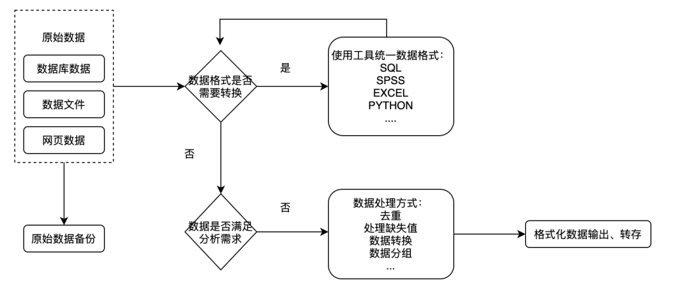
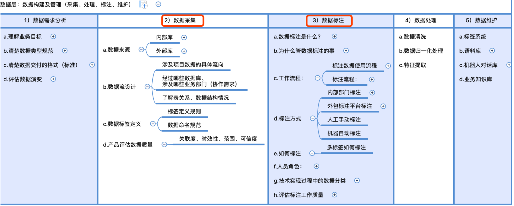

# 数据处理流程拆解

AI开发项目与数据相关的流程大概有以下

注意：一般在数据未产生且亦可通过程序自动标注的情况：数据采集和数据标注合并需求方案会在一起定义输出文档给研发同事。[3]

一般的项目数据相关的工作内容包含：从数据的构建到数据标注到后期维护管理等。如下图，罗列关于产品经理需要了解的数据相关认知，但AI产品经理入门，侧重点在数据采集、数据标注、数据维护。（下图建议在网页版打开）

## 数据工作 [2]

数据准备可以分为3个阶段，数据来源—数据定义—数据交付，在这3个阶段中，需要AI产品经理具备规划、收集、整理数据的能力。在数据准备的过程中，我们可以根据不同阶段考虑以下问题。

### 数据来源

- 数据源。数据源在哪？这些数据是否存在不同的地方，以及如何进行关联？
- 数据规模。数据是否能够或足够进行建模，有多少数据来描述这个场景？
- 数据更新。数据是怎么更新的？这些数据的维度是什么？

### 数据定义

- 数据清洗。用什么样的方法清洗和整理数据？
- 输入和输出。设置什么样的“输入”和“输出”，能够保证测试集训练出来的机器能更好地运用在实际场景中？
- 数据标注。如何更迅速高效地标注数据？不同的输入方式之间有什么层级关系？我们应该用什么形式来展现这些层级关系？

### 数据交付

在产品的实际交互中，应记录哪些数据？
用什么样的形式提供数据？
如何使用数据，通过接口或是批量推送？

获取正确数据的过程并非我们想象中那么简单，因为不同团队对于数据的维护程度是不一样的，在获取正确数据的过程中，沟通成本是非常高的，在AI产品构建过程中，除了业务场景的调研，数据的准备环节也是很重要的，因为数据是AI产品设计的基础，所有的工作自始至终都是围绕数据展开的。

## 数据处理流程拆解

![数据处理[4]](../img/data_process.png)

一、数据标注[5]

数据的质量直接会影响到模型的质量，因此数据标注在整个流程中绝对是非要重要的一点。

1、一般来说，数据标注部分可以有三个角色

- 标注员：标注员负责标记数据。
- 审核员：审核员负责审核被标记数据的质量。
- 管理员：管理人员、发放任务、统计工资。

只有在数据被审核员审核通过后，这批数据才能够被算法同事利用。

2、数据标记流程

任务分配：假设标注员每次标记的数据为一次任务，则每次任务可由管理员分批发放记录，也可将整个流程做成“抢单式”的，由后台直接分发。

标记程序设计：需要考虑到如何提升效率，比如快捷键的设置、边标记及边存等等功能都有利于提高标记效率。

进度跟踪：程序对标注员、审核员的工作分别进行跟踪，可利用“规定截止日期”的方式淘汰怠惰的人。

质量跟踪：通过计算标注人员的标注正确率和被审核通过率，对人员标注质量进行跟踪，可利用“末位淘汰”制提高标注人员质量。

而且，模型的效果，需要在这两个指标之间达到一个平衡。

测试同事需要关注特定领域内每个类别的指标，比如针对识别人脸的表情，里面有喜怒哀乐等分类，每一个分类对应的指标都是不一样的。测试同事需要将测试的结果完善地反馈给算法同事，算法同事才能找准模型效果欠缺的原因。同时，测试同事将本次模型的指标结果反馈给产品，由产品评估是否满足上线需求。

2、数据标记流程

1. 任务分配：假设标注员每次标记的数据为一次任务，则每次任务可由管理员分批发放记录，也可将整个流程做成“抢单式”的，由后台直接分发。
1. 标记程序设计：需要考虑到如何提升效率，比如快捷键的设置、边标记及边存等等功能都有利于提高标记效率。
1. 进度跟踪：程序对标注员、审核员的工作分别进行跟踪，可利用“规定截止日期”的方式淘汰怠惰的人。
1. 质量跟踪：通过计算标注人员的标注正确率和被审核通过率，对人员标注质量进行跟踪，可利用“末位淘汰”制提高标注人员质量。

对于众包平台来讲，国外首选亚马逊众包平台，ImageNet就是通过这个平台进行标注的。而国内也有百度众包、京东众智、龙猫数据等众包平台可供选择。

二、模型训练

这部分基本交由算法同事跟进，但产品可依据需求，向算法同事提出需要注意的方面；

举个栗子：

背景：一个识别车辆的产品对大众车某系列的识别效果非常不理想，经过跟踪发现，是因为该车系和另外一个品牌的车型十分相似。那么，为了达到某个目标（比如，将精确率提高5%），可以采用的方式包括：

补充数据：针对大众车系的数据做补充。值得注意的是，不仅是补充正例（“XXX”应该被识别为该大众车系），还可以提供负例（“XXX”不应该被识别为该大众车系），这样可以提高差异度的识别。

优化数据：修改大批以往的错误标注。

产品将具体的需求给到算法工程师，能避免无目的性、无针对性、无紧急程度的工作。

三、模型测试

测试同事（一般来说算法同事也会直接负责模型测试）将未被训练过的数据在新的模型下做测试。

如果没有后台设计，测试结果只能由人工抽样计算，抽样计算繁琐且效率较低。因此可以考虑由后台计算。

一般来说模型测试至少需要关注两个指标：

精确率：识别为正确的样本数/识别出来的样本数

召回率：识别为正确的样本数/所有样本中正确的数

举个栗子：全班一共30名男生、20名女生。需要机器识别出男生的数量。本次机器一共识别出20名目标对象，其中18名为男性，2名为女性。则

精确率=18/（18+2）=0.9

召回率=18/30=0.6

再补充一个图来解释：

四、产品评估

“评估模型是否满足上线需求”是产品必须关注的，一旦上线会影响到客户的使用感。

因此，在模型上线之前，产品需反复验证模型效果。为了用数据对比本模型和上一个模型的优劣，需要每次都记录好指标数据。

假设本次模型主要是为了优化领域内其中一类的指标，在关注目的的同时，产品还需同时注意检测其他类别的效果，以免漏洞产生。

[1]: https://www.36kr.com/p/1721868828673
[2]: https://weread.qq.com/web/reader/40632860719ad5bb4060856ka1d32a6022aa1d0c6e83eb4
[3]: https://shimo.im/docs/jxCw6W6XrGqwkqwd/read
[4]: http://sjrzld.com/a/AI0273.html
[5]: https://zhuanlan.zhihu.com/p/30646657
