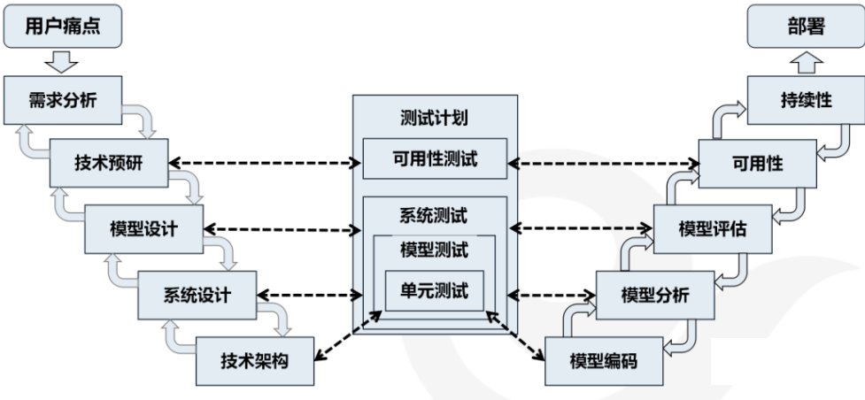
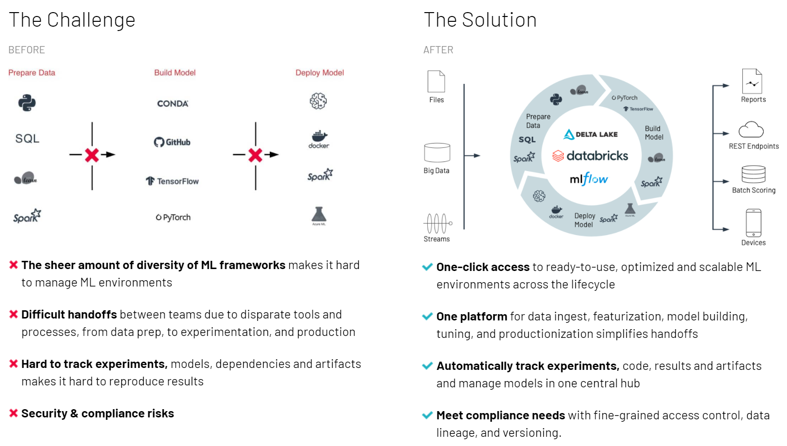
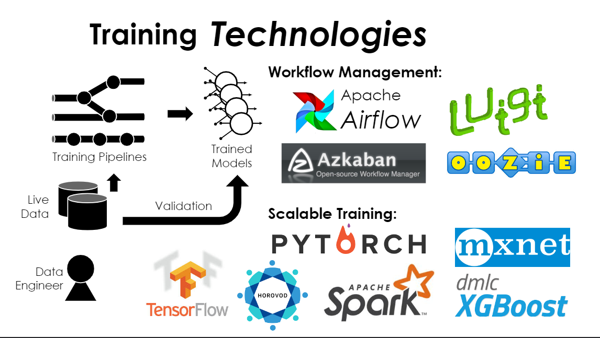

# 模型过程

## 整体框架

## 生命周期 [1]

## 模型开发

数据收集-》数据清理&可视化

需要数据工程师来帮助：

- 识别数据的潜在来源
- 从多个来源连接数据
- 定位缺失值和异常值
- 绘制趋势以识别异常

—》特征工程&模型设计-》训练&评估

数据科学家为此而生：

- 构建信息丰富的特性
- 功能设计新的模型架构
- 重新调整超参数
- 验证预测准确性

### 特征和特征工程

特征:输入的属性或特征

为什么从模型开发中直接生成训练有素的模型是一个坏主意

为了解决新问题，正在构建模型

- 需要跟踪组合和验证端到端的准确性。
- 需要对模型进行单元和集成测试

TODO:

Dynamic Features: features can often be modified faster than models：

- Useful for addressing fast changing dynamics (e.g., user preferences can be encoded in click history features).
- Issue:resulting potential covariate shift can be problematic

### 超参数

参数和更普遍的配置细节不是通过培训直接确定的

- 手动设置或使用交叉验证进行调整
- 为什么不直接学习?

###

Training Pipelines -> Code
Trained Models -> Binaries

### 训练科技

## 推断

目的:在深度神经复杂的突发运行下在~10ms内进行预测

### 并包括反馈

1. 模型更新:当新数据来重新培训。

- **周期性**:权衡利用批处理和验证。因为模型可能会过期一段时间。
- **持续地(在线学习)**:最新鲜的模型。需要验证，学习率?…非常复杂。

2. 特征更新:新数据可能会改变特征

- 例如:更新用户的点击历史-》新预测
- 比在线学习更健壮

新的训练数据到达并改变损失面。而不是从以前的解的随机权重开始重新开始

### 反馈圈

Models can bias the data they collect

- Example: content recommendation
- Future models may reflect earlier model bias

Exploration –Exploitation Trade-off

- Exploration:observe diverse outcomes
- Exploitation:leverage model to takepredicted best action

Solutions：

- Randomization (ε-greedy): occasionally ignore the model
- Bandit Algorithms/Thompson Sampling: optimally balance exploration and exploitation àactive area of research

[1]: https://ucbrise.github.io/cs294-ai-sys-fa19/assets/lectures/lec03/03_ml-lifecycle.pdf
[2]: http://shujuren.club/a/AI0102.html
