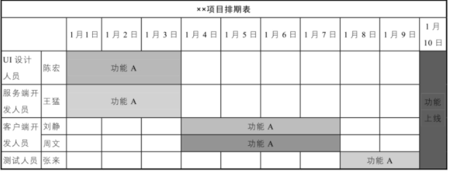
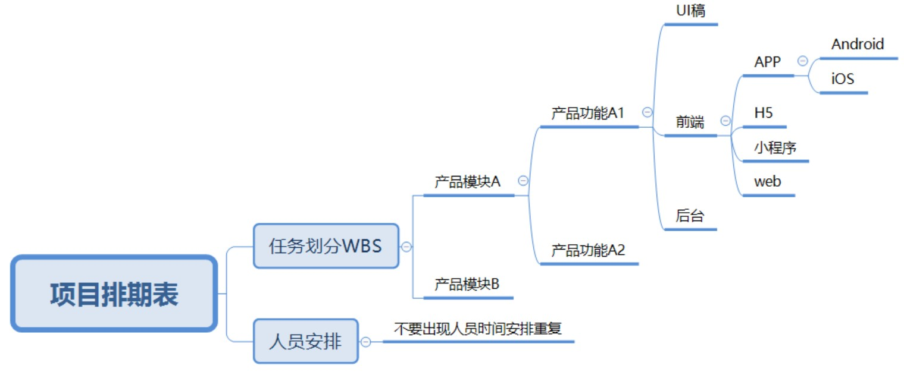

# Scrum

## 瀑布式（Waterfall）开发

瀑布式（Waterfall）开发：概念设计>>设计>>编程>>测试修正 [1]

## 问题 [14]

- 不清楚用户在哪里：这是利用传统产品开发方法创业失败最核心的原因，缺少用户和有效的商业模式；
- 过分强调产品的发布时间：这个时间只是意味着开发结束的时间，而并不意味着充分掌握用户信息，也并不意味着团队知道如何开展市场营销活动，还没有知道用户以及市场在哪里就盲目地推出产品，这样做完全是本末倒置；
- 过分强调执行，忽略探索和学习：由于创业公司总是强调要快速完成任务，所以团队只要按部就班地运用已有的营销知识和销售技巧，保持以往的工作即可，无须学习新知识，而创业过程面临无数的新问题就是需要不断地学习和探索才能找到答案；
- 市场营销活动和销售工作缺乏明确目标：产品开发的优点是具有明确定义的目标，各个阶段界限分明，但是营销和销售的情况却往往不一样，是混乱的，围绕着各种可量化的任务进行执行，而忽略了其真正要探寻的问题，即：理解用户需求，发现用户购买产品的规律、利用合理的商业模式获取利润；
- 用产品开发的方法指导销售：流程是（愿景→产品开发→大量招聘销售人员→组建销售部门），这个策略的假设在于，一旦开发完成，产品就会有生意，但实际上多数情况下会事与愿违；
- 用产品开发的方法指导市场营销：流程是（愿景→产品开发→市场公关早期营销→品牌推广创造需求），所有的这些都发生在用户的消费行为之前，产品定位、营销策略、需求创造都没有经过实际的市场检验，即产品发布之后才能知道营销策略的有效性，团队无异于失控的火车一样撞向终点，没有任何机制可以让它暂停接受检修；
- 仓促扩张：通常，公司高层决定扩大经营规模的依据有三个，即产品开发方法、商业计划、预期收益，但这些依据的前提都是基于产品一旦会成功。还是缺少“停车检修”的机制；
- 恶性循环：仓促扩张会直接诱发公司陷入恶性循环，同时加快恶化速度，这些扩张的支出加速消耗公司的现金流，但致命的是团队对市场和用户还是知之甚少，处于业绩的压力下不断更换策略，但仍然没有停下来反思，反而加快烧钱的速度希望事情有所转机；
- 忽视市场类型的影响：常见的市场类型有现有市场（开发市场上已有的产品）、全新市场（开发全新产品，开拓全新市场）、细分市场（开发改良产品，进一步细分现有市场），面对不同类型的市场，用户对产品的接受程度和接受时间完全不同（跨越鸿沟），所以营销策略以及销售策略大相径庭，因而维持公司经营所需的现金流也不同；
- 好高骛远：创业公司如果采用传统的产品开发方法（瀑式），一两年就会出现致命的问题，因为他们抱有不切实际的期望，即用产品开发方法指导与产品开发无关的经营活动(如寻找市场、发掘用户、制定商业模式)、用户数量会随着产品开发的进度自动增长、只要产品发布上市就会被用户接受。除了三条外，投资者以及公司高层的压力也会起到推波助澜的作用，同时创业者往往会夸大市场份额和业务前景并故意忽略市场类型。

迭代周期可能短到一周，但分析、设计、编码、集成和测试等开发阶段一应俱全。而在采用瀑布开发的项目中，单个阶段也许就得花费数年时间。
与瀑布模式相比，敏捷放弃了从开始到结束控制项目形态的总体计划和规范，而选择了许多中途修正。

## 动因

来自于市场的压力（逼迫我们用更少的成本来制作更符合真实客户需求的软件）

用Scrum的开发模式小步快跑，可以以速度最快、最经济的方式逐步加入满足消费者的功能，明确用户价值。

瀑布式开发的致命症结就在于它的预先设计（BDUFs，Big Design Up-Front）无法完全清晰，并且变更成本巨大

## 敏捷软体开发宣言

- 个人与互动 重于流程与工具
- 可用的软体 重于详尽的文件
- 与客户合作 重于合约协商 
- 回应变化 重于遵循计划 

也就是说，虽然右侧项目有其价值，但我们更重视左侧项目。 [10]

## Scrum流程

在发布产品获得用户反馈后才正式开始——由真实用户反馈影响需求规划、产品迭代的“小步快跑”方式，才是Scrum的精髓所在

### 发布产品

营销推广模型，源自《用图秀演讲》：

背景介绍、描述阻碍、点燃希望、震撼登场、展现价值、精雕细琢、给出诱惑。 [7]

### 产品Backlog

最顶端的核心需求拆分成同样颗粒度大小的需求——这样才能准确估计工作量——然后把需求排入版本中。

### User Story

随着讨论和了解的细节增多，能够浮现出更多关于产品设计的细节和场景，也便越能进一步准确估算每个需求的工作量——不确定的特性是无法精确估算难度的。

### Sprint

固定的时间限，大约2~4周，每个版本产出功能性的垂直切片，他们各自就像一个个小型项目

### Release

进入到准上市状态，这称作一次发布。一个典型的发布需要经历2~4个月，节奏类似于一个经典项目中的里程碑。

### 监控产品

产品回顾会 《敏捷回顾：团队从优秀到卓越之道》

罗伯特议事原则

六顶思考帽： [7]

- 白色：客观而中立、数据:ref:`data_analysis`和事实
- 绿色：创造力和想象力
- 黄色：价值和肯定、乐观、建设性
- 黑色：否定、怀疑、批判
- 红色：表达情绪、直觉、预感
- 蓝色：控制和调节思维过程，用来控制其他思考帽的使用顺序，规划和负责整个思考过程，给出结论。

## 步骤

1. 通过创建需求池项目，进行对产品Backlog（需求列表）的管理。
1. 建立发布计划和Sprint迭代计划，清晰地区分阶段性目标。
1. 把需求排入相应的版本中，进行对发布计划和迭代的任务管理。

### 好的Product Backlog

好的Product Backlog应该具备以下特性DEEP: [11]

1. 适当详细：Detailed appropriately，意思就是在Backlog 的Item 并不是每个内容都有仔细地描述，在每次Sprint Meeting 之前，笔者建议采用八二法则，只要共20% 的有详细描述即可(意即到开发团队可以拆解出Task地步)，其他80% 只要有大概的叙述即可(因为未来的变动)，通常这样的数量对于开发团队已经足够。
2. 估算过的：Estimated，代表撰写的Item 有询问过相关人等去估算该Item 大约要花多少的时间与成本完成，同时也估算重要性质，以利优先顺序的排列。
3. 持续更新：Emergent (虽然中文跟英文不太一样，但认为翻译持续更新比较能表达Emergent的意思)，要一直持续的更新Item内容，去因应每周甚至每日所接受到最新的需求，这样交付下去的Item才会跟最终客户期待的产品认知不会落差太大。
4. 优先顺序：Prioritized，产品负责人必须要去考虑如何安排Item 的优先顺序，必须要从不同的方向考量，包含商业价值、成本、和其他利害关系人的因素。

## XP核心实践

1. 团队协作：通过客户、开发团队、项目经理三方共同参加的会议来确定开发计划。
1. 规划策略： 计划是持续的、循序渐进的。每2周，开发人员就为下2周估算候选特性的成本，而客户则根据成本和商务价值来选择要实现的特性。
1. 结对编程：系统的每一行代码都是两个人用一个键盘完成的。
1. 测试驱动开发：先写测试，后写代码。
1. 重构：不断优化系统设计，使之保持简单。
1. 简单设计：为明确的功能进行最优的设计，不考虑未来可能需要的功能。
1. 代码集体所有权：开发队伍中任何人可以修改任何其他人的代码，代码不属于某个个人。
1. 持续集成：至少每天将整个系统集成一次，保持一个能运转的系统。
1. 客户测试：客户自己也是软件开发队伍的重要一份子。
1. 小版本发布：尽快发布，尽早发布。
1. 每周40小时工作制：保证休息，保持体力。
1. 编码标准：必须有统一的编码规范，确保代码的可读性。
1. 系统隐喻：将整个系统联系在一起的全局视图；它是系统的未来影像，是它使得所有单独模块的位置和外观变得明显直观。如果模块的外观与整个隐喻不符，那么你就知道该模块是错误的。 [9]

## 角色

### Product Owner

负责明确目标、提出需求并排出优先级

### Scrum Master

项目经理一般也是版本负责人，他会控制需求变更、增加需求的数量，提前预告风险，以及明确版本交付质量。

PM必须提醒大家每个版本都是产品的垂直切片，不能推迟到下一个版本才修复上个版本的bug和资源。

### Team

Scrum相关著述推荐团队有7~9个成员（Schwaber 2004

将大团队拆分成多个小型Scrum团队负责某个模块，比如关卡原型制作团队。每个敏捷团队都包含所有职能的开发人员，设计、开发、测试等，他们共同为团队的产品交付物负责。

## 每日站会

一种有效的方法是让每个将要构建系统的人都在一个房间里，并让团队对每个项目的难度、人数和影响形成一致的估计。然后，您可以创建一个影响和易用性图表，根据投资回报对每个项目进行排序，并相应地进行优先级排序。在现实中，确定优先级是一个混乱和不稳定的过程，因为项目经常有依赖性，面临人员限制或与其他涉众截止日期的冲突。为了与其他团队或优先级保持一致，经常需要减少范围或牺牲质量。

目的：

1. 让所有团队成员统一步调，一起向着“完成Sprint”的目标进发；
1. 承诺第二天要完成的工作，并重申团队对Sprint目标的承诺；
1. 识别出团队面临的所有障碍；
1. 使团队成员成为“一条绳子上的蚂蚱“，每个人都需要了解其它人面临的困难，以便在会后找到解决方法。

Q：为什么一定要是”站“会呢？

A：因为要通过站立的形式让大家明确，这是一个需要快速解决的短会，而非冗长艰苦的会议。

## 反馈

销售，服务环节，运营环节，甚至公司团队成员本身，在ONES系统上我们可以用反馈池进行详尽记录：

## 敏捷开发 [2]

把一个大的产品功能模块拆解为多个相互独立的小功能模块，每次只上线一部分功能，在保证产品可用的前提下，一步步迭代完成整个功能的上线，这种方式就叫敏捷开发。 [4]

例如，一款新的电商App要做一个购物车功能，第一个版本上线最基础的商品结算功能，第二个版本上线移除商品功能，第三个版本上线降价商品提醒功能等，不要在一次迭代中把所有的功能都做完。

### 宣言

- 个体和交互胜过过程和工具。
- 可以工作的软件胜过面面俱到的文档。
- 客户合作胜过合同谈判。
- 响应变化胜过遵循计划。

### 计划

- 任何过大的素材都应该被分解成小一点的部分，任何过小素材都应该和其它小的素材合并。
- 如果知道了开发速度，客户就能够对每个素材的成本有所了解。
- 迭代期间用户素材的实现顺序属于技术决策范畴。
- 一旦迭代开始，客户就不能改变该迭代期内需要实现的素材。

### 测试

编写单元测试是一种验证行为，更是一种设计行为。同样，它更是一种编写文档的行为。编写单元测试避免了相当数量的反馈循环，尤其是功能验证方面的反馈循环。

首先编写测试可以：

- 程序中的每一项功能都有测试来验证它的操作的正确性。
- 迫使我们使用不同的观察点。
- 迫使自己把程序设计为可测试的，从而迫使我们解除软件中的耦合。（forces us to decouple the software）
- 作为一种无价的文档形式。

### 重构

每一个软件模块都有三个职责：

1. 它运行起来所完成的功能。
1. 它要应对变化。
1. 要和阅读它的人进行沟通。

## 项目看板

看板方法源自丰田的“及时生产”JIT=just-in-time）系统。

项目看板清晰地展示了：需求池中的哪些功能待开发；哪些功能进入UI设计阶段；哪些需求在开发阶段；哪些需求在测试阶段；哪些需求已经上线；哪些需求需要延期等。项目看板可以明确哪类问题需要谁去跟进，从而保证项目按照项目排期表稳步推进

看板方法可以动态显示瓶颈：你之所以能找到这些瓶颈，是因为限制了在制品（work-in-progress, WIP）的数量会显示出瓶颈。

卡片代表了工作项，列代表了开发工序，卡片会从第一步工序流动到最后一步。每一列顶部的数字用来限制每一列最多允许放置卡片的数量。

一些列分割成了两列，这是为了用来说明正在进行中的项与哪些已经完成并准备好被下游工序拉走的项。

### 项目排期表

项目排期表为了保证项目按时上线，会使用项目排期表确定每个参与者的具体工作内容及起止时间。

项目排期表示例如图所示。

## 敏捷产品 [5]

对于产品小团体交付给设计小团体前，我们要做需求、方案、原型三个方面的敏捷冲刺

1. 需求敏捷
1. 方案敏捷
1. 原型敏捷

### 需求敏捷

所有公司都用专门的问题反馈线：

客户->Customer Service->Support Engineer->PM->SDM->SDE

## 算法的敏捷迭代

深度学习算法在一定程度上比较难针对badcase（误杀或者漏杀）进行快速的迭代，这样的情况下，一方面可以通过产品功能上进行补充（黑白样本库），一方面目前学界逐步在解决小样本场景，部分业务场景已经在小样本上有可工程化的应用。

敏捷开发不再追求 MVP（Minimum Viable Product，即最小化可行产品），而是追求 MDP（Minimum Data Product），指训练算法的一个迭代所用的最小化数据集。 [13]

### 更多

2020 Scrum Guide（含中英文版）[Download](http://www.shinescrum.com/downloads/Scrum%E6%8C%87%E5%8D%972020%E4%B8%AD%E8%8B%B1%E6%96%87%E7%89%88.zip)

[中国式敏捷](https://gitbook.cn/gitchat/geekbook/5c73a5c56203c926b7ba8cc1)

[1]: https://ones-ai.gitbooks.io/ones-ai
[2]: https://www.jianshu.com/p/e53974f9cbc9
[3]: https://weread.qq.com/web/reader/8d232b60721a488e8d21e54k8f132430178f14e45fce0f7
[4]: https://weread.qq.com/web/reader/8d232b60721a488e8d21e54kc51323901dc51ce410c121b
[5]: https://zhiya360.com/135801.html
[6]: https://www.oreilly.com/radar/what-you-need-to-know-about-product-management-for-ai/
[7]: https://www.yinxiang.com/everhub/note/f9ab87ee-73e6-4241-9428-9507cbfd007f
[8]: https://www.zhihu.com/question/346379206
[9]: http://www.woshipm.com/pmd/956881.html
[10]: https://agilemanifesto.org/iso/zhcht/manifesto.html
[11]: https://medium.com/@b98606021/%E6%B7%B1%E5%85%A5%E6%B7%BA%E5%87%BA-%E6%95%8F%E6%8D%B7%E8%BB%9F%E9%AB%94%E9%96%8B%E7%99%BC-scrum-4a9d357ac0a4
[12]: https://b98606021.medium.com/%E6%B7%B1%E5%85%A5%E6%B7%BA%E5%87%BA-%E6%95%8F%E6%8D%B7%E8%BB%9F%E9%AB%94%E9%96%8B%E7%99%BC-scrum-%E4%B8%8B-acba23f3dca1
[13]: http://www.qidianlife.com/Singular/index.php?m=Home&c=Discover&a=article&id=2211
[14]: https://blog.csdn.net/weixin_45036344/article/details/102837495
