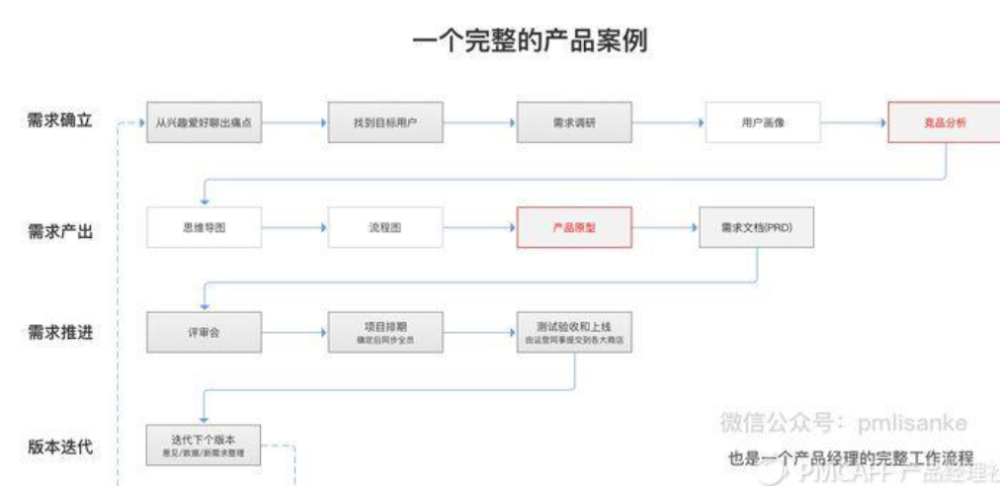
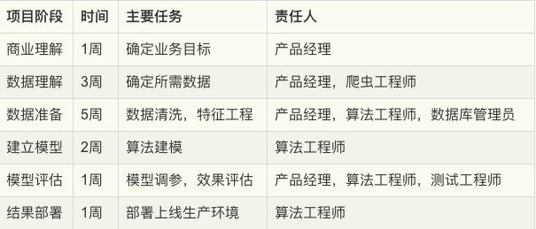

# 产品整个流程[1]

## 研究背景 [3]

1、提高研发计划性
产品开发流程每个环节都涉及时间排期，这些时间管理要素可以有效控制项目时间表。

2、提高研发效率
通过明确开发团队每个角色的职责和协作方式，让每个成员只需严格按照规范做好自己的工作即可高效协作，降低沟通成本。

3、保证产品质量
通过确保每个环节的输入输出结果，让最终产出的产品得到有效保证。

4、及时发现问题
通过各环节过程数据，方便管理人员深入了解问题。

## 组建团队

产品研发核心团队通常由产品经理（1名）、研发经理（1名）、研发人员（5-10名）组成。产品开发涉及的职责分配到各位成员身上。

角色见：:ref:`prod_people`

## 工作流程[2]

收集产品需求（需求池）→  评审需求→ 竞品分析 → 产品原型设计 →  Demo评审→ UI评审→ 开发跟踪→上线前的测试 →  产品上线后的bug收集 →  对客服的培训，可根据实际情况酌情进行调整。

## 七步

1. 市场调研
2. 需求管理
3. 产品设计
4. 产品研发
5. 产品测试
6. 产品发布上线
7. 项目跟进优化

## 市场调研

市场调查：分析行业现状和市场规模，发现并掌握目标市场和用户需求的变化趋势；
用户调研：通过用户访谈,可用性测试,调查问卷,数据分析的方法对用户需求进行挖掘和分析；
竞品分析：剖析产品的竞争对手,对其产品进行用户体验分析。
盈利分析：估算产品成本,验证产品需求。

## 需求管理

产品规划：确定目标市场、产品定位、发展规划及路线图；
提炼需求：由市场或运营部门收集的需求来进行分析，提炼核心功能；
根据竞品分析，市场调研来对功能进行优先级排序；
版本规划：每个版本重点开发什么，预估研发进度，上线日期。

## 产品设计

编写产品需求文档，确认产品周期。
产品原型要做的是梳理和完善产品需求流程，降低团队沟通成本。
跟设计师确立产品设计规范，从视觉效果角度确立选用图标类型，文字大小，模块间距，宽高大小等。

## 产品研发

组织讨论，对需求进行评估及确认研发周期、提测时间、预发布时间点、正式发布时间点；
App的开发环境搭配，确定技术框架，以及研发各种基础系统等；
跟踪和推动项目进度，确保项目计划的完成；
布局产品运营工具，方便后期分析与用户跟踪。

## 产品测试

测试周期是直接跟着开发周期一起做；
测试设备：确定要兼容的系统版本，手机品牌类型，手机分辨率等；
按照产品需求文档进行测试。

## 产品发布上线

发布环境的搭建，包括预发布环境、生产环境、灰度发布环境的准备等工作。

而正式上线的工作，则包括数据库上线、程序文件上线等工作。

应用商店ASO优化并根据不同的应用商店作出调整；
协作运营部门做产品推广。

## 项目跟进优化

根据用户反馈对功能进行改进，对用户体验进行优化；
对产品数据进行监控，分析产品运营效果、用户使用行为及需求，以便对产品进行持续性优化和改进；
根据数据挖掘新需求。

1. 研发工作总结：需要对产品研发过程做总结，不论是产品上的还是流程配合上的，为后续加强沟通协作、产品运营打好基础。
2. 上线后收集用户反馈：为了更好的收集用户反馈，需要在所有产品上都增加反馈入口，以便用户提交反馈内容。每天都需要花费相当比例的时间去浏览，并将反馈建议**转化产品需求点加入需求池。**
3. 产品体验可用性测试：邀请一批真实的典型客户，针对典型场景使用产品，用户研究员在一旁观察、聆听、记录，从而发现产品中存在的可用性缺陷。必须性，因为产品运营团队的员工往往潜意识里会认为用户一定会怎样操作，但是事实上用户很大概率上都不会按照他们希望的进行操作，甚至会陷入茫然根本用不下去。而通过可用性测试，就可以找到问题点，通过优化体验设计**降低用户使用门槛**。
4. 运维系统优化：升级版本上线工作、服务监控、应用状态统计、日常服务状态巡检、突发故障处理、服务日常变更调整、集群管理、服务性能评估优化、数据库管理优化、随着应用PV增减进行应用架构的伸缩、安全、运维开发等工作。

## 人工智能规划流程

业内较为常见的设计流程是CRISP-DM（Cross-Industry Standard Process for Data Mining，跨行业数据挖掘标准流程）

在1996年的时候，SPSS，戴姆勒-克莱斯勒和NCR公司发起共同成立了一个兴趣小组，目的是为了建立数据挖掘方法和过程的标准。并在1999年正式提炼出了CRISP-DM流程。

这个流程确定了一个数据挖掘项目的生命周期，包括以下六个阶段：

1. 商业理解：了解进行数据挖掘的业务原因和数据挖掘目标。
1. 数据理解：深入了解可用于挖掘的数据。
1. 数据准备：对待挖掘数据进行合并，汇总，排序，样本选取等操作。
1. 建立模型：根据前期准备的数据选取合适的模型。
1. 模型评估：使用在商业理解阶段设立的业务成功标准对模型进行评估。
1. 结果部署：使用挖掘后的结果提升业务的过程。

是否可以继续进行下一个阶段取决于是否有达到最初的业务目标，如果业务目标没有达到，那么就要考虑是否是数据不够充分或算法需要调整，一切都以业务目标为导向。

### 商业理解

海微购是一家从事跨境电商业务的创业公司，在前几年抓住了海淘的趋势，用户量和交易额都还不错。在新的财年，公司希望能在去年的基础上将GMV提高10%，并以此为目标制定新一年的工作计划。

#### 确定业务目标

根据电商零售额公式（零售额=流量转化率客单价*复购率），公司认为：在获客成本较高的市场环境，以及本公司经营的海淘产品复购周期较长的情况下，应优先提高转化率和客单价两项指标。根据SMART目标制定原则，确定下一次迭代的产品目标为：猜你喜欢模块中的商品点击量需提高20%，交叉销售额提高10%。

#### 确定数据挖掘目标

需要明确数据挖掘的问题是一个分类问题，聚类问题还是一个预测问题，以便于后续的建模阶段选择合适的算法。另外，还需要确定的是数据挖掘的范围，是针对所有用户大范围调整，还是先针对小规模的部分用户进行A/B Test，待验证成功之后再全面推行。

数据挖掘成功的标准是什么，例如：推荐的准确率要提高40%，或用户的流失概率降低20%等，通过可量化的指标评估整个工作的效果。

#### 制定项目计划

根据具体的，可量化的方案组织相关的干系人来评估工作量。根据工作量倒排项目计划表，将目标拆解到更小的时间颗粒度，并指定相关责任人进行任务跟进

在这个阶段需要明确各个环节的交付产物，并识别可能的项目风险，提前制定风险应对计划。

例如：本公司缺乏某方面的**数据，需要从外部获取，**或者相关人员配置不足，需要招聘或借调人力资源的支持等等。在项目进行的过程中持续监控，以确保项目的正常进行。

### 数据理解

明确了业务目标之后，我们需要针对数据挖掘的问题收集相关的数据，并对数据进行初步的处理，目标是熟悉数据，探索数据与数据之间的内在联系，并识别数据的质量是否有问题。

用户画像，选择典型的主要客户——例如：最近有过购买记录，并且在一定时间内持续活跃的用户。而不能选择已经流失的，或者是从来没有购买记录的无效客户。

对于参与建模的特征，需要选择那些与业务目标息息相关的数据，以购买商品转化为例：从业务经验来看与之相关的数据有用户的月均消费额度、用户的商品偏好、商品的曝光率、好评率等等。

### 模型评估

开始最后的部署阶段之前，最重要的事情是彻底的评估模型，根据在商业理解阶段定义的业务目标来评估我们努力的成果。

#### 评估结果

数据挖掘没有达成业务目标的结果，也不一定意味着建模的失败，有多种可能性导致不成功的结果。

例如：业务目标一开始定得不够合理，与业务目标密切相关的数据未收集到，数据准备出现了错误，训练数据和测试数据不具备代表性等等。这时候我们就要回到之前的步骤，来检视到底是哪个环节出现了问题。

### 结果部署

建模的作用是从数据中找到知识，获得的知识需要以便于用户使用的方式重新组织和展现，这就是结果部署阶段的工作。根据业务目标的不同，结果部署简单的可能只需要提交一份数据挖掘报告即可，也有可能复杂到需要将模型集成到企业的核心运营系统当中。

#### 制定部署计划

根据业务要求和运算性能的的不同，部署的模型可分为：离线模型，近线模型和在线模型三种

离线模型一般适用于重量级的算法，部署于大数据集群仓库，运算的时间需要以小时计，并且时效上通常是T+1的。

近线模型适用于轻量级算法，一般在内存和Redis(一种支持Key-Value等多种数据结构的存储系统，适用于高速消息队列)中进行，运算的速度以秒为单位。而在线模型则通常根据业务规则来设置，在内存中运行，运行的速度以毫秒计。

另外，部署还需要考虑不同编程语言对于算法模型的调取兼容性，在这个阶段算法工程师需要与原有业务的开发工程师进行联调协作，确保业务系统能够正确的调用算法模型结果。

#### 模型监督和维护

我们知道算法模型是基于历史数据得来的，但是在模型部署并运行一段时间之后，可能业务场景已经发生了变化，原有的模型已经无法满足当前的业务需要。这就需要我们在模型部署上线的同时，同步上线模型的监督和维护系统，持续跟踪模型的运行状况。

当发现模型结果在出现短期异常值时，排查异常的原因，例如：运营活动或者节假日等因素，当发现模型长期表现不佳时，则要考虑是否是用户和产品的数据构成已经发生了变化。如果是因为数据构成已经发生变化，则需要重新通过CRISP-DM流程构建新的模型。

#### 生成最终报告

最后，不要忘了向项目的相关干系人发送一份最终的项目总结报告。

[1]: http://www.woshipm.com/pd/313514.html
[2]: http://www.woshipm.com/zhichang/459131.html
[3]: http://www.woshipm.com/pd/841065.html
[4]: http://www.woshipm.com/ai/2182762.html
