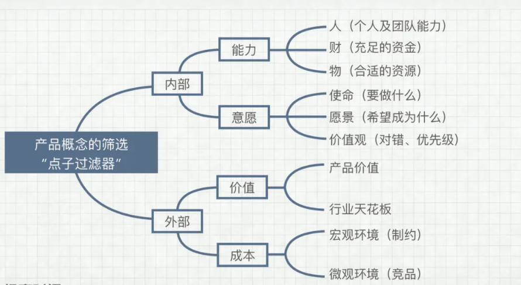
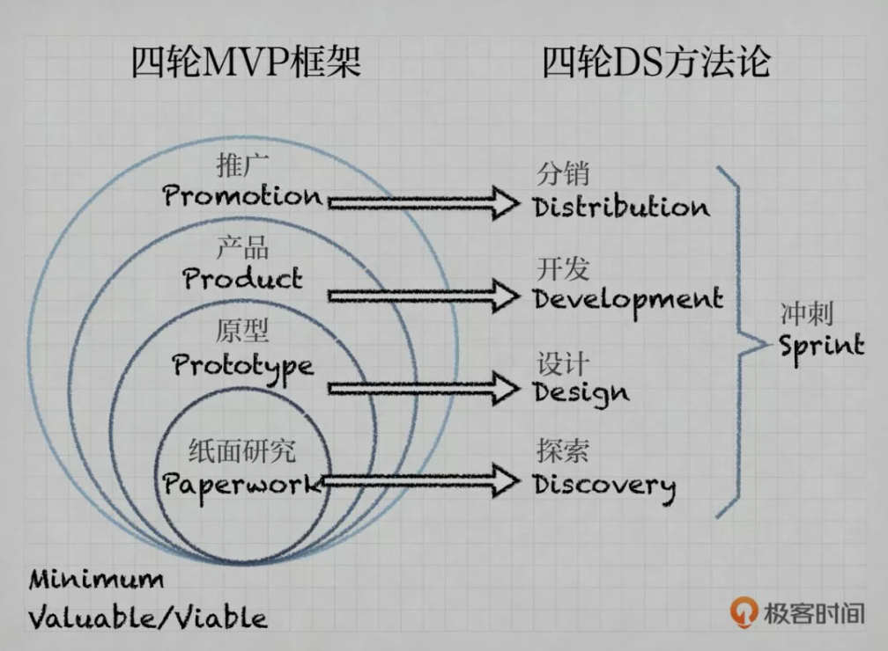

# BRD [1]

## 定义

BRD指的是商业需求文档（Business Requirement Document）。在这篇的文档当中不会有详细的产品规划，只会有基于市场调查和用户需求调查的产品构思。

BRD 是给谁看的呢？老板、投资人、股东，目的是让他们知道这款产品如何给公司盈利。BRD 的撰写侧重点是需求描述、盈利模式。产品总监或者产品VP（Vice President，副总监）才需要写BRD，初级产品经理基本接触不到BRD

这篇文档常以PPT等形式，以数据说服他们，帮产品的立项，来获得公司资源支持。

## 顺势而为 [7]

## 产品立项流程 [4]

项目概述
商业价值
项目的目标
项目风险
项目干系人、组织和其他产品

## 前期调研 [3]

人群特征
需求特点
用户价值
体量规模
竞争优势
产品定位
资源能力
成本收益

## 产品目的 [2]

提出一个清晰、简明的价值主张，让它很容易被接受，要让产品团队、管理人员、用户、市场人员清楚的明白这个产品到底是什么意图。

考虑“velevator pitch ”(电梯间演讲、电梯行销)测试。

## 一个中心

收益！来生存

## 多个基本点

1. 市场调查报告；
2. 竞争对手报告；
3. 用户需求调研报告；
4. 产品功能构思；
5. 产品运营构思；
6. 收益分析；
7. 风险分析；
8. 其他。

## 可行性评估 [3]

MVP:核心是试错，有反馈渠道。
PMF:Dropbox用视频介绍产品的功能，来测试反馈。核心功能内测

最短时间
最小成本
可行性验证

## 可用性测试

### 确定测试目标:

- 产品设计方案
- 测试功能点
- A/B测试
- 产品改进方案测试

### 定义用户:

- 可从用户访谈和问卷调查中选择
- 存量用户或者新用户

### 测试过程记录:

- 录屏、录音和摄像
- 记录A/B选项结果
- 页面埋点追踪
- 过程中的疑惑点,改进点及时其他特殊情况

### 结果分析根据过程记录总结、修改方案,如:

- 通过统计分析追踪结果
- AB测试结果得出改进方案

## 四轮 MVP 框架

VUCA 的中文含义分别对应着易变性、不确定性、复杂性和模糊性。V：Volatility 易变性U：Uncertainty 不确定性C：Complexity 复杂性A：Ambiguity 模糊性

如今VUCA时代信息无时无刻不在变化，用户的需求无时无刻不在变化。

1. Paperwork：产出物是纸面研究的结论，用的方法是 Discovery Sprint，探索冲刺。
1. Prototype：在方案层面“先发散，后收敛”，做出原型，获得反馈后，不断修正原型，用的方法叫 Design Sprint，设计冲刺。
1. Product：验证的重点是真实产品是否可以培养出用户习惯，用户愿意用，能更高效地解决用户需求、创造价值，并且让用户愿意反复使用。这时候，我们会关注某些和用户留存有关的指标。
1. Promotion：做小规模推广尝试，测试渠道，逐步确定优选渠道，降低分销成本。对应的方法论是 Distribution Sprint，分销冲刺。

注意：

1. 用户参与都是必须的
2. 过滤器的开口应该越来越小
3. 在每一轮停留的时间、投入的资源也不尽相同
4. 这四轮走完，产品也才刚刚上路

## 项目风险 RAID [4]

- Risk风险：会对项目产生负面影响的事件,事件可能发生的概率和随之对项目带来的影响
- Assumption假设：知群可以预想到的因素,一旦发生就会促进项目成功(但不发生就没有促进效果)
- Issues问题：在项目中任何不怡当的,需要管理和解决的事情,这些事情需要持续跟踪并记录
- Dependence依赖：任何项目所依赖的或者依赖该项目的事件和工作,需要记录依赖实现的时间

## PEST分析 [5]

政治因素包含了租税政策、劳工法律、环境管制、贸易限制、关税与政治稳定。
经济因素有经济增长、利率、汇率和通货膨胀率。
社会因素通常着重在文化观点，另外还有健康意识、人口成长率、年龄结构、工作态度及安全需求。
科技因素包含生态与环境方面，决定进入障碍和最低有效生产水准，影响委外购买决策。科技因素着重在研发活动、自动化、技术诱因和科技发展的速度。

PEST分析与外部总体环境的因素互相结合就可归纳出SWOT分析中的机会与威胁。

## 波特五力分析 [6]

波特五力分析来定义出一个市场吸引力高低程度。

来自买方的议价能力、来自供应商的议价能力、来自潜在进入者的威胁、来自替代品的威胁和潜在竞争者的威胁 — 共同组合而演变出影响公司的第五种力量：来自现有竞争者的威胁。而每一种力量都由数项指标决定：

1. 来自买方的议价能力（Bargaining power of customers）
1. 来自供应商的议价能力（Bargaining power of suppliers）
1. 来自潜在进入者的威胁（Threat of new entrants）
1. 来自替代品的威胁（Threat of substitutes）
1. 来自现有竞争者的威胁（Competitive rivalry）

### 来自买方的议价能力（Bargaining power of customers）

- 买方集中度（buyer concentration to firm concentration ratio）
- 谈判杠杆（bargaining leverage）
- 买方购买数量（total buyer volume）
- 买方相对于厂商的转换成本（buyer switching costs relative to firm switching costs）
- 买方获取资讯的能力（buyer information availability）
- 买方垂直整合（bargaining leverage，backward vertical integration）的程度或可能性
- 现存替代品（availability of existing substitute products or services）
- 消费者价格敏感度（buyer price sensitivity）
- 总消费金额（price of total purchase）

### 来自供应商的议价能力（Bargaining power of suppliers）

- 供应商相对于厂商的转换成本 （switching costs of firms in the industry）
- 投入原料的差异化程度
- 现存的替代原料（presence of substitute inputs）
- 供应商集中度 （supplier concentration）
- 供应商垂直整合（bargaining leverage，forward vertical integration）的程度或可能性
- 原料价格占产品售价的比例

### 来自潜在进入者的威胁（Threat of new entrants）

- 消费者对替代品的偏好倾向
- 替代品相对的价格效用比
- 消费者的转换成本
- 消费者认知的品牌差异

### 来自现有竞争者的威胁（Competitive rivalry）

- 现有竞争者的数目
- 产业成长率（industry growth）
- 产业存在超额产能的情况
- 退出障碍 （exit barrier）
- 竞争者的多样性 （diversity of rivals）
- 资讯的复杂度和不对称
- 品牌权益 （brand equity）
- 每单位附加价值摊提到的固定资产
- 大量的广告需求
- 不同的产品 （product differences）

[1]: http://www.woshipm.com/pmd/178527.html
[2]: http://www.woshipm.com/pmd/21446.html
[3]: https://www.bilibili.com/video/BV1wz4y1y7sg
[4]: https://www.bilibili.com/video/BV1254y1D7Ht?from=search&seid=14167562900175777805
[5]: https://zh.wikipedia.org/wiki/PEST%E5%88%86%E6%9E%90
[6]: https://zh.wikipedia.org/wiki/PEST%E5%88%86%E6%9E%90
[7]: https://www.jianshu.com/p/a4b1fd94b49a
