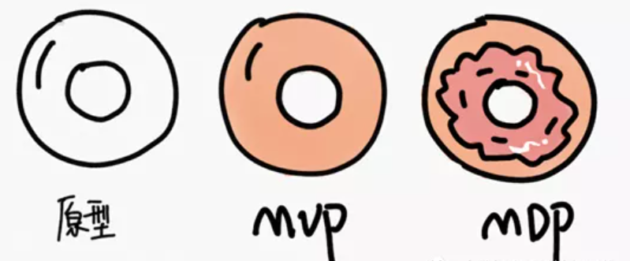

# MVP

传统的产品开发流程，先定义最终产品，然后逐步进行开发测试上线，这通常需要花费数月甚至数年的时间。当投入使用后，才知道产品是否和市场契合，用户是否喜爱。如果失败了，则浪费大量的人力物力财力。而MVP呢，倡导先开发一款具有基本功能和吸引力的产品，立即投入运行，视市场的反馈来决定是继续还是转型，有效地降低了风险、而且能及时获取用户反馈。

![MVP建造[3]](../img/MVP_build.png)

## 原型与MVP [1]

在《Managing Software Requirements:A Use Case Approach》一书中，不止一次提到原型是应该用完即弃的，是个一次性的玩意儿。在日常项目中，也都是用Axure等工具进行高保真原型开发，而真实产品开发则是另起炉灶。

原型和产品隔离，一方面可以加速原型开发、激发创意，另一方面可以提高产品稳定性，因为避免了通过对原型进行修修补补来制造产品。而MVP呢？是**最小可行产品**，也是第一代产品，是可以让用户使用的产品——尽管功能不丰富。原型背后的逻辑都是**软件模拟**的、是假的、用户是不能真正用其解决问题的，它只是看起来像真的而已。

斯坦福的一个创业团队打算在无人机上安装高清摄像头，拍摄（每一颗）农场作物的病害、施肥和灌溉情况。农场主可以根据采集并经过处理的数据来决定如何更好地播种，团队则可以通过销售数据来盈利。创业者们本想先购买无人机、超清摄像头、图像处理软件，然后花费数月时间来进行开发整合。但是Steve Blank（Steve Blank和下文的Eric Ries均为MVP推广者）的建议是：既然团队目标是想确定农场主是否愿意购买数据，而农场主并不关心数据是来自卫星、无人机或者魔法，那么，只需要租借一个手动控制的飞机模型、安装上普通相机，然后飞跃农场拍摄、手动处理数据，再验证农场主是否愿意为这些信息付费即可。

因此，在上文的两个例子中，Dropbox的视频是原型，Steve Blank建议的遥控飞机是MVP。

## 最小可行性测试 [2]

### 自然增长用户

自然增长就是抛开人工干预后的自然结果。用户增长的方法有很多，无论是直接广告推广、应用市场推广还是积分墙、资源互换、地推和拉身边的人脉，都是进行了人工干预的。

产品经理一定要为一款新产品预留出 1 个月左右的自然增长期，在这段时间，不进行任何的人工干预，只将应用上传至各大应用市场就足够了。接下来，产品经理要做的就是等待并关注自然增长的数据。

那么，为什么要这样做呢？

很简单，产品经理通过自然增长的数据可以明显看出一款产品的被需求程度。因为不进行人工干预，所有的用户增长量都来自应用市场，主要包括应用市场精品推荐（代表平台对于这款产品的认可）和用户自然搜索（代表用户基于某种需求而选择了这款产品）。两者相结合就能够体现出产品的被需求程度和产品的精良程度。

### 主动分享用户

除了用户自然增长，还有一点是主动分享用户的数据，主要是指在不进行任何的人工干预的情况下，用户主动、自愿地进行分享的数据。这里一定不能依靠活动或一些奖励进行人工干预，一旦进行了人工干预，其背后的核心价值便无法区分了。当然，主动分享用户和自然增长用户一样，产品经理需要预留 1 个月的时间观测。

那么，主动分享用户又代表着什么呢？

应用市场官方将产品选入精品推荐，代表产品得到了某市场官方的认可，或者某市场官方刚好对此类产品有需求。而用户主动分享则代表用户主动下载并使用了这款产品以后，非常满意并认为这款产品远远超出了自己的预期。这也代表产品提供了超出预期的解决方案，为后续进行大规模的人工干预打下了良好的基础。

无论是自然增长用户的增加还是主动分享用户的增加，都在于产品品质已经过关；而产品品质过关的核心在于产品抓住了用户最核心的需求，从而提供了超出预期的解决方案。

### MVP必备模块 [3]

MVP产品除了核心流程以外,还有几个必备模块,这里做一下简单的介绍

#### 便捷的反馈渠道

尽可能为用户在MVP产品内提供便捷的反馈机制，而不仅仅是微信群和QQ群。为什么用户发现问题了，最希望第一时间把自己的疑问或者不满反应出来，微信群和QQ群毕竟有滞后性;其次，微信群和αQ群接触的用户可数量不足，在群里活跃的可能就老是那几个人，一个个去私聊嘛，效率可能低。所以，我们在微信QQ以外还是结合套内部反馈机制比较好

#### 数据埋点不可少

MVP的目的就是要验证。因此相应的数据埋点也不可少(纸面原型和墨刀原型不能埋点)。但是简单开发的还是可以埋点的。但是传统的数据埋点方法耗时比较久，这里我推荐 growing io，只需要把一段SDK代码埋入网页和应用中，产品经理和运营人员就可以快速自己埋点(也有类似产品，比如诸葛IO，神策，但是我没用过，不好评价)

#### 前期用户调研不可少

做MVP虽然从某种意义上可以理解为用户调硏的一种延伸，但是不能因为有了MVP就忽视了正式的用户调研。毕竟MVP也是要依赖于前期用户调研。

### 更多

#### MMP(Minimum Marketable Product)是什么？ [4]

MMP是将为客户提供的最小特性集合构成一个产品发布, 目标是抢占市场窗口，而且在发布后可以及早获取真实用户的反馈，为产品的迭代演进提供输入。MMP (Minimum Marketable Product)的思想是非常敏捷的，但那是在产品的Idea和商业模式得到验证后，开始启动产品研发的工作方法。

永远都不要期望一个版本里做尽可能多的需求，而是相反：以最少的特性先发布第一个版本，这个版本要体现产品的独特价值主张。这样的策略有以下几点优势：

1. 抢占市场先机
1. 及早获取真实用户的反馈
1. 依据第一版本的市场反馈，决策后续迭代的演进，从而减少不必要的需求开发，减少浪费。

那么如何决定哪些特性在MMP里发布呢？

- 首先依据核心价值主张，那些不在核心价值主张的特性，一定不在MMP里；
- 其次，对每个特性，问一个问题：如果没有它会怎么样？如果没有它用户可以完成基本场景的使用，那就可以没有。

#### MDP

MDP即Most Desirable Product，最渴望的产品。MDP是为用户提供高价值、高满意度用户体验所必需的最基本产品，不只是功能上，还需要关注 UI、产品质量等。所以MDP产品一定是一个比较成熟的产品。

## AI产品的MVP [5]

### API

在MVP阶段，暂不用考虑数据安全等问题，完全可以直接调大厂的接口。

### Demo视频

B站视频的“朱茵的脸换成了杨幂的脸”证明了ZAO可行性。

### 人工+智能

智能医生：找医生来冒充机器人，在线回复用户问题，首先要验证的是会不会有人来问机器人问题，会问到什么问题，会问到什么程度，试问机器人告诉你你的病要吃什么药，你敢吃吗？

当搜集到足够多的问题后，对问题进行统计，再来评估是用知识图谱还是知识库QA。

[1]: https://www.jianshu.com/p/5b078398f632
[2]: https://www.zhihu.com/pub/reader/119980992/chapter/1284104623666458624
[3]: https://www.yuque.com/wuxinghua/01/uqgdgxs
[4]: http://www.shinescrum.com/news_and_events/mvp
[5]: http://www.woshipm.com/pmd/2817456.html
