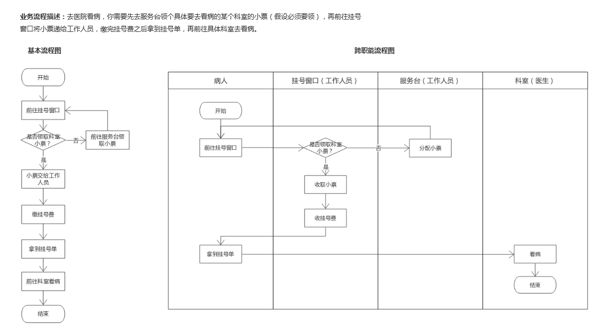
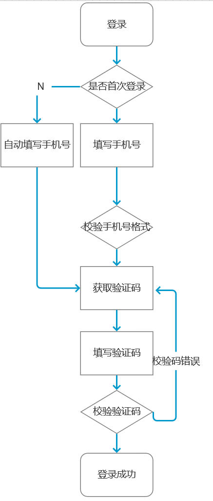
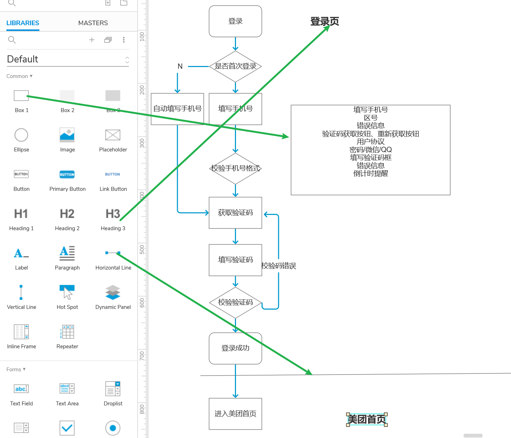
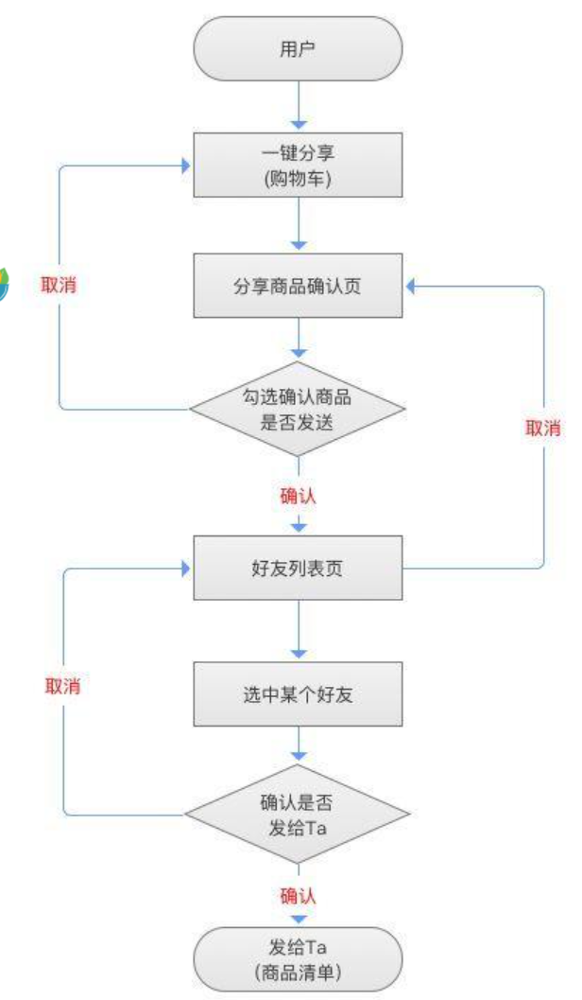
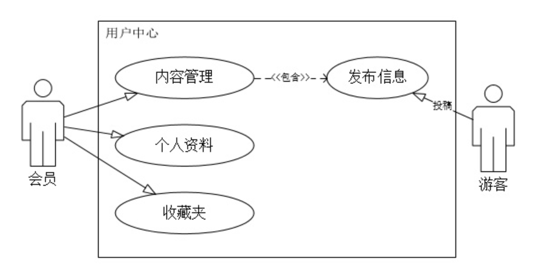
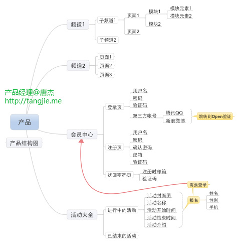

# 流程图 [1]

## 编写有效用例 [6]

- 低精度：页面流程图（页面名称、页面内容、判断、触发动作和跳转）
- 中精度：静态页面（导航信息、组件元素、页面布局-栅格系统、文案信息、重要备注）
- 高精度：动态高保真原型

## 画流程图

画原型前应该先画流程图，所以画流程应该是最基本最必要的技能。但往往大多数新产品人却对流程的概念异常模糊。

下面将讲解定义、分类以及画法，及各种流程图的特点。

## 流程图

流程——顾名思义：水流的路程；事物进行中的次序或顺序的布置和安排。流程是自然而然就存在的，它可以不规范，可以不固定，可以充满问题。

图——Chart 或者 Diagram, 是将基本固化有一定规律的流程进行显性化和书面化，从而有利于传播与沉淀、流程重组参考。

由两个及以上的步骤，完成一个完整的行为的过程，可称之为流程；注意是两个及以上的步骤。

流程图的核心就在于如何排布事物进行的次序，不同的顺序可能造成截然不同的结果。

流程不可或缺的因素：对象、输入、动作、输出。

- 对象就是执行人，也就是产品中的用户；
- 输入可以理解为前提、前置条件；
- 动作，就是产品中的操作，可以是点击、输入，等等；
- 输出，可以理解为结果、动作的目的。

## 目的

1. 流程图为产品设计基石，可以保证产品的使用逻辑合理顺畅；为画原型做向导，也能反向检验流程图，发现完整流程中必不可少的原型图。
2. 展现了基于用户选择的状态、页面视图和内容，更好地传达需求，用流程图来更好地表达产品逻辑。纯粹的原型图会让沟通对象陷入页面本身的焦点中，而流程图则可以告诉沟通对象要经历哪些过程、最终要实现怎样的目标。
3. 查漏补缺，检验是否有遗漏的分支流程。

## 常见问题 [7]

- 没有任何前提条件：做饭的前提之一是有电或燃气
- 没异常：手机忽然没电关机了OR确认支付时系统卡死了
- 没角色：电商中买家、卖家、服务商各自的流程
- 没背景：说出，现阶段优化的目的、不足、方案、能否解决、能否预防

## 组件

## 分类

流程图以描述对象分类，包括：业务流程图、页面流程图、功能流程图、数据流程图等。作为产品，经常谈的是业务流程图；作为交互设计师，则比较关心页面流程图；而作为系统分析师，数据流程图最关键。 [4]

流程图其实是传统的管理业务流程图，包含基本流程图和跨职能流程图（泳道图）两种。

### 业务流程图（Transaction Flow Diagram, TFD）

“大象塞进冰箱”--分解

业务流程图(TFD)是一种抽象地描述管理系统内各单位、人员（系统组织结构）之间的业务关系、作业顺序（业务流程）和管理信息流向，而不涉及具体操作与执行细节的图表。

以医院挂号流程为例:

#### Axure实战
:label:`flow_chart_Axure`

![TFD Axure[8]](../img/flow_chart_axure.png)

#### 绘制思路一般是：

- 首先将业务按阶段划分，比如电商类可以分为下单和支付，单车类可以分为提车、骑行和停车；
- 然后列出每个阶段参与的功能模块，比如下单阶段，就有商品查看、登录/注册、信息记录、个人中心等功能。
- 最后按照时间顺序，画出业务需求在各个功能模块之间的流转情况。

有两个原则：

- 先思考主干流程，再思考分支流程，主干流程逻辑准确，分支流程全面无遗漏；
- 表达清楚后台产生的各种判断及相应的前端展示,这将作为接口设计的重要根据。

心得：

- 先画流程图,再画页面原型不要想一步到位,完善需要过程
- 以能解决问题为目的,不要过分追求细致

### 页面流程图（Page Flow Diagram）

问题：

1. 这么多流程总不可能要在同一个页面吧，那需要几个页面呢？
1. 页面里又应该有什么流程和功能呢？

- 业务流程图重要的是描述谁在什么条件下做了什么事。
- 而页面流程图是具体到了网站、系统、产品功能设计的时候，表现页面之前的流转关系——用户通过什么操作进了**什么页面**及后续的操作及页面。

定义：指电子产品具体所呈现的页面跳转流程图。其承载了业务流程图所包含的业务流转信息。

页面流程图依然是包含在业务流程图的。这恰恰符合定义中的要求，同时也印证了页面流程图的正确性。

我们将抽象的业务，映射在了具象的页面上，用软件的页面承载起了业务需求。而以上就是由业务流程图到页面流程图的转化过程。

京东购物车流程:https://www.processon.com/view/5715d26ce4b0d89bd25a2998

#### Axure实战

:label:`flow_chart2page_Axure`

#### 好处

- 对于设计师或产品经理的好处：

1. 页面流程图一张页面助你讲完完整的用户与系统的交互故事，借助它，你更容易知道流程中的潜在地雷是什么，哪里的效率比较低，有助于系统化、全局化、周全性的思考
2. 细化工作量的基础，通过页面流程图可准确评估需要多少张页面。
3. 聚焦：页面流程图中的每个页面都不必追求精细——你的目标是规划行为路径，而不是单页面交互设计，所以完全无需考虑页面内容、布局。所以你会更加聚焦于用户目标和任务的完成。不必过早陷入细节。
4. 关键是很快。线框图有可能有几十张，你画起来没那么快，而且一旦进入细节，则还需要慢慢深究。但是页面流程图也许就是几个小时的事情。你就可以对整个项目心中有数了。

- 对于开发工程师的好处：

1. 可作为评估工作量的重要依据——可帮助他们对工作量也心中有数。
1. 可做为开展代码工作的重要参考——特别是前端开发，必须得知道每一种操作指向什么页面。
1. 他们会映射功能逻辑，会给你更多好的建议。

### 功能流程图（Function Flow Diagram）

定义：指单页面内或多页面之间的功能操作流程，其包含在页面流程中。

任何功能都是被包含在页面内的，但一个页面内往往不止一个功能，所以单单页面流程图可能无法完整表达所有流程，而这时就需要用功能流程图来更加具体表达每个页面内所包含的功能。

相比于业务流程图，功能流程图的特点是：

- 只展现用户的操作，不展现后台的判断；
- 只展现正常流程，不展现异常流程；
- 只可查看用户的工作流程，无法作为开发的参考。

### 数据流程图（Data Flow Diagram）

定义：特指软件产品中，描述数据在不同节点被处理的过程所画的图表。主要表达计算机程序对于业务的实现原理。用户在功能流程图中的每一个操作，对应都会反映在数据流程图中。同时，数据流程图也可以叫程序流程图（Program Flow Diagram）。

它是一种能全面地描述信息系统逻辑模型的主要工具。它可以利用少数几种符号综合的反映出信息在系统中的流动、处理和存储的情况。数据流程图具有抽象性和概括性。

每个流程图中都有一个核心伴随着不同操作在整个系统中不断流转。比如业务流程图大多以人为核心，每个节点都是在传递人的不同行为。而页面流程图和功能流程图也类似，都是以人的操作行为为核心，在不同页面和功能间进行流转。但数据流程图不同，它是以数据为核心，展示整个系统中，数据是如何被处理的。其更偏技术思维，更多的是展现后台程序的实现原理。所以，常常是开发人员绘制此图，而产品经理涉及较少。

### 理解业务

分别展示了一个产品的业务流程、页面流程、功能流程和数据流程。从中可以发现，由业务到页面，再到功能，再到数据处理，是顺序拓展的。一个产品的页面或功能，不是凭空出现的，而是依据业务层的各个节点和流程进行设计的。这就是为什么在做产品设计时一定要先理解业务的原因。

尽量将业务、页面、功能和数据区分清楚，并且逐层递进，不要把多种类型的流程图混杂一起。这样反而会将思想搞得混乱。

## 颗粒度

流程图的细致程度。

我在画流程图时也常常会犹豫纠结，这个功能点用不用描写得更详细？这条分支用不用标出来？这个和服务器的交互事件用不用在流程图体现？等等这些问题，也都是产品经理在日常画图时会遇到的。

## 流程图的结构

流程图中大致包含四种结构：顺序结构、条件结构（又称选择结构）、循环结构。基本上大多数流程图都是由这三种结构组成的。

## 线框图 [2]

- 线框图只需要使用线条、方框和灰阶色彩填充,是低保真设计图。
- 线框图主要呈现主体信息群,勾勒结构和布局,表达用户交互界面的主视觉和描述。
- 线框图是一种低保真且静态的呈现方式,产品经理通常使用纸笔来表达自己的想法。

包括:
1. 内容大纲:这个产品包含什么内容信息结构、
1. 布局:这个产品的内容怎么放
1. 用户交互界面:这个产品用户怎么操作

## 总体流程图

![简书APP总体流程图[10]](../img/whole_flow_chart.png)

## 案例

### 分享购物车

“发起者”角度

节点分别是： [3]

1. 用户是作为起点，来开始；
2. 抵达的第一个页面，是购物车；
3. 在购物车，有“一键分享”的按钮；
4. 点击完“一键分享”后，吊起商品选择确认页面；支持“取消”商品的勾选；
5. 用户点击确认后，吊起好友筛选列表；
6. 在好友筛选列表中，选中某一个特定的好友；弹出“确认”或“取消”按钮；
7. 用户点击“确认”后，则把之前选择好的商品商品列表发给Ta;

### 登录注册流程图 [4]

一个大的流程就是由许多小流程（一个流程一个小模块）组成，每个小流程（常用的，每个App流程基本改动不太大的）可反复使用，提高工作效率，这就有点像面向对象的封装思想。

### AI落地

一个AI产品从需求到落地，大概需要经历以下环节：

需求分析→数据采集→数据清洗→数据标注→训练迭代→测试验证→交付模型→生产环境部署

### 常见的绘制流程图的工具

（1）在线工具

- ProcessOn：https://www.processon.com/
- draw.io：https://www.draw.io/

（2）客户端

- Microsoft Visio
- edraw亿图
- xmind
- omniGraffle（mac）
- StarUML

## 更多图

- 蜘蛛图
- 气泡图
- 散布图
- 用例图
- 信息架构图
- 线框图
- 实体关系图[5]

### 用例图 [11]

#### 用例

用例(Use Case)是一种描述产品需求的方法，使用用例的方法来描述产品需求的过程就是用例模型，用例模型是由用例图和每一个用例的详细描述文档所组成的。在技术和产品的工作领域里都有用例模型的技能知识。技术人员的用例主要是为了方便在多名技术人员协同工作，或者技术人员任务交接时，让参与者更好的理解代码的逻辑结构。产品人员的用例主要是为了方便技术研发和功能测试时，让参与者更好的理解功能的逻辑。

用例起源和发展于软件时代的产品研发，后来被综合到UML规范之中，成为一种标准化的需求表述体系。虽然用例在软件研发和技术工作中应用的非常广泛，但是在互联网产品规划和设计中，并不经常使用，互联网产品的需求表达为了敏捷效率，**通常采用原型加产品需求文档**。

#### 用例图

用例图并不是画成了图形的用例。用例图包含一组用例，每一个用例用椭圆表示，放置在矩形框中；矩形框表示整个系统。矩形框外画如图所示的小人，表示参与者。参与者不一定是人，可以是其它产品、软件或硬件等等。某一参与者与某一用例用线连起来，表示该参与者和该用例有交互。

许多人通过UML认识了用例，UML定义为展现用例的图形符号。UML并不是为描述用例定义书写格式的标准，因此许多人误认为这些图形符号就是用例本身；然而，图形符号只能给出最简单的一个或一组用例的概要。UML是用例图形符号最流行的标准，但是除了UML标准，用例也有其它的可选择的标准。

#### 用例描述文档

1. 用例名称：本用例的名称或者编号
1. 行为角色：参与或操作(执行)该用例的角色
1. 简要说明：简要的描述一下本用例的需求(作用和目的)
1. 前置条件：参与或操作(执行)本用例的前提条件，或者所处的状态
1. 后置条件：执行完毕后的结果或者状态

### 信息架构图

#### 信息架构
:label:`information_infra`

产品经理的工作需要设计业务架构、产品架构和信息架构。一个企业的业务架构决定了产品架构，产品架构决定了信息架构，是一个递进的关系。[14]

设计里面非常关键的就是信息架构。信息架构最主要的就是把一些核心任务给突出出来。根据你的用户画像，你要知道用户最核心的任务是哪些，根据这些核心任务再去排列组合你的信息架构。参考《信息架构，超越WEB设计》[13]

信息架构完成之后，我们就要做具体的设计。设计要遵从设计规范。安卓也、 iOS也好，或者是各个公司都会有自己的设计规范，这都是最优秀的、最有经验的设计师输出的，所以如果我们能够遵照设计规范来做我们的设计，就一定是比较不错的一个设计了。 [9]

#### 产品结构图

产品结构图是一种让产品经理通过思维导图的方式梳理思路的方法，通过这种方法可以明确产品有多少个频道、有多少个页面、页面有多少个功能模块、功能模块有多少个元素，逐步的将脑海里的想法明确梳理成结构。虽然这种方法能够明确产品的结构，但是这样的思维导图也就只有产品经理自己能够看懂，因为对于设计和技术人员这是一个抽象的表述方式，如果没有详细的讲解，是很难理解的。

产品结构图是将产品原型具体化的一种方式，只是罗列了产品的频道页面和功能，但是没有详细的进行推演，关于细化方面是否符合产品逻辑，是否符合用户体验，这些都是没有深思过的，因此我们接下来就要进行原型设计，开始具体的考虑可行性。[12]

示例：

如上图示例，“活动大全”的产品结构依次是：产品 -> 频道 -> 页面 -> 页面元素 -> 操作 -> 元素。我们换一个角度观看示例，产品结构图实际上就是一种结构化的产品原型。这样做的目的就是梳理产品结构逻辑，让我们清楚的知道产品有几个频道，频道下面有没有子频道或者有多少个页面，这些页面里又有哪些功能模块，这些功能模块里又有哪些元素。

[1]: http://www.woshipm.com/pd/818876.html
[2]: https://www.bilibili.com/video/BV1254y1D7Ht?from=search&seid=14167562900175777805
[3]: https://coffee.pmcaff.com/article/2714966199749760/pmcaff?utm_source=forum
[4]: http://www.woshipm.com/pd/675174.html
[5]: http://www.woshipm.com/pmd/3864.html
[6]: https://www.yinxiang.com/everhub/note/f9ab87ee-73e6-4241-9428-9507cbfd007f
[7]: https://www.zhihu.com/pub/reader/119980992/chapter/1284104609896828928
[8]: https://www.bilibili.com/video/BV1WE411w7LW?from=search&seid=9895003283584993406
[9]: https://www.zhihu.com/question/311376037/answer/1628258822
[10]: https://www.jianshu.com/p/e89e97858be1
[11]: https://tangjie.me/blog/115.html
[12]: https://tangjie.me/blog/113.html
[13]: http://www.woshipm.com/pmd/3024508.html
[14]: http://www.woshipm.com/pd/3236364.html
