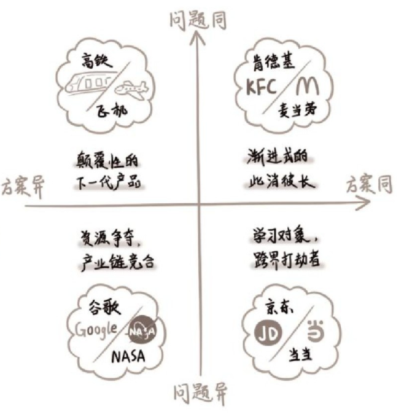
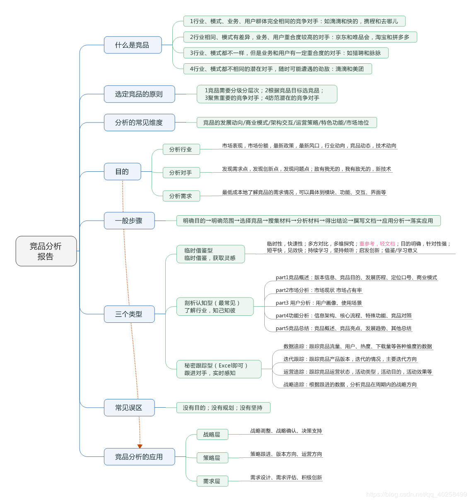

# 竞品分析 [1]

## 竞品本质

目标用户是同一群人或者组织。[5]

## 目的

竞品分析的目标包括：学习借鉴、优化自身、跟随竞争、反制对手。[11] 工作目标的不同，需要解决的问题不同。竞品分析的方式方法也会不同，最终**把问题解决了**才是有效的竞品分析！

竞品分析的目的是获取有价值的信息，基于信息的指导，让本产品在不同目标上做得更好；

- 用户分级来提升粘性活跃度和内容质量。
- 年龄大看不清分析竞品的字号大小，但目标群体年轻人就不重要了。

## 分类 [4]

- 功能分析：主要是列出自己产品的功能和同级别产品的功能，从中发现成本差异，研发能力差异。
- 交互分析：交互其实已经包含工业设计中，但是有必要单独拿出来分析，因为决定了用户体验。是用已经发展多年的按键，触屏，手机控制还是用目前最火的语音交互？为什么？
- 设计分析：在工业设计上，设计语言不仅是公司战略级的事务，也是产品极为重要的元素之一。设计领域还是有规可循的，把该类产品历史发展的设计风格和现在市场的风格研究一番，就能略知一二。还应该讨论，设计元素的变更有什么原因，目前的技术是否能够支持。

- 战略(产品定位与用户需求)
- 业务(主要功能)
- 结构(产品结构与信息结构)
- 体验(交互与视觉设计)
- 模式(商业模式)[12]

## 原则

- 海盗指标
- 场景分析
- 关键流程分析
- 尼尔森法则

## 步骤

### 产品定位规划阶段

要解决的问题是:

- 我们要怎么做?
- 如何来做才能赚到更多的钱?
- 如何比竞品做的更好?

竞品是怎么做的?主要包含,用户细分,产品定位产品模式,业务模型,盈利模型,付费的转化漏斗模型等等。

#### 竞品概述

如果是大项目，当然就不需要写对方的体量(下载量等数据)，就直接写就可以了；如果你自己做的项目是比较小众的，那么就需要列一下对方的体量，体量是很好反映一个公司，一个产品受欢迎程度的指标；这个指标决定了看报告的人，会对你的报告投入多少的信任度，倒不是说你的报告，而是对于竞品的功能和要做功能的本身质疑；[9]

### 产品设计阶段

- 我们的产品如何设计?
- 业务流程是什么?
- 都有那些功能?
- 功能逻辑的细节是什么?

这个阶段的竞品分析,更关注的是,以上这些内容竞品是怎么做的?

### 产品的优化迭代阶段

任何竞品分析都不可能是静态的,整个市场在变动,分析也应该长期保持更新：

1. 我们的产品存在哪些问题?
1. 如何优化改进?
1. 可以通过数据分析,并与竞品进行对比分析来，发现自身的问题

根据产品的问题确定竞品分析的方式和内容

## 竞品定义

蛋糕 = 需求量*ARPU，僧多粥少？

竞品一词来源于经济学领域，是指对竞争对手产品的优劣势进行比较分析。随着互联网时代的到来，现在的竞品用处更加宽泛。追根溯源竞品分析更像是工业时代企业管理里面的标杆管理，都是一种见贤思齐的人性体现，我更愿意接受竞品分析是战略规划工具这一说法。

竞品理念最早的成功案例要说富士施乐（FUJI XEROX）公司，施乐公司通过不断的同当时的日本企业进行对标，最后在复印机市场成功逆袭日本佳能。施乐公司成功后，这个方法风靡美国很多大型公司。

## 对什么？

出发点不对的强制竞品分析任务只会适得其反，带着目的与初衷愿景去做竞品分析，做出来的结果才有意义。

## 和谁对？

这五力分别指，同行业内现有竞争者的竞争能力、潜在竞争者进入的能力、替代品的替代能力、供应商的讨价还价能力、购买者的讨价还价能力。我们可能对直接竞争对手关注颇多，但殊不知竞品无处不在。

重新定义用户视角下的竞品分类。

做竞品分析，是为了从竞争者那里抢用户！

用户认为我们是什么，把我们归到哪一类，我们就应该在这个范围内去找自己的竞品，这之后，才谈得上抢用户。

分析“用户”！

知识付费类的APP：喜马拉雅APP，也可以是混沌大学APP
消遣无聊时光：喜马拉雅了，还可能是花椒、蜻蜓FM。
学习：选择线下大学、培训班、学习类图书、音像制品等等
没有明确的需求方向：所有可能抢占用户钱包和时间的产品都可以作为彼此的竞品。“得到”的竞品可能就是“王者荣耀”

## 怎么对

常规的一些资料权威来源主要是一些有公信力的第三方咨询或报告公司，比如：艾瑞咨询、Talkingdata、IDC、麦肯锡、易观智库、企鹅智库、CNNIC、百度指数、友盟数据、App Annie等。

行业协会与企业官网也是不错的选择，一般是行业内的自律组织，很多行业协会都会定期在网站上发布业内活动、重大新闻、大型会晤、科技进步以及行业数据。虽然可能有水分，但是相对比较直观量化。很多官网都会详细介绍拳头产品，甚至提供完整的产品手册（新手说明、常见问题、技术文档等），你可以和自己的产品比对，快速找出优缺点。

## 竞品分类

对于问题和方案的异同，我们可以用象限概念来帮助理解，把与自己产品有关系的潜在竞争对手分为四大类：问题同方案同、问题同方案异、问题异方案同、问题异方案异。

- 问题同方案同：直接竞品的厮杀通常是渐进式的创新，此消彼长
- 问题同方案异：用不同方案解决相似问题的产品，往往会成为行业里颠覆巨头的下一代产品。要特别关注！
- 问题异方案异：产品存在跨行业迁移，京东原来只卖 3C 数码，积累了用户和基础设施之后，卖起书来一点都不比当当差、星巴克原来只卖咖啡，2019 年也推出了茶饮料。
- 问题异方案异：占用了相似的不可再生资源，比如时间、金钱、人才等。产品产业链条中的上下游。任何行业里的某个角色，如果做大做强了，都很可能忍不住要占据产业链条里更多的位置

### 竞品分类举例 [2]

烧饼
工艺、口味、为啥好？

1. 直接竞品：边上家的烧饼
2. 间接竞品：卖麻花
3. 潜在竞品：卖臭豆腐的也想卖烧饼

- 一共有多少人跟我抢这块蛋糕?(竞争形势)
- 最好的几个是谁?(用户规模、融資、口碑)
- 他们用什么方法抢的?(产品模式)
- 他们产品有多少功能?(需求分析)
- 他们盈利模式是如何设计的?
- 运营转化策略是什如何推广的?
- 他们抢到了多少?
- 他们的发展曲线
- 竞品的优点和缺点
- 参考他们的转化漏斗模型：用户量-》活跃-》转化

观察角度：

- 定位规划
- 功能设计
- 优化迭代

目的：为我所用！

### 分析维度

竞品的商业模式、竞品目标用户、竞品的运营推广营销策略、技术分析、市场份额，从这几个维度进行分析。[7]

1. 竞品的商业模式。就是直接竞争产品如何盈利，如何赚钱的，对直接竞品内容的详细展开。
2. 竞品目标用户。各个竞品根据产品定位的差异，或者推广方式和覆盖地区的不同，目标用户不一样。人人贷在北京，则它的目标用户主要是30-39岁的男性用户，且由于公司本身在北京，则北京用户居多。点融网和人人贷的用户年龄层次分布和性别比例差不多，主要是地域不一样，以上海用户居多。
3. 竞品运营、营销、推广策略。从运营、营销、推广等维度分析产品迭代策略。
4. 技术分析。包括项目研发可能遇到的技术壁垒，如人工智能、语音图像识别等。
5. 市场份额。从不同角度了解竞品的市场情况，例如：可以通过Alexa网站了解流量排名，以及了解各大应用市场的安装量、活跃用户、地区分布、用户增长率等。

## 无竞品

绝大多数情况下，没有竞争对手是因为市场不存在、需求不存在。也可能是因为创业者把竞争对手理解得太狭隘了。

竞争对手不仅仅是那些很相似的产品，或者解决相似问题的产品，还包括整个行业生态，它们共同服务着我们的用户。

我们可以回顾用户生态的相关内容，结合对用户的理解，去了解更多的用户故事。了解用户每天在相关领域的各种所作所为、所思所想后，才能帮助我们更全面地发现竞品。

### ToB的「无竞品」

即使市场上存在性质类似的产品，作为普通用户想访问和使用也不是那么容易

外部公开的相似ToB产品设计资料资料可能很少，但对内的话，如果稍微留心搜索寻找一下，是可以通过内网的论坛、云盘、设计交流站点、设计稿预览站点还有不定期举办的内部专业分享等，找到前人对于类似项目的设计文档与经验总结的，给自己的设计思路带来启发。

这些小的模块很多在我们熟悉的ToC产品里都能找到影子，具体到交互设计模式很多都是通用的

一边学、一边猜、一边悟，通过收集资料，不断分析拼凑自己的产品版图

## 竞品选择策略

产品生命周期有所了解。主要包括四个发展阶段：导入期、成长期、成熟期和衰退期。

在品类不同的发展期间，用户对品类的认知是不一样的，对应的，竞品选择策略也是不一样的。

- 导入期:家用轿车是更快的马车、不用马拉的马车
- 成长期:A领导，竞品很可能还是马车。第二、第三抢领导品牌A
- 成熟期:沃尔沃代表安全，宝马代表驾驶的乐趣，可能还有消费者认为，日系品牌代表省油等等
- 衰退期:需求下降，换一个赛道，特性的创新

## 步骤

### 第一种刚起步,从0-1

step1：找到优质竞品

行业热门、人气最旺、融资最多、最具特色

- 关键词,搜索:全部>只找最优秀的几个(前10)
- 行业调研过程中发现的优秀竞品
- 基础数据查找,进行筛选

step2：锁定核心竞品

step3：确认分析维度

- 产品不同、行业不同、业不同、产品关注点不同,你需要跟老大沟通的
- 产品概述(介绍这款产品的业努,公司背景)
- 产品模式(模式分析,优劣对比)
- 用户细分(用户模式,用户画像)
- 基本运营现状(用户量、日活月活、单量等指标)
- 盈利模式(讲清楚,讲细,都多少种,多少钱,角色差异)
- 核心业务流程、核心功能、亮点(点,要细节,要细节,要细节)

step4：横向对比分析

step5：借鉴与规避竞品分析总结,结合我们自身情况,可以吸收的

- 产品模式、用户细分、盈利模式、特色亮点也许是融资最多的
- 核心业务流程
- 核心功能
- 竞品总结(借鉴与规避)

### 规避竞品的问题 [6]

竞品遇到的问题是真真切切存在的，如果产品经理不认真地对待和规避，那么最终自己一定也会遇到这些问题。对于一款新产品来说，任何问题可能都会造成至少 10 万元的损失，更别提其他的时间成本、机会成本了。

1. 团队和产品不匹配：凭什么能够在自己不熟悉的项目里输出自己的价值。
1. 只谈情怀，不谈收入：需要去预算收益，收入有安全感，才有希望。
1. 步子迈得太大：围绕一个更细分的市场去搭建，通过一个小的点来切入。形成了绝对的竞争壁垒。
1. 无法满足用户的需求：社交因为关系链本身无法迁移。

## 内容产品如何防盗版 [5]

盗版也属于广义竞品的范畴。

- 官方上场：版权方主动放出部分内容，占领流量入口，让想找盗版的人找不到盗版内容。
- 变目的为手段：随着盗版资源在市场上的传播，咨询业务也在无形中扩大了影响力。
- 产品本身创新：拉大盗版与正版的价值差距，给正版用户提供更多的增值服务。

## 示例

十三：饿了么、美团外卖、百度外卖竞品分析：https://www.jianshu.com/p/a49663820163

不建议大家去网上看那些动辄几十页的竞品分析，找来各种不靠谱的数据，要知道绝大多数可以被网络上搜到的行业、某个App的下载量数据，基本都是假的。

不要去反推某个大厂App的前一个功能是怎么做的，因为这个真没有任何技术含金量，自嗨式的炫技，既成的事实，自然不会锻炼到产品经理的思考能力。[8]

## 我为什么要做这份竞品分析报告？通过这篇竞品分析报告要解决一个什么？

真的就是这一点，几乎很少去做一整个APP的竞品分析，也从来没有使用《用户体验要素》里头讲的战略层、范围层等理论去进行分析(知乎上关于如何找到产品实习工作的帖子，教大家用这样的方法写竞品，其实是错的)。

因为在实际的工作中，做的人和看得人都是行业内从业者，对于市场盘子，竞品的体量心里大体都有个数，而时间都很宝贵，在大力倡导MVP(敏捷开发)的移动时代，每个版本的迭代一般也就一两个核心功能，所以一般竞品分析，我们就只做一两个核心功能的竞品分析就可以了。[9]

[1]: http://www.woshipm.com/pmd/1842636.html
[2]: https://www.bilibili.com/video/BV1wz4y1y7sg?p=4
[3]: https://www.zhihu.com/question/39005837
[4]: https://www.zhihu.com/question/39005837/answer/167081923
[5]: https://weread.qq.com/web/reader/8d632bc07208ed1c8d697c4k9bf32f301f9bf31c7ff0a60
[6]: https://www.zhihu.com/pub/reader/119980992/chapter/1284104622898974720
[7]: https://www.pianshen.com/article/89602055805/
[8]: https://zhuanlan.zhihu.com/p/69502665
[9]: https://www.zhihu.com/question/23601989/answer/317794141
[10]: https://g.yuque.com/zhongguodianxinyanjiuyuan/bgso10/wcfgzs
[11]: https://blog.csdn.net/weixin_45036344/article/details/103200505
[12]: http://www.woshipm.com/pmd/1642415.html
