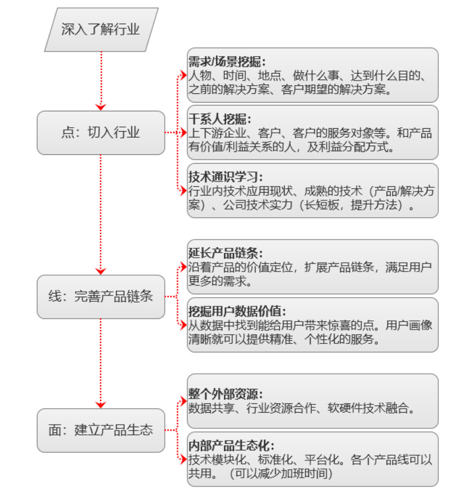

# 行业分析

## 目的

产品经理需要随时了解市场和行业的变化，提前做好对行业变化的预判工作，找到机会点。这样，才能保证我们做出的产品能够更好的顺应市场。

## 分析出机会点

产品小白如何快速做行业分析，找到机会点，最后能够做出分析结论：我们在哪些产品链条上的市场规模如何？存在哪些机会点？我们会面临上下游及竞品等哪些挑战？从中可以得到哪些商业价值？（需要日常练习，积累经验）

最后，针对我们的目标用户的典型需求，进行MVP。

## 套路

## 行业分析的思路如下：

1. 了解市场规模（这个市场有多大？市场变化趋势如何？这个市场有哪些参与者？各参与者的行业影响力如何？细分市场趋势如何？指标：市场销售总量，年复合增长率，标志性现象看前瞻性）
1. 产业地图分析（这个市场现状如何？行业如何运转？行业如何拆分？上下游关系如何？所在的竞争环境如何？细分市场的产品如何？指标：细分市场比例，增长率）
1. 行业典型产品分析（针对我们要做的产品，来了解竞品怎么做？竞品核心业务逻辑如何？功能架构如何？运营动作如何？用户评价如何？优缺点如何？）
1. 用户分析（针对我们要做的产品，来分析用户画像，从中挖掘需求，用户行为如何？机会点是什么？）
1. 总结（分析结论：我们在哪些产品链条上的市场规模如何？存在哪些机会点？我们会面临上下游及竞品等哪些挑战？从中可以得到哪些商业价值？）

### 三四规则 [5]

三四规则可用于分析企业在一个成熟市场中的竞争地位，它将参与市场竞争的企业分为三类，分别是领先者、参与者和生存者。三四规则描述了这样一个市场规律：在有影响力的领先者之中，企业的数量绝对不会超过三个，而在这三个企业之中，最有实力的竞争者的市场份额又不会超过最小者的四倍。

一般来说，领先者是指市场占有率在15%以上、可以对市场变化产生重大影响的企业，体现在价格、产量等方面；参与者一般是指市场占有率为5%～15%的企业，这些企业虽然不能对市场产生重大的影响，但是它们是市场竞争的有效参与者；生存者一般是局部细分市场的填补者，这些企业的市场占有率都非常低，通常小于5%。

三四规则的成立也有两个假定条件。① 在任何两个竞争者之间保持2∶1的市场份额均衡点时，无论哪个竞争者要增加或减少市场份额，都显得不切实际而且得不偿失。② 当市场份额小于最大竞争者的1/4时，就不可能有效参与竞争。

我们通过“三四规则”可以了解一些市场规律，倘若两个竞争者拥有几乎相同的市场份额，在竞争时谁能提高相对市场份额，谁就能同时取得在产量和成本两个方面的增长，而在任何主要竞争者的激烈争夺情况下，最有可能受到伤害的却是市场中最弱的生存者。

## 市场调查 [3]

市场调查是指用科学的方法，有目的、系统地搜集、记录、整理和分析市场情况，了解市场的现状及其发展趋势，为企业的决策者制定政策、进行市场预测、做出经营决策、制定计划提供客观、正确的依据。

专业知名机构： [6]

- China Ceidea Market Research 策点市场调研公司
- Acorn Marketing & Research Consultants 毅群市场研究咨询股份有限公司
- 上海伊霍珀信息科技股份有限公司
- 北京新数易博（EBMRS）信息咨询有限公司
- 华通明略（MillwardBrown ACSR）信息咨询有限公司 中机系（北京）信息技术研究院
- 中国商业数据中心
- 尼尔森市场研究中心
- 数字100市场研究公司
- 益普索（中国）市场研究咨询有限公司
- 凯度（中国）购物者指数（Kantar Worldpanel Chin- a）
- 上海AC尼尔森市场研究公司
- 盖洛普（中国）咨询有限公司
- 华南国际市场研究公司
- 百维数元信息科技（北京）有限公司
- 艾斯艾（北京）市场调查有限公司（SSI China）
- 欧睿（Euromonitor）市场调查机构

## 关注以下几个重要指标

- TAM：即Total Available Market，总有效市场或者市场规模，这是行业空间的天花板。然而，这是一个庞大的、基本没用的数字；
- SAM：即Serviceable Available Market，可服务市场，在基于公司内外部资源的客观条件下，所能服务到的市场范围。这个数字小了很多，基本有点用了；
- SOM：即Serviceable Obtainable Market，可获得市场，在能服务到的市场范围内，有能力拿下来的市场范围。这个数字进一步缩小，可以作为业务目标了；
- Market Share：市场占有率，关注该产品在TAM中所占有份额；
- Market Growth：市场成长性，关注整个行业TAM的增长或下降趋势；
- Market Net Value：公司实际收入，基于SOM所推断出来的公司实际收入（非流水，流水有可能只是过账户一道手，不一定是收入）。

## 行业标准 [7]

了解行业中规范的设计和开发标准不仅能缩短产品设计中的基础探索周期，而且能避免未来由于产品不符合行业标准或规则而带来的风险。如果公司能参与行业标准的制定最好，即使不能，熟悉行业标准和规范对于产品定义、设计都非常关键。

例如《机器人性能规范》《机器人安全要求》可以指导产品非功能需求设计，《机器人系统与集成标准》可以保证产品的集成设计方案是合理且通用的，《服务机器人模块化设计总则》可以指导机器人的模块化设计等。

## 行业数据分析

和企业内部数据（特别是财务数据）相比，完全不是一个量级的准。

## 渠道获取

1. 内部市场、运营部门、管理层等信息收集
1. 艾瑞咨询、DCCI互联网数据中心、Alexa、Appstore
1. 竞争对手网站、交流互动平台、产品历史更新版本、促销活动、最新调整、招聘信息等
1. 竞争对手的季度/年度财报
1. 行业媒体平台新闻、论坛、QQ群等
1. 调查核心用户、活跃用户、普通用户不同需求弥补和代替的产品
1. 使用对方的产品、客服咨询、技术问答等等
1. 搜索国外同行业的官网及行业信息订阅（市场竞争可能不大，但盈利模式和功能定义用户群体具有一定前瞻性和市场趋势导向性）

## 成为一个行业专家

如何快速深入一个行业，笔者基于自身经验，罗列了如下6个维度：行业特点、行业运行趋势、商业模式、竞争力因素分析、行业整合、政府管制。以个人/家庭服务机器人为例。

### 深挖“点”，变成“线” [7]

现代管理学之父彼得·德鲁克（Peter F.Drucker）曾经说过“企业的目的是创造和留住顾客。”在人工智能行业初期，一定是由技术驱动形成单个的场景应用和创新，随着市场同质化竞争日趋严重，企业一旦在某个“点”建立起竞争优势后，就需要快速转向“线”，即为客户创造更丰富的产品和服务，让客户不断看到新的价值和惊喜，最终积累更多的忠诚客户。

拥有对“点”的把控力，只是产品经理修炼成为行业专家的第一步。人工智能产品经理还要通过深挖场景价值，完善产品链条，即形成从“点”到“线”的变化。如果说互联网时代的主流价值观是“流量为王”，那么人工智能时代的产品就是“获得更多的超级用户”，这些超级用户创造了绝大部分的企业利润。企业靠“点”的创新只会保证其在第一阶段获取更多的初始客户，如果想要保住这些用户，而且要让他们变为忠诚的“超级用户”，就需要定制化、一站式的完整解决方案。

人工智能产品经理可以从下面几个方面进行从“点”到“线”的积累。

（1）深挖用户在场景中的需求，为用户提供解决方案而不仅仅是产品。举个例子：作为电商平台，给用户提供完美的网购体验并没有完，有些平台还会自建物流体系，延长服务链条，这么做在赚取额外利润的同时，还积累了大量会员。

当发现用户口袋里的钱不够时，没关系，用户还可以赊账，这样又衍生出了金融服务。按照这种逻辑规划出来的产品本质上就是解决方案，因为用户永远都会不停地挑剔、比较，只有产品的链条足够长，才能保持品牌持久的竞争力。而找到这样的“线”，就是产品经理尤其是人工智能产品经理重要的使命。

（2）挖掘用户数据中的价值，为用户创造惊喜。例如，如果你是做线上房屋租赁平台产品的，可以通过分析每个用户线上的行为和习惯数据建立个人的消费和信用模型，筛选出一些优质用户，以免租金和免租房押金的方式，定期提供福利和惊喜，甚至可以通过用户所在行业、兴趣爱好帮助用户匹配最适合的房东，当用户想换个地方住的时候还可以提供个性化建议。这就是一种典型的从“点”到“线”的思路。人工智能产品经理要通过人工智能技术挖掘那些从量变到质变的潜在机会，最终实现产品服务链条化，积累更多的忠诚用户。

### 横向拓展“线”，变成“面”

当人工智能产品完成从“点”到“线”的变化后，需要进一步巩固自身优势，让产品变成“面”。“面”包括两方面的含义，一是通过引入外部资源建立紧密的协同关系并构建更宽广的产品覆盖度，与用户产生更多的联系；二是指通过整合公司内部资源打通各产品线的数据和基础服务，形成公司内部的产品生态。

人工智能产品经理可以从两个方面进行从“线”到“面”的整合。

（1）整合外部资源，实现多元化协作：由于人工智能产品的架构复杂，数据、算法、计算能力想要实现快速积累并整合，在某种程度上可以通过对外协作和资源整合的方式实现。因此需要人工智能产品经理做好整合资源的准备并提出解决方案。例如高质量有效数据的共享及交易；和传统行业解决方案公司或业内具有影响力的客户从数据、行业资源等方面进行深入合作、优势互补；如果是做软件的公司，就和一些硬件供应商进行软硬技术的融合，通过整合上下游资源形成利益结盟。

人工智能行业的产业链协作还处于初期，未来越来越多的公司在研发自己的人工智能产品时会主动选择协作，人工智能产品经理在市场竞争中应保持和外部资源的密切关系，这不仅对公司来说是一种积累和扩大优势的方式，而且对于产品经理个人来说也是一种扩大个人在行业中影响力的途径。

（2）布局内部产品生态化：当公司的产品线变得丰富后，产品经理应通过构建人工智能统一平台，实现各条产品线的优势联合与价值共享。比如公司有三条产品线，每条产品线有大量的交叉用户，而且都包含搜索引擎、推荐引擎、智能售后机器人等通用功能，这个时候就可以考虑整合三条产品线的用户数据和算法（例如智能交互、语义搜索、智能匹配等），统一研发公司级别的搜索平台、个性化推荐引擎和知识图谱等。这样的公司级别的平台反过来为三条产品线的用户提供全方位的个性化决策服务。随着各平台对基础服务的优化，会增强各条产品线的竞争力，进而产生更多有价值的数据，最终形成良性循环。另外，当公司有新的产品线成立时，可以在公司现有平台基础上快速建立自身优势，快速融入公司的产品生态。

##  框架

腾讯5G生态计划负责人 余一列出了一个做行研的基本框架：（1）确定研究目标；（2）圈定已有资料的概览范围，上市公司财报及分析报告、咨询公司报告、数据机构资料、行业专业网站、政府网站、招聘网站、媒体网站等；（3）需要圈定时间和目标，不要迷失在资料中。（4）输出初步框架，行业现状（规模、结构、阶段）、行业趋势（发展推动要素、推动力分析）、竞争格局、其他。（5）业内访谈 ，产业链、公司、专家、技术。（6）输出。

Envolve Group Co-founder 刘嘉培Alex详细拆解了查阅报告材料和思考的六个步骤，即要Top-down地思考一个行业：第一，先看整体市场规模，再看CAGR年复合增速，并思考：a) 容得下几家巨头公司？ b) 增长的驱动因素是什么？ 第二，了解最新资本市场活动：投资总额、IPO数量、兼并收购数量，思考:a) 行业受资本青睐吗？为什么？b) 大家是想靠估值倍数、分红、增长、并购重组挣钱？第三，利用MECE的方式把市场分割成多个不同的赛道：a) 关注不同赛道的行业规模、增速、市场活动、趋势、龙头、商业模式b) 考虑行业上下游之间的关系：整合还是分散？竞争还是合作？会一家独大还是百花齐放？c) 不同赛道里面最容易出现商业模式成熟、盈利模式清晰的公司的是哪个？ 第四，关注最新行业动态、趋势和"催化剂"：a) 趋势是利好还是利空？对巨头有利还是对挑战者有利？b) 看行业垂直媒体c) 看公司研报。第五，研究行业巨头3-5家，新兴挑战者企业8-15家，做总结：a) 总结领先产品、品牌策略、用户positioning，b) 总结商业模式、盈利模式、经营模型、竞争策略，c) 二级市场估值倍数和市值变化规律，d) Where they started and how they got here。第六，从创始人、投资人、客户/用户、投行咨询四个角度问：a)如果现在进入市场的话，会怎么做？b)如果投股票、收购公司、天使投资、债券的话，分别怎么投？为什么？在赌什么？c) 作为一个用户，最希望看到的是什么？为什么？

在实操过程中，Red Tripod captial Investment Director Vivian Young特别强调了供需分析的重要性：一般的行业分析员大部分的时间就是在做供需分析，分析时要注意当前的供求结构关系，区分国内还是全球，存量还是增量。另外，需要重点关注：需求周期，产能周期，需求传导的逻辑，传导的节奏等。除了供需，还要研究行业未来发展趋势，其中，政策影响很关键。

除了具体的方法与步骤，阿尔法公社投资经理Gang Liu还提醒大家，在做行研的时候不能求快，要以慢为快，在有限的时间段里，花更多的时间在研究上，方式方法重要，但执行同样重要。同时，要敬畏专业性，尽可能的找到这个领域的一线从业者或者专家，多跟他们交流。交叉验证，保持思辨性很重要。

[1]: http://www.woshipm.com/zhichang/2124682.html
[2]: https://www.linkedin.com/news/story/%E6%8A%95%E8%B5%84%E4%BA%BA%E8%AF%A5%E5%A6%82%E4%BD%95%E5%81%9A%E5%A5%BD%E8%A1%8C%E4%B8%9A%E7%A0%94%E7%A9%B6-5372810/
[3]: https://baike.baidu.com/item/%E5%B8%82%E5%9C%BA%E8%B0%83%E6%9F%A5/170622#:~:text=%E5%B8%82%E5%9C%BA%E8%B0%83%E6%9F%A5%E6%98%AF%E6%8C%87%E7%94%A8,%E6%8F%90%E4%BE%9B%E5%AE%A2%E8%A7%82%E3%80%81%E6%AD%A3%E7%A1%AE%E7%9A%84%E4%BE%9D%E6%8D%AE%E3%80%82
[4]: http://www.woshipm.com/pmd/3487853.html
[5]: https://weread.qq.com/web/reader/40632860719ad5bb4060856k283328802332838023a7529
[6]: https://www.shangyexinzhi.com/article/1924707.html
[7]: http://reader.epubee.com/books/mobile/f4/f4c52db61d39acb835e2709cbed1585e/text00005.html
