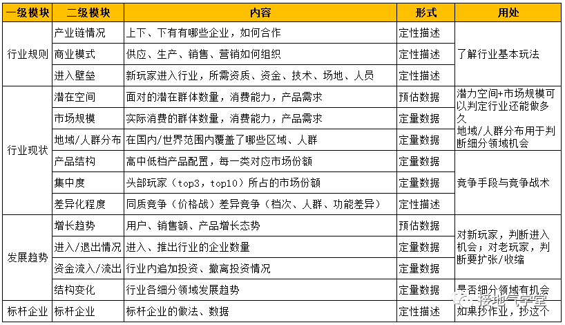

# 行业分析

## 目的

产品经理需要随时了解市场和行业的变化，提前做好对行业变化的预判工作，找到机会点。这样，才能保证我们做出的产品能够更好的顺应市场。

## 分析出机会点

产品小白如何快速做行业分析，找到机会点，最后能够做出分析结论：我们在哪些产品链条上的市场规模如何？存在哪些机会点？我们会面临上下游及竞品等哪些挑战？从中可以得到哪些商业价值？（需要日常练习，积累经验）

最后，针对我们的目标用户的典型需求，进行MVP。

## 套路

## 行业分析的思路如下：

1. 了解市场规模（这个市场有多大？市场变化趋势如何？这个市场有哪些参与者？各参与者的行业影响力如何？细分市场趋势如何？指标：市场销售总量，年复合增长率，标志性现象看前瞻性）
1. 产业地图分析（这个市场现状如何？行业如何运转？行业如何拆分？上下游关系如何？所在的竞争环境如何？细分市场的产品如何？指标：细分市场比例，增长率）
1. 行业典型产品分析（针对我们要做的产品，来了解竞品怎么做？竞品核心业务逻辑如何？功能架构如何？运营动作如何？用户评价如何？优缺点如何？）
1. 用户分析（针对我们要做的产品，来分析用户画像，从中挖掘需求，用户行为如何？机会点是什么？）
1. 总结（分析结论：我们在哪些产品链条上的市场规模如何？存在哪些机会点？我们会面临上下游及竞品等哪些挑战？从中可以得到哪些商业价值？）

### 三四规则 [5]

三四规则可用于分析企业在一个成熟市场中的竞争地位，它将参与市场竞争的企业分为三类，分别是领先者、参与者和生存者。三四规则描述了这样一个市场规律：在有影响力的领先者之中，企业的数量绝对不会超过三个，而在这三个企业之中，最有实力的竞争者的市场份额又不会超过最小者的四倍。

一般来说，领先者是指市场占有率在15%以上、可以对市场变化产生重大影响的企业，体现在价格、产量等方面；参与者一般是指市场占有率为5%～15%的企业，这些企业虽然不能对市场产生重大的影响，但是它们是市场竞争的有效参与者；生存者一般是局部细分市场的填补者，这些企业的市场占有率都非常低，通常小于5%。

三四规则的成立也有两个假定条件。① 在任何两个竞争者之间保持2∶1的市场份额均衡点时，无论哪个竞争者要增加或减少市场份额，都显得不切实际而且得不偿失。② 当市场份额小于最大竞争者的1/4时，就不可能有效参与竞争。

我们通过“三四规则”可以了解一些市场规律，倘若两个竞争者拥有几乎相同的市场份额，在竞争时谁能提高相对市场份额，谁就能同时取得在产量和成本两个方面的增长，而在任何主要竞争者的激烈争夺情况下，最有可能受到伤害的却是市场中最弱的生存者。

## 市场调查 [3]

市场调查是指用科学的方法，有目的、系统地搜集、记录、整理和分析市场情况，了解市场的现状及其发展趋势，为企业的决策者制定政策、进行市场预测、做出经营决策、制定计划提供客观、正确的依据。

## 关注以下几个重要指标

- TAM：即Total Available Market，总有效市场或者市场规模，这是行业空间的天花板。然而，这是一个庞大的、基本没用的数字；
- SAM：即Serviceable Available Market，可服务市场，在基于公司内外部资源的客观条件下，所能服务到的市场范围。这个数字小了很多，基本有点用了；
- SOM：即Serviceable Obtainable Market，可获得市场，在能服务到的市场范围内，有能力拿下来的市场范围。这个数字进一步缩小，可以作为业务目标了；
- Market Share：市场占有率，关注该产品在TAM中所占有份额；
- Market Growth：市场成长性，关注整个行业TAM的增长或下降趋势；
- Market Net Value：公司实际收入，基于SOM所推断出来的公司实际收入（非流水，流水有可能只是过账户一道手，不一定是收入）。

## 行业数据分析

和企业内部数据（特别是财务数据）相比，完全不是一个量级的准。

## 渠道获取

1. 内部市场、运营部门、管理层等信息收集
1. 艾瑞咨询、DCCI互联网数据中心、Alexa、Appstore
1. 竞争对手网站、交流互动平台、产品历史更新版本、促销活动、最新调整、招聘信息等
1. 竞争对手的季度/年度财报
1. 行业媒体平台新闻、论坛、QQ群等
1. 调查核心用户、活跃用户、普通用户不同需求弥补和代替的产品
1. 使用对方的产品、客服咨询、技术问答等等
1. 搜索国外同行业的官网及行业信息订阅（市场竞争可能不大，但盈利模式和功能定义用户群体具有一定前瞻性和市场趋势导向性）

## 成为一个行业专家

如何快速深入一个行业，笔者基于自身经验，罗列了如下6个维度：行业特点、行业运行趋势、商业模式、竞争力因素分析、行业整合、政府管制。以个人/家庭服务机器人为例。

##  框架

腾讯5G生态计划负责人 余一列出了一个做行研的基本框架：（1）确定研究目标；（2）圈定已有资料的概览范围，上市公司财报及分析报告、咨询公司报告、数据机构资料、行业专业网站、政府网站、招聘网站、媒体网站等；（3）需要圈定时间和目标，不要迷失在资料中。（4）输出初步框架，行业现状（规模、结构、阶段）、行业趋势（发展推动要素、推动力分析）、竞争格局、其他。（5）业内访谈 ，产业链、公司、专家、技术。（6）输出。

Envolve Group Co-founder 刘嘉培Alex详细拆解了查阅报告材料和思考的六个步骤，即要Top-down地思考一个行业：第一，先看整体市场规模，再看CAGR年复合增速，并思考：a) 容得下几家巨头公司？ b) 增长的驱动因素是什么？ 第二，了解最新资本市场活动：投资总额、IPO数量、兼并收购数量，思考:a) 行业受资本青睐吗？为什么？b) 大家是想靠估值倍数、分红、增长、并购重组挣钱？第三，利用MECE的方式把市场分割成多个不同的赛道：a) 关注不同赛道的行业规模、增速、市场活动、趋势、龙头、商业模式b) 考虑行业上下游之间的关系：整合还是分散？竞争还是合作？会一家独大还是百花齐放？c) 不同赛道里面最容易出现商业模式成熟、盈利模式清晰的公司的是哪个？ 第四，关注最新行业动态、趋势和"催化剂"：a) 趋势是利好还是利空？对巨头有利还是对挑战者有利？b) 看行业垂直媒体c) 看公司研报。第五，研究行业巨头3-5家，新兴挑战者企业8-15家，做总结：a) 总结领先产品、品牌策略、用户positioning，b) 总结商业模式、盈利模式、经营模型、竞争策略，c) 二级市场估值倍数和市值变化规律，d) Where they started and how they got here。第六，从创始人、投资人、客户/用户、投行咨询四个角度问：a)如果现在进入市场的话，会怎么做？b)如果投股票、收购公司、天使投资、债券的话，分别怎么投？为什么？在赌什么？c) 作为一个用户，最希望看到的是什么？为什么？

在实操过程中，Red Tripod captial Investment Director Vivian Young特别强调了供需分析的重要性：一般的行业分析员大部分的时间就是在做供需分析，分析时要注意当前的供求结构关系，区分国内还是全球，存量还是增量。另外，需要重点关注：需求周期，产能周期，需求传导的逻辑，传导的节奏等。除了供需，还要研究行业未来发展趋势，其中，政策影响很关键。

除了具体的方法与步骤，阿尔法公社投资经理Gang Liu还提醒大家，在做行研的时候不能求快，要以慢为快，在有限的时间段里，花更多的时间在研究上，方式方法重要，但执行同样重要。同时，要敬畏专业性，尽可能的找到这个领域的一线从业者或者专家，多跟他们交流。交叉验证，保持思辨性很重要。

[1]: http://www.woshipm.com/zhichang/2124682.html
[2]: https://www.linkedin.com/news/story/%E6%8A%95%E8%B5%84%E4%BA%BA%E8%AF%A5%E5%A6%82%E4%BD%95%E5%81%9A%E5%A5%BD%E8%A1%8C%E4%B8%9A%E7%A0%94%E7%A9%B6-5372810/
[3]: https://baike.baidu.com/item/%E5%B8%82%E5%9C%BA%E8%B0%83%E6%9F%A5/170622#:~:text=%E5%B8%82%E5%9C%BA%E8%B0%83%E6%9F%A5%E6%98%AF%E6%8C%87%E7%94%A8,%E6%8F%90%E4%BE%9B%E5%AE%A2%E8%A7%82%E3%80%81%E6%AD%A3%E7%A1%AE%E7%9A%84%E4%BE%9D%E6%8D%AE%E3%80%82
[4]: http://www.woshipm.com/pmd/3487853.html
[5]: https://weread.qq.com/web/reader/40632860719ad5bb4060856k283328802332838023a7529
