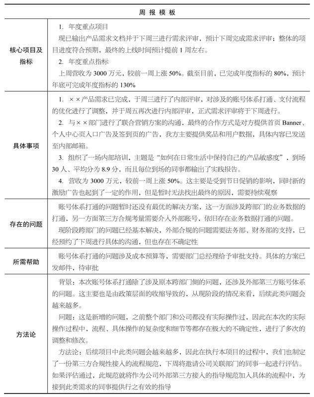

# 项目管理

## 定义 [2]

PM能在产品的整个生命周期中，进行产品迭代的规划、各类资源的整合以及生产进度的把控。

## 最简单的项目管理 [5]

立项——需求（开发）——开发——测试——发布
文档管理——流程管理——敏捷方法

## VS Project Manager

产品和开发的是同样的团队和同样的人，但在驱动产品和驱动项目这两件事情上，最好还是有所差别。至少产品更关注的是产品、功能、方向和反馈；而项目则更关注进度、质量和测试等。

- 做好评估。几乎所有项目最终未按计划执行，其最根本原因就是在项目开始阶段，没有对需求、技术、产品有足够充分的了解，也就没有后续开发中的可控力度。高估和低估都是有问题的，所以我们常用的做法就是非常重视前期的评估，宁愿多花时间，并且对有模糊边界或者有挑战的问题，留足buffer。
- 将计划落实到可执行的单元和可执行的人。有了评估，然后就是将计划落实到足够力度的任务，以任务驱动开发过程，任务落实到责任人，任务要标明截止日期。在此，通过一定的工具来管理，是十分必要而可控进度的。例如我们基于自主产品PingCode 的任务驱动方式，就可以很好的将开发计划落实到任务和可执行的人，以直观的方式来告诉负责人项目整体的状态、执行者的情况、被delay的事情有哪些。总之，工具的辅助需要团队开发想法的驱动。(再多说一句：PingCode不仅可以进行以上的项目管理，还覆盖了项目、任务、需求、缺陷、迭代规划、测试、目标管理的研发管理全流程。)

## 明确分工职责 [4]

1. 明确产品方案
1. 明确分工职责
1. 明确项目排期
1. 明确 Review 周期

## 周报 [6]

写好周报的重点在于方法论建设，知识传承的核心在于能够真正用到实际工作中且可以快速复制。而周报本身就是基于自身工作的且与团队成员有极强的契合度，因此更容易引起共鸣，产生实际的价值。产品经理切记，从入职的第一天起就要启动周报的知识传承。下面为大家提供一个周报模板。

[1]: https://www.zhihu.com/question/20102432
[2]: https://www.iamxiarui.com/?p=1782
[3]: https://www.iamxiarui.com/?p=1782
[4]: https://www.iamxiarui.com/?p=1369
[5]: https://quizlet.com/129588206/%E4%BA%BA%E4%BA%BA%E9%83%BD%E6%98%AF%E4%BA%A7%E5%93%81%E7%BB%8F%E7%90%86-%E7%AC%94%E8%AE%B0-flash-cards/s
[6]: https://www.zhihu.com/pub/reader/119980992/chapter/1284104645191839744
