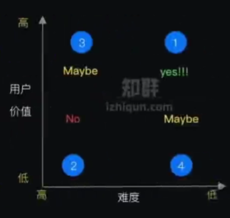

# 迭代优化

## 需求管理

需求管理——加深对业务和产品的理解；需求优先级、工作迭代计划——业务准确判断力

需求排序[1]——第一要务就是分清产品需求的主次，解决问题的顺序：

## 需求来源部分

不同方向的需求来源略有不同，总体来说，产品经理的需求来源有以下几个方面：

- 业务需求：由业务方，比如 BD、编审、运营等，直接提出的业务需求；
- 数据挖掘：通过数据挖掘和分析，发现的问题或需求；
- 竞对调研：通过分析竞对的产品，发现竞对比我们有优势或值得学习借鉴的地方；
- 实地观察：不论是 B 端产品还是 C 端产品，其实都有大量的机会实地观察用户行为。比如直接陪访城市运营等；
- 战略需要：俗话说「老大拍的」，这类是由公司 leader 直接安排的需求，通常表示公司未来发展方向或急需解决的关键问题；
- 其他还包括客服、商服反馈的问题，通过在线渠道或用户访谈获得的需求，还有微博、朋友圈吐槽等各种 SNS 途径。不论哪种途径获取的需求，产品经理都应该有一个自己的需求池，统一记录各种想法。

在不同需求来源中，最看重的产品经理自己发现/评估的需求，这是评价产品经理需求决策能力的重要指标。

## 收集和整理需求

收集和整理需求，就是将需求统一记录到需求池，方便团队内/间的传播。每个团队建议维护自己的需求池地址。

需求池只是一个备忘，记录下来的需求不一定都要做，也未必是值得做的需求才记录下来。

### 需求收集

- 需求来源：见上。
- 需求内容：交互体验优化、业务调整要求、业务管理要求
- 需求采集：1V1面谈、问卷调研、轮岗实习
- 需求背后的 **真实问题** 以及 **需求的价值**
- 需求背后的真正问题是什么？
- 问题是否有简单快速的解法？
- 问题影响面有多大？个案问题是否值得研究解决
- 共性问题，优先级和紧急程度？

### 需求池管理

1. 目的：实现清晰准确的需求管理、迭代计划管理，使项目进度透明
1. 需求池管理模板：

- 业务线/对应的系统
- 需求类型：产品需求、产品需求（插入）、技术需求、技术需求（插入）、线上bug
- 主题：需求概述
- 内容：需求具体描述
- 来源：需求提出者
- 提出时间
- 优先级：重要紧迫度、目标、作用对象；需要与业务方在原则上达成一致
- 迭代版本
- 业务负责人
- 产品经理
- 研发负责人
- 测试负责人
- 状态
- 计划上线时间
- 实际上线时间
- 前端开始/结束日期
- 前端研发工作量
- 发版计划

## 如此困难

- 相比去做更普适的项目，做那些你最喜欢的、自己会用的产品更令人满足。
- 相比去做直接对你的目标产生影响的项目，把注意力集中在那些聪明有趣的主意上更有诱惑力。
- 相比去做自己已经有信心的项目，去钻研新的想法更令人兴奋。（有些情况也可能反过来）

## 需求属性的评估

### 三维度

- 需求价值评估：需求的价值分为两个维度，一个维度是创造效益，另一个维度是节省成本，通过对需求背景的影响因子给定假设条件进行评估，就能大致估算出这个需求可以产生的预期效果；例如：当前的妥投率为95%，未妥投原因中收件地址错误的原因占比75%，假设通过增加收件人地址校验，解决85%，那么需求的预期收益就是提升3.18%的妥投率。
- 需求难度评估：难度可以从是否需要设计新模块开发、原有模块改造量、开发实现难度、是否涉及关联系统改造几个方面进行考量；如果一个需求既设计算法选项、参数优化、训练数据标注、模块封装、总控接入、前端改造那么这个需求的实现难度就属于很高的程度了。
- 需求周期评估：需求拆解后本项目组的开发周期加上关联系统排期、开发的周期就能确定需求的实现周期。

### RICE

RICE SCORE = R*I*C/E
Reach（接触数量）
Impact（影响程度）
Confidence（信心指数）
Effort（投入精力）

### MoSCoW

美其名曰“全面”，以全面来打入市场。最终却是“样样做，样样差”。must have、should have、could have、won’t have模型。

- 位于“1”（Must have）:用户价值高,难度低,优先制作
- 位于“2”（won’t have）:用户价值低,难度高,延后制作甚至不做;
- 位于“3"、“4":如果交货时间紧，“可以有”将第一批被删除，“应该有”紧随其后。

### Kano帮你找到用户满意度[2]

一种在不同阶段按产品目标倒退需求优先级的思维方式，它将需求分为三类：

它将需求分为三类：

1. 基础功能。代表产品进入市场的基本门槛，保证能够满足用户普遍需求的最低标准。然而在后续的研发若投入大量精力，并不会显著提高用户的满意度或建立产品的竞争门槛，因此此类需求优先级较低。
2. 性能需求。即在实现基础功能后，为了提升和优化产品性能的需求。这类需求可以在一定程度上提升用户满意度，但其他竞争对手同时也会在这方面持续投入，ROI通常为线性。
3. 尖叫（兴奋）功能。用户使用产品后能够感受到喜悦和兴奋，这种产品可能是非常有创造性的，也有可能带来

属性的成熟程度和情绪反应之间呈线性关系，主要针对于如易用性、成本、娱乐价值和安全性这样的产品特征。

狩野纪昭(Noriaki Kano)将五种情绪反应可视化为图中的曲线，其中，y轴是情绪反应，x轴是特征的成熟程度。情绪反应的强度由特征如何充分呈现和其成熟程度驱动。

将需求划分为必备型、期望型、魅力型、无差异型、反向型五类，分别以英文字母M、O、A、I、R表示。

- 必备型需求(M)：需求满足时，用户不会感到满意。需求不满足时，用户会很不满意。
- 期望型需求(O)：需求满足时，用户会感到很满意。需求不满足时，用户会很不满意。
- 魅力型需求(A)：该需求超过用户对产品本来的期望，使得用户的满意度急剧上升。即使表现的不完善，用户的满意度也不受影响。
- 无差异型需求(I)：需求被满足或未被满足，都不会对用户的满意度造成影响。
- 反向型需求(R)：该需求与用户的满意度呈反向相关，满足该要求，反而会使用户的满意度下降。

better-worse系数：

- Better系数=（期望数+魅力数）/（期望数+魅力数+必备数+无差异数）
- Worse系数= -1*（期望数+必备数）/（期望数+魅力数+必备数+无差异数）

Better系数越接近1，表示该具备度越高该需求对用户满意度提升的影响效果越大。Worse系数越接近-1，表示具备度越低该需求对用户满意度造成的负面影响越大。

http://www.woshipm.com/pd/4383131.html

----

## 产品迭代管理

软件的持续优化、升级：充分利用研发资源，正确认识技术优化所需的资源，升级研发效率

1. 研发资源管理：研发人力资源安排图（时间、负责人、项目模块）
1. 技术优化资源分配

- 初创：权利开发业务功能，10%用来技术优化
- 瓶颈：业务需求满足疲态，技术架构、设计缺陷出现问题，50%技术优化
- 重构：80%资源做技术重构
- 稳定：10%-20%资源持续做技术优化

1. 双周迭代
局限性：MVP不一定能在迭代周期内交付、跨端项目复杂研发节奏相互依赖、难以准确预估工作投入

## 技巧 [4]

1. 平衡
如果是面向B端业务，那么所有业务线对自己的需求都是关注且紧迫的；这时候就需要学会平衡每个业务的需求，不能被业务完全牵着走，这样对产品规划会有极大影响。

那么每当这时候，就需要可以一起拉通多个业务，来集中评估各方的诉求，宣导团队的资源是有限性的；让业务之间来取舍他们之间的优先级，这就是让“决策”转移到业务自身上。

2. 替代
任何的产品解决方案都是有备选方案的，那么在当前无法尽快满足用户的前提；可以优先采用临时方案，先满足用户最核心的需求，把其他延伸性需求先砍掉，待到条件成熟在上线完整需求。

而这就是采用“替代”的方式，一定程度上去满足用户需求，这对挽留用户、提升用户口碑有极大帮助。

3. 延迟
这是一个不太“厚道”的方式，前面提到用户对他们自身的需求都关注比较强烈，受限当前的规划和限制条件，确实无法那无法尽快满足的情况，但用户是不会理解买账的；那么如何去“安抚‘用户情绪呢，把负面情绪尽可能降到最低？

这就靠一个“拖”字决，可以先给对方的一个明确信号：我们会做（类似先画个饼）。

但是由于一些原因（把这些问题夸大），需要稍微往后一些才能支持，那么这个往后的时间就可以相对灵活可变的，在这里也主要是安抚用户的情绪为主。

[1]: http://www.woshipm.com/pd/1887717.html
[2]: https://www.huaweicloud.com/articles/280202e7d83cd36df93e5f027939cbaa.html
[3]: https://zhuanlan.zhihu.com/p/38387218
[4]: http://www.woshipm.com/pmd/4161341.html
