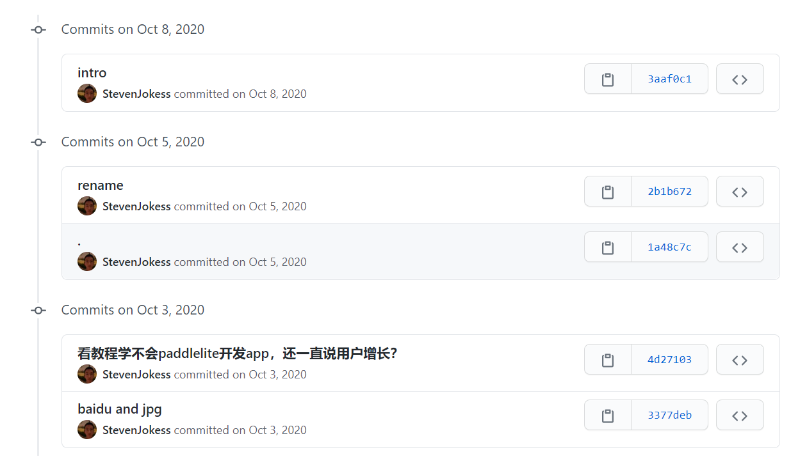
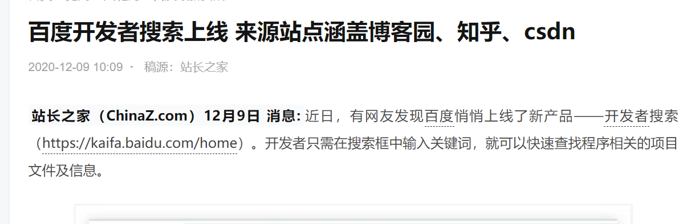
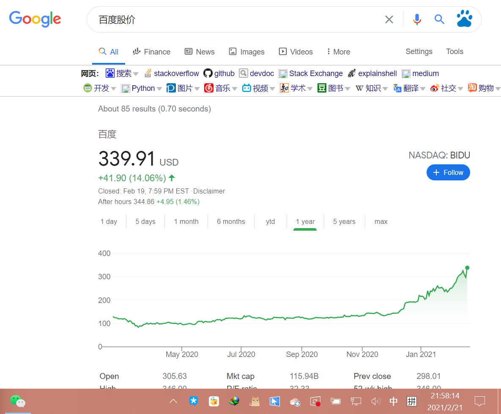
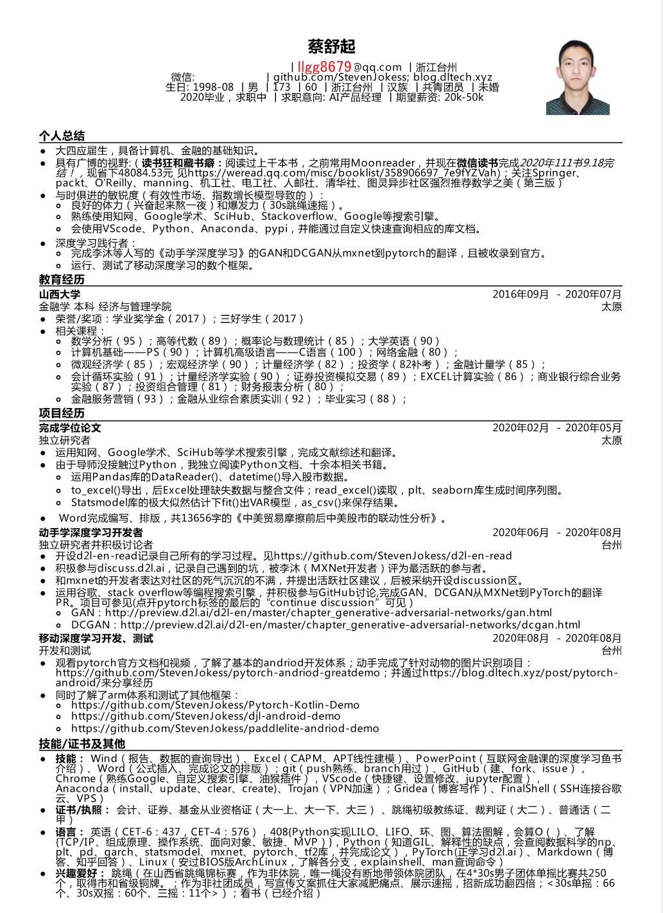

# 求职AI PM，百度用了我战略idea？

AI产品经理是直接应用或间接涉及了AI技术，进而完成相关AI产品的设计、研发、推广、产品生命周期管理等工作的产品经理。由于AI的技术领域太多、且有更多和垂直行业结合的机会，导致细分AI领域的产品经理所需要的背景和能力可能大不相同。[1]

<embed width=100% height=100% fullscreen=yes
src="/蔡舒起-AI产品经理-动手学深度学习GAN开发者.pdf" />

## [求职AI产品经理，点击下载简历PDF](https://github.com/StevenJokess/StevenJokess.github.io/blob/master/%E8%94%A1%E8%88%92%E8%B5%B7-AI%E4%BA%A7%E5%93%81%E7%BB%8F%E7%90%86-%E5%8A%A8%E6%89%8B%E5%AD%A6%E6%B7%B1%E5%BA%A6%E5%AD%A6%E4%B9%A0GAN%E5%BC%80%E5%8F%91%E8%80%85.pdf)

----

细节：

**一面百度AIstudio产品经理失败**后的总结：https://github.com/StevenJokess/d2l-en-read/blob/moreme/chapter-generative-adversarial-networks/aistudio-job.md

可以看到2020年10月3日里面就有最近**才beta测试**的 https://kaifa.baidu.com 的主意!

据我能找到的最早时间：

百度股价预测：

:depth:300px

百度最新股价：

:depth:200px

----

https://www.overleaf.com/project/603dfbba8126ff225dc18564

## **简历**

### 自我评价：

- 健身跳绳、计算机AI、金融的基础
- 《动手学深度学习》GAN、DCGAN从MXNet到PyTorch的开发
- PyTorch Android demo等移动深度学习框架复现
- docker部署的d2lbook2写 《To be AI PM》
- 证书：省跳绳铜牌、初级教练、裁判证；会计、证券、基金从业；六级、二甲
- 快速学习：与时俱进、千书阅读

### 工作经历

企业名称: 个人求职中

开始时间: 2020-12-01

结束时间: 2021-02-01

职位名称: 学习并撰写AI产品经理相关内容

所在部门: 个人求职中

离职原因: 对AI更热爱。感觉AI能服务更多人。

工作描述:

- 运用docker的 https://github.com/aieye-top/d2l-book2 包，来：
- 撰写普惠深度学习（WIP）：https://github.com/aieye-top/d2cl
- 撰写人工智能产品经理相关书（WIP)：https://stevenjokess.github.io/2bPM/

---

### 项目经验

项目名称: 移动深度学习开发、测试
开始时间: 2020-08-01
结束时间: 2020-09-01
项目描述:

- 观看pytorch官方文档和视频,了解了基本的andriod开发体系;
- 动手完成了针对动物的图片识别项目:https://github.com/StevenJokess/pytorch-andriod-greatdemo;
- 并通过https://stevenjokess.github.io/post/pytorch-android/来分享经历
- 项目职责: 同时了解了arm体系和测试了其他框架:
- https://github.com/StevenJokess/Pytorch-Kotlin-Demo
- https://github.com/StevenJokess/djl-android-demo
- https://github.com/StevenJokess/paddlelite-andriod-demo

---

项目名称: 动手学深度学习GAN开发者

开始时间: 2020-06-01

结束时间: 2020-11-01

项目描述:

- 开设d2l-en-read记录自己所有的学习过程.见https://github.com/StevenJokess/d2l-en-read
- 积极参与discuss.d2l.ai,记录自己遇到的坑,被李沐(MXNet开发者)评为最活跃的参与者.
- 和mxnet的开发者表达对社区的死气沉沉的不满,并提出活跃社区建议,后被采纳开设discussion区.
- 并学习更多AI内容记录在https://github.com/StevenJokess/d2l-en-read/tree/moreme
- 项目职责: 运用谷歌、stack overflow等编程搜索引擎,并积极参与GitHub讨论,完成GAN、DCGAN从MXNet到PyTorch的翻译
- PR.项目可参见(点开pytorch标签的最后的“continue discussion”可见)
- GAN:http://preview.d2l.ai/d2l-en/master/chapter_generative-adversarial-networks/gan.html
- DCGAN:http://preview.d2l.ai/d2l-en/master/chapter_generative-adversarial-networks/dcgan.html

---

项目名称: 完成学位论文

开始时间: 2020-02-01

结束时间: 2020-05-01

项目描述: 独立研究者 repo: https://github.com/StevenJokess/gra_paper

- 运用知网、Google学术、SciHub等学术搜索引擎,完成文献综述和翻译.
- 由于导师没接触过Python,我独立阅读Python文档、十余本相关书籍.
- 项目职责: 运用Pandas库的DataReader()、datetime()导入股市数据.
- to_excel()导出,后Excel处理缺失数据与整合文件;read_excel()读取,plt、seaborn库生成时间序列图.
- Statsmodel库的极大似然估计下fit()出VAR模型,as_csv()来保存结果.
- Word完成编写、排版,共13656字的《中美贸易摩擦前后中美股市的联动性分析》

项目名称: 参加山西省跳绳竞标赛

开始时间: 2018-07-01

结束时间: 2018-08-01

项目描述:

- 30s单摇：66;30s双摇：60;三摇：11个
- 毕业前还可单手俯卧撑、单腿深蹲（现在学AI学肥了。。）

项目职责:

- 偶然在操场练习双摇被相中参加比赛。
- 作为非体院唯一绳没有的第四棒,在4*30男子团体单摇比赛共250个,取得市和省级铜牌
- 更多见 https://www.bilibili.com/video/BV1Wf4y167Kp?pop_share=1 的第四棒。
- 社团成员文案抓住大家减肥痛点、展示速摇,招新成功翻4倍。

### 培训经历

开始时间: 2018-05-01
结束时间: 2018-06-01
培训机构: 山西跳绳运动协会
培训地点: 山西
培训课程: 跳绳初级裁判、初级教练
获得证书: 跳绳初级裁判证、初级教练证

### 语言能力

- 语种: 英语
- 听说能力: 良好
- 读写能力: 精通
- 语言等级: 英语-英语六级

### 计算机技能

- 技能类别: Anaconda 掌握程度: 良好
- 技能类别: VScode 掌握程度: 良好
- 技能类别: Python 掌握程度: 良好
- 技能类别: markdown 掌握程度: 良好
- 技能类别: pytorch 掌握程度: 良好
- 技能类别: mxnet 掌握程度: 良好
- 技能类别: Linux 掌握程度: 良好
- 技能类别: Android开发 掌握程度: 普通

### 专业技能

技能名称: 跳绳 掌握程度: 精通

### 证书

- 证书名称: 会计从业资格证 说明: 大一上获得
- 证书名称: 跳绳初级教练证 说明: 大二下获得
- 证书名称: 跳绳初级裁判证 说明: 大二上获得
- 证书名称: 证券从业资格证 说明: 大一下获得
- 证书名称: 基金从业资格证 说明: 大三下获得
- 证书名称: 普通话二甲证书 说明: 大四上获得

## 个人基本信息

接受调剂: 不接受

姓名: 蔡舒起

性别: 男

出生日期: 1998-08-11

国籍/地区: 中国

民族: 汉族

婚姻状况: 未婚

工作年限: 无经验

政治面貌: 共青团员

证件类型: 身份证

证件号码: ？

现居住地: 浙江省-台州市

籍贯: 浙江省-台州市

学历: 本科

毕业时间: 2020-07-01

学位: 学士

毕业院校: 山西大学

专业: 经济学类-金融学

移动电话: 1840xxxxxxx

电子邮箱: llgg8679@qq.com

### 求职意向

期望工作性质: 全职

期望行业: 互联网/电子商务/AI金融/AI健身

目前薪酬: 面议

期望薪酬: 面议

期望年薪: 面议

到岗时间: 随时

### 教育经历

学校: 山西大学

开始时间: 2016-09-01

结束时间: 2020-07-01

学历: 本科

学位: 学士

专业: 经济学类-金融学

专业描述: 经济与管理学院 太原

荣誉/奖项:学业奖学金(2017);三好学生(2017)

相关课程:

- 数学分析(95);高等代数(89);概率论与数理统计(85);大学英语(90)
- 计算机基础--PS(90);计算机高级语言--C语言(100);网络金融(80);
- 微观经济学(85);宏观经济学(90);计量经济学(82);投资学(82补考);金融计量学(85);
- 会计循环实验(91);计量经济学实验(90);证券投资模拟交易(89);EXCEL计算实验(86);商业银行综合业务
- 实验(87);投资组合管理(81);财务报表分析(80);
- 金融服务营销(93);金融从业综合素质实训(92);毕业实习(88);

书单分享： https://weread.qq.com/misc/booklist/358906697_7e9fYZVah

[1]: https://www.boxuegu.com/news/4368.html
